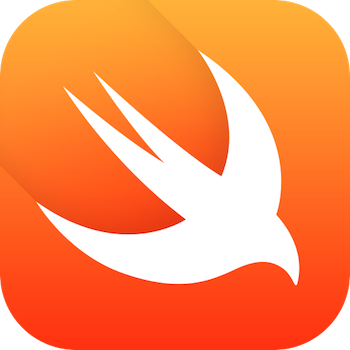

# iOS8 Day-by-Day :: Day 1 :: Swift for Blaggers

This post is part of a daily series of posts introducing the most exciting new
parts of iOS8 for developers - [#iOS8DayByDay](https://twitter.com/search?q=%23iOS8DayByDay).
To see the posts you've missed check out the
[introduction page](http://www.shinobicontrols.com/ios8daybyday),
but have a read through the rest of this post first!

---

## Introduction

It won't have gone unnoticed that at WWDC this year, in addition to announcing
iOS8, they also introduced a new programming language in the form of Swift. This
is quite a different language from objective-C in that it is strongly-typed and
includes some features common to more modern languages.

In the interests of embracing anything and everything that's new and shiny, this
blog series will exclusively use Swift. There is a wealth of information out
there about how to learn Swift, and how to interact with the Cocoa libraries -
in fact you can't go wrong with starting out by reading through the official
books:

- [The Swift Programming Language](https://itunes.apple.com/us/book/the-swift-programming-language/id881256329?mt=11&ls=1)
- [Using Swift with Cocoa and Objective-C](https://itunes.apple.com/us/book/using-swift-cocoa-objective/id888894773?mt=11&ls=1)

You should also check out the official
[swift blog](https://developer.apple.com/swift/blog/), and some of the other
[resources](https://developer.apple.com/swift/resources/) made available by
Apple.

Since there is so much good info out there about how to use Swift, this post is
not going to attempt to cover any of that. Instead, it's going to run through
some of the important gotchas and potential pain points when using Swift for
the first time - especially when relating to the system frameworks.

There is an Xcode 6 playground which accompanies this post - including short
samples for each of the sections. You can get hold of it on the ShinobiControls
Github page - at [github.com/ShinobiControls/iOS8-day-by-day](https://github.com/ShinobiControls/iOS8-day-by-day).

If you have any questions or suggestions of other things to add to this post
then do let me know - I'll try to keep it up to date throughout the blog series.
Drop a comment below, or gimme a shout on twitter -
[@iwantmyrealname](https://twitter.com/iwantmyrealname).

## Initialisation

Swift formalises the concepts surround initialisation of objects somewhat -
including designated -vs- convenience initialisers, and sets a very specific
order of the operations to be called within the initialisation phases of an
object. In the coming weeks, there will be an article as part of this series
which will go into detail about how initialisation works in Swift, and how this
affects any objective-C that you write - so look out for this.

There is one other fairly major difference in initialisation between Swift and
objective-C, and that is return values and initialisation failure. In objective-C
an initialiser looks a lot like this:

    - (instancetype)init {
      self = [super init];
      if (self) {
        // Do some stuff
      }
      return self;
    }

Whereas in Swift:

    init {
      variableA = 10
      ...
      super.init()
    }

Notice that in objective-C the initialiser is responsible for 'creating' and then
returning `self`, but there is no `return` statement in the Swift equivalent.
This means that there is actually no way in which you can return a `nil` object,
which is a pattern commonly used to indicate an initialisation failure in objC.

This is apparently likely to change in an upcoming release of the language, but
for now the only workaround is to use class methods which return optional types:

    class MyClass {
      class func myFactoryMethod() -> MyClass? {
        ...
      }
    }

Interestingly, factory methods on objective-C APIs are converted into initialisers
in Swift, so this approach is not preferred. However, until language support
arrives, it's the only option for initialisers which have the potential to fail.

## Mutability

The concept of (im)mutability is not new to Cocoa developers - we've been used
to using `NSArray` and its mutable counterpart `NSMutableArray` where appropriate,
and even understand that we should always prefer the immutable version wherever
possible. Swift takes this concept to the next level, and bakes immutability into
the language as a fundamental concept.

The `let` keyword defines an immutable variable, which means that you can't change
what it represents. For example:

    let a = MyClass()
    a = MySecondClass() // Not allowed

This means that you can't redefine something specified with the `let` keyword.
Depending on the type of the object referred to, it might itself be immutable
too. If it is a value type (such as a struct) then it will also be immutable.
If it is a reference type, such as a class then it will be mutable.

To see this in action, consider the following `struct`:

    struct MyStruct {
      let t = 12
      var u: String
    }

If you define a variable `struct1` with the `var` keyword then you get the
following behaviour:

    var struct1 = MyStruct(t: 15, u: "Hello")
    struct1.t = 13 // Error: t is an immutable property
    struct1.u = "GoodBye"
    struct1 = MyStruct(t: 10, u: "You")

You can mutate the `u` property, since this is defined with `var`, and you can
redefine the `struct1` variable itself, again because this is defined with `var`.
You can't mutate the `t` property, since this is defined with `let`. Now take
a look what happens when you define an instance of a `struct` using `let`:

    let struct2 = MyStruct(t: 12, u: "World")
    struct2.u = "Planet" // Error: struct2 is immutable
    struct2 = MyStruct(t: 10, u: "Defeat") // Error: struct2 is an immutable ref

Here, not only are you unable to mutate the `struct2` reference itself, but you
are also unable to mutate the struct itself (i.e. the `u` property). This is
because a struct is a __value type__.

The behaviour is subtly different with a class:

    class MyClass {
      let t = 12
      var u: String

      init(t: Int, u: String) {
        self.t = t
        self.u = u
      }
    }

Defining a variable using `var` gives behaviour you might be used to from
objective-C:

    var class1 = MyClass(t: 15, u: "Hello")
    class1.t = 13 // Error: t is an immutable property
    class1.u = "GoodBye"
    class1 = MyClass(t: 10, u: "You")

You can mutate both the reference itself, and any properties defined using
`var`, but you are unable to mutate any properties defined with `let`. Compare
this to the behaviour when the instance is defined with `let`:

    let class2 = MyClass(t: 12, u: "World")
    class2.u = "Planet" // No error
    class2 = MyClass(t: 11, u: "Geoid") Error: class2 is an immutable reference

Here you are unable to mutate the reference itself, but you __can__ still mutate
any properties defined with `var` within the class. This is because a class is
a __reference type__.

This behaviour is fairly easy to understand, and is well-explained in the
language reference books. There is potential for confusion when looking at
Swift collection types though.

An `NSArray` is a reference type. That is to say that when you create an instance
of `NSArray`, you create an object and your variable is a pointer to the location
of the array itself in memory - hence the asterisk in the objective-C definition.
If you take a look back over what you've learnt about the semantics of reference
and value types with respect to `let` and `var` then you can probably work out
how they would behave. In fact, if you want a mutable version of an `NSArray` you
have to use a different class - in the shape of `NSMutableArray`.

Swift arrays aren't like this - they are value types instead of reference types.
This means that they behave like a struct, not a class. Therefore, the `let` or
`var` keyword not only specifies whether or not the variable can be redefined,
but also whether or not the created array is mutable.

An array defined with `var` can both be reassigned, and mutated:

    var array1 = [1,2,3,4]
    array1.append(5)        // [1,2,3,4,5]
    array1[0] = 27          // [27,2,3,4,5]
    array1 = [3,2]          // [3,2]

But an array defined with `let` can be neither:

    let array2 = [4,3,2,1]
    array2.append(0) // Error: array2 is immutable
    array2[2] = 36   // Error: array2 is immutable
    array2 = [5,6]   // Error: cannot reassign an immutable reference

This is an area with a huge potential for confusion. Not only does it completely
change the way we think about mutability for collections, but it also mixes up
two previously distinct concepts. There is potential that this might be changed
in a future release of the language - so keep an eye on the language definition.

A corollary of this is that since arrays are value types, they are passed by
copy. `NSArray` instances are always passed by reference - so a method which
takes an `NSArray` pointer will point to exactly the same chunk of memory. If
you pass a Swift array into a method, it will receive a copy of that array.
Depending on the type of the objects stored in that array this could either be
a deep, or a shallow copy. Be aware of this whilst writing your code!

## Strong Typing and `AnyObject`

Strong typing is seen as a great feature of Swift - it can allow for safer code,
since what in objective-C would have been runtime exceptions can now be caught
at compile time.

This is great, but as you're working with the objective-C system frameworks
you'll notice a lot of this `AnyObject` type. This is the Swift equivalent of
objective-C's `id`. In many respects, `AnyObject` feels rather un-Swift-like. It
allows you to call __any__ methods it can find on it, but these will result in
a run-time exception. In fact, it behaves _almost_ exactly the same as `id` in
objective-C. The difference is that properties and methods which take no
arguments will return `nil` if that method/property doesn't exist on the
`AnyObject`:

    let myString: AnyObject = "hello"
    myString.cornerRadius // Returns nil

In order to work in a more Swift-like way with the Cocoa APIs, you'll see the
following pattern a lot:

    func someFunc(parameter: AnyObject!) -> AnyObject! {
      if let castedParameter = parameter as? NSString {
        // Now I know I have a string :)
        ...
      }
    }

If you know that you've definitely been passed a string, you don't necessarily
need to guard around the cast:

    let castedParameter = parameter as NSString

A top-tip is to realise that casting arrays is really easy too. All arrays that
you'll receive from a Cocoa framework will be of the type `[AnyObject]`, since
`NSArray` doesn't support generics. However, in nearly every case not only are
all the elements of the same type, but they are of a known type. You can cast
an entire array in both the conditional and unconditional ways expressed above,
with the following syntax:

    func someArrayFunc(parameter: [AnyObject]!) {
      let newArray = parameter as [String]
      // Do something with your strings :)
    }

## Protocol Conformance

Protocols are well-understood in Swift - defined as follows:

    protocol MyProtocol {
      func myProtocolMethod() -> Bool
    }

One of the things you often want to do is test whether an object conforms to a
specified protocol, which you could do as follows:

    if let class1AsMyProtocol = class1 as? MyProtocol {
      // We're in
    }

However, this will have an error, because in order to check conformance of a
protocol that protocol must be an objective-C protocol - and annotated with
`@objc`:

    @objc protocol MyNewProtocol {
      func myProtocolMethod() -> Bool
    }

    if let class1AsMyNewProtocol = class1 as? MyNewProtocol {
      // We're in
    }

This can actually be more effort than you'd expect, since in order that a protocol
be labelled as `@objc`, all of its properties and method return types must also
be understood in the objective-C world. This means that you might end up annotating
loads of classes you thought you only cared about in Swift with `@objc`.

## Enums

Enums in Swift have become super-charged. Not only can an enum now have associated
values (which needn't be of the same type), but also contain functions too.

    enum MyEnum {
      case FirstType
      case IntType (Int)
      case StringType (String)
      case TupleType (Int, String)

      func prettyFormat() -> String {
        switch self {
        case .FirstType:
          return "No params"
        case .IntType(let value), .StringType(let value):
          return "One param: \(value)"
        case .TupleType(let v1, let v2):
          return "Some params: \(v1), \(v2)"
        default:
          return "Nothing to see here"
        }
      }
    }

This is really powerful - use it as follows:

    var enum1 = MyEnum.FirstType
    enum1.prettyFormat() // "No params"
    enum1 = .TupleType(12, "Hello")
    enum1.prettyFormat() // "Some params: 12, Hello"

It'll take a little practice to see where you can get some benefit out of the
power of these, but just as an indication of what you can achieve - the optionals
system within Swift is built out of enumerations.

## Conclusion

Swift is really powerful - and it's going to take us a while to establish best
practice and work out what idioms and patterns we can now use that weren't
possible within the constraints of objective-C. This post has outlined some of
the common areas of confusion when moving from objective-C to Swift, but don't
let this put you off. All of the projects associated with this blog series are
written using Swift, and on the most-part are really simple to understand.

There is a playground which contains some of the samples mentioned in this post -
it's part of the Github repo which accompanies this series. You can get it at
[github.com/ShinobiControls/iOS8-day-by-day](https://github.com/ShinobiControls/iOS8-day-by-day).

If you have any questions or suggestions for additions / updates on this page then
please do get in contact. You can leave a comment below, or tweet me - I'm
[@iwantmyrealname](https://twitter.com/iwantmyrealname).

The series starts properly on Monday - with a look at one of the significant new
APIs within iOS8. Join us then - or use the __subscribe__ button below to get an
email reminder that a new post has been published.

sam
