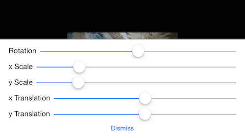
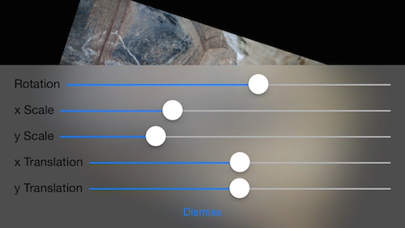
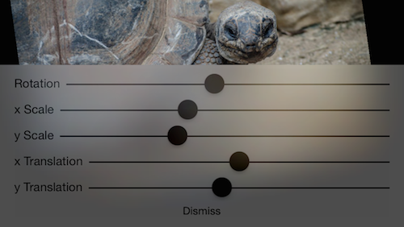

# iOS8 Day-by-Day :: Day 3 :: UIVisualEffects

This post is part of a daily series of posts introducing the most exciting new
parts of iOS8 for developers - [#iOS8DayByDay](https://twitter.com/search?q=%23iOS8DayByDay).
To see the posts you've missed check out the [index page](http://shinobicontrols.com/iOS8DayByDay),
but have a read through the rest of this post first!

---

## Introduction

As part of the iOS7 refresh the concept of visual depth within an app was
introduced. This include some stunning visual effects involving live-filtering
content in the background of the current view. This can be seen all over iOS7 -
from the navigation bar blurring the content as it scrolls underneath it, to the
background of control center.

This type of filter is computationally expensive, and in iOS7, developers weren't
provided with an API to the underlying hardware-accelerate functionality, so we
all built our own versions. Most of these were on the CPU, and therefore often
weren't performant enough to cope with live-views. In iOS8 there's a new option
available in the form of `UIVisualEffects`. Apple has made their underlying
implementation publicly accessible, so now you too can get cool blurring-style
effects in your apps.

The app which accompanies this project displays an image, and has an overlay view
with controls to vary the transform applied to the image. Before using the
UI visual effects it looks like this:

The source code for the app is available on github at
[github.com/ShinobiControls/iOS8-day-by-day](https://github.com/ShinobiControls/iOS8-day-by-day).
Feel free to send any pull requests or issues you find :)

## Blurring with UIVisualEffectView

The architecture associated with the visual effects includes 2 classes:

- `UIVisualEffect` Specifies which kind of visual effect you want to apply. Choices
are currently __blur__ or __vibrancy__.
- `UIVisualEffectView` The view which actually performs the effect. You add your
overlaid content to the `contentView` property and add the visual effect view
itself to your view hierarchy.

In order to construct a `UIVisualEffectView` you need to have created a `UIVisualEffect`.
To create a blur effect, use the `UIBlurEffect` subclass:

    // Create the blur effect
    let blurEffect = UIBlurEffect(style: .Light)

You create a blur effect with a particular style, of which there are 3 choices:

- `ExtraLight` Blurs and results in a lighter hue than the background
- `Light` Similar hue to that of the background
- `Dark` Darker appearance than the background

Since `ExtraLight` and `Dark` involve changing the hue as well as blurring, they
involve an additional render pass, and are therefore marginally more expensive.

Once you've created a visual effect, then you can create a view to enable it
to be rendered on screen:

    let blurEffectView = UIVisualEffectView(effect: blurEffect)

The reason that you've created this blur view is so that you can use it as a
background for some content you wish to display. Importantly, you do __not__
add the content as a subview of the effect view itself, but rather its
`contentView` property:

    blurEffectView.contentView.addSubview(contentView)

Then, you just have to add the `blurEffectView` to your view hierachy and you're
done.

    containerView.addSubview(blurEffectView)

### A real-world example

Well, that's the theory. In practice, you have to size and position your view
appropriately. Which isn't too difficult in itself. But I like to design my view
in a storyboard, using auto layout. When you remove a view from the hierarchy
(as you have to do in this case) it loses any layout constraints associated with
its superview, therefore you need to re-create some. In most cases you want the
content to be the same size as the visual effects view, which in turn should be
the same size as its container.

    // Prepare autolayout
    contentView.setTranslatesAutoresizingMaskIntoConstraints(false)
    blurEffectView.setTranslatesAutoresizingMaskIntoConstraints(false)
    applyEqualSizeConstraints(blurEffectView.contentView, v2: contentView)
    applyEqualSizeConstraints(containerView, v2: blurEffectView)

Where the `applyEqualSizeConstraints is as follows`:

    func applyEqualSizeConstraints(v1: UIView, v2: UIView, includeTop: Bool) {
      v1.addConstraint(NSLayoutConstraint(item: v1, attribute: .Left, relatedBy: .Equal,
                                          toItem: v2, attribute: .Left, multiplier: 1, constant: 0))
      v1.addConstraint(NSLayoutConstraint(item: v1, attribute: .Right, relatedBy: .Equal,
                                          toItem: v2, attribute: .Right, multiplier: 1, constant: 0))
      v1.addConstraint(NSLayoutConstraint(item: v1, attribute: .Bottom, relatedBy: .Equal,
                                          toItem: v2, attribute: .Bottom, multiplier: 1, constant: 0))
      v1.addConstraint(NSLayoutConstraint(item: v1, attribute: .Top, relatedBy: .Equal,
                                          toItem: v2, attribute: .Top, multiplier: 1, constant: 0))
    }

In the accompanying demo app, adding this functionality allows the layout of the
controls to be in a storyboard. It results in an overlaid image controls view
that looks like this:

## Improving legibility with vibrancy

When this topic was introduced you may have noticed that in addition to the blur
effect, there is also a __vibrancy__ effect. Vibrancy is used in combination with
a blur effect, and it applies a recoloring effect to the content itself (as opposed
to the blur effect which only affects the background). This effect effect not
only looks great, it also ensures that the content is always legible.

Since the vibrancy needs to appear different for each of the different blur effect
types, it's necessary to initialize it with a blur effect. This means that it's
not possible to apply a vibrancy effect to a view which doesn't also have a blur
effect applied to it.

In exactly the same way you did with the blur effect, create an effect object, and
then create a view which uses this:

    // Create the vibrancy effect - to be added to the blur
    let vibrancyEffect = UIVibrancyEffect(forBlurEffect: blurEffect)
    let vibrancyEffectView = UIVisualEffectView(effect: vibrancyEffect)

You add your content as a subview to the vibrancy effect view, and that in turn
to the blur effect view:

    vibrancyEffectView.contentView.addSubview(contentView)
    blurEffectView.contentView.addSubview(vibrancyEffectView)

Then add the `blurEffectView` to your view hierarchy to display it:

    containerView.addSubview(blurEffectView)

You can use the same autolayout dance as before to ensure that the view sizes
are all correct:

    // Prepare autolayout
    contentView.setTranslatesAutoresizingMaskIntoConstraints(false)
    blurEffectView.setTranslatesAutoresizingMaskIntoConstraints(false)
    vibrancyEffectView.setTranslatesAutoresizingMaskIntoConstraints(false)

    applyEqualSizeConstraints(vibrancyEffectView.contentView, v2: contentView)
    applyEqualSizeConstraints(blurEffectView.contentView, v2: vibrancyEffectView)
    applyEqualSizeConstraints(containerView, v2: blurEffectView)

This will result in this really rather cool effect:

## Performance Concerns

Creating these effects is hard work - involving multiple render passes. Therefore
it's quite possible that on older devices using these with complex backgrounds
can result in framedropping - which appears to users as choppiness. Even if the
device can cope with it, the process will be quite power hungry. Therefore, it's
important to use carefully, and ensure that you are fully aware of what usage
entails.

In addition, Apple makes some recommendations on how to best use the visual effects
view:

- Don't use transparency in the background of the visual effects view.
- Don't use masking in any superviews.
- To snapshot when you're using a visual effects view, you need to capture the
entire window or screen in order for the effect to be visible.

## Conclusion

This is a really powerful feature of iOS8 - and will really allow developers to
easily create apps which sit really well within the depth-model introduced in
iOS7. It was a little disappointing that this ability wasn't available in iOS7,
so it's good to have it ready to go in iOS8.

Go and give it a try, but remember not to go wild with it - keep concerns of
performance and energy usage at the forefront of your mind.

Don't forget that the code which accompanies this blog series is all available
on github at
[github.com/ShinobiControls/iOS8-day-by-day](https://github.com/ShinobiControls/iOS8-day-by-day).
Feel free to send any pull requests or issues you find, or gimme a
shout on twitter -
[@iwantmyrealname](https://twitter.com/iwantmyrealname).

sam
