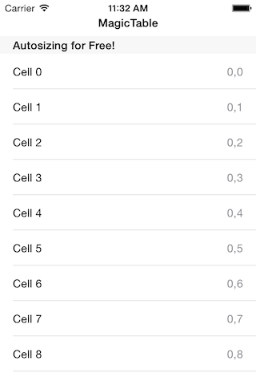
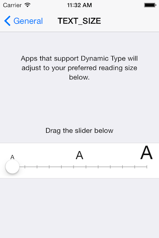
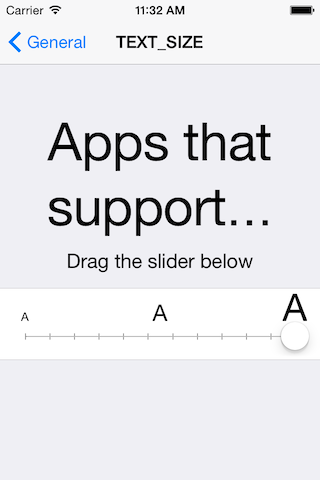
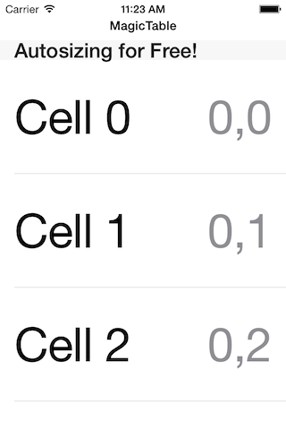
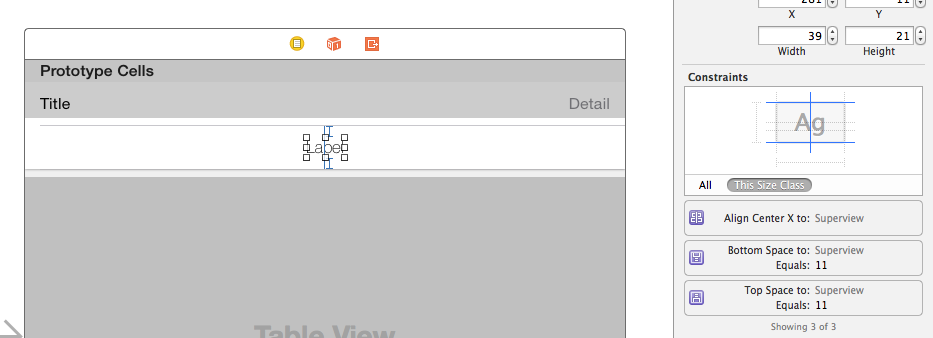
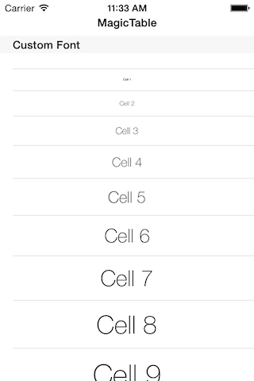

# iOS8 Day-by-Day :: Day 5 :: Auto-sizing table view cells

This post is part of a daily series of posts introducing the most exciting new
parts of iOS8 for developers - [#iOS8DayByDay](https://twitter.com/search?q=%23iOS8DayByDay).
To see the posts you've missed check out the [index page](http://shinobicontrols.com/iOS8DayByDay),
but have a read through the rest of this post first!

---

## Introduction

In iOS7 developers were introduced to the concept of dynamic type - which allows
the user to change the font size used within apps, via the settings panel. This
is really powerful, and can drastically improve the user experience for users
with varying qualities of eye-sight.

However, there was a huge problem associated with this - in the form of table
views. Although the type size can change, it was up to the developer to
define the height of cells in the table view. This would mean either
pre-calculating the values, or calculating them on the fly, neither of which was
easy. Surely there must be a better way?

Well, in iOS8 it is finally possible to have table view cells which can autosize
themselves. In this project we'll take a look at how easy it is to implement,
with a demo associated with dynamic type and with custom cells.

As with all articles in this series, the sample project is available on github at
[github.com/ShinobiControls/iOS8-day-by-day](https://github.com/ShinobiControls/iOS8-day-by-day).

## Using the 'stock' table view cells

When you first create a table view, chances are you've just used the stock
table view cells - of which there are 4 styles (basic, left detail, right detail,
and subtitle). In iOS8, the labels in the base `UITableViewCell` are pre-configured
for dynamic type. This means that they adapt to the text size specified in the
device settings panel.

Since these cells are also laid out using autolayout, they will autosize to fit
the differing sizes of text.

This actually means that you get auto-sizing table view cells __for free__ if you
just use the stock cells. To see this in action run up the accompanying
__MagicTable__ app:

If you then use the settings to change the text size (in the same way as iOS7):

And then return to the __MagicTable__ app then you'll be able to see the effect:

This is all well, and good, but more often than not you'll want to create your
own custom table cells. In order to do this, you need to understand a little bit
more about how the auto sizing actually works - let's take a look at that next.

## Creating custom table view cells

Traditionally setting the row height for a table view cell would be done on the
table - using the `rowHeight` property. In order to vary the row size on a per-row
basis, you would use the table view delegate method `estimatedHeightForRowAtIndexPath:`
to return a different height for each row.

The problem for this approach is that you either need to know the row height at
compile time, or calculate the row height for each row at run-time. The delegate
method is called when the tableview first appears, which means that you need to
calculate the cell height _before_ the cells are created. In order to do this you
can end up writing layout code twice - once for size calculations and once for
display. This process can take a long time to perform - and involves entirely
up-front calculations.

iOS7 introduced `estimatedRowHeight`, which transformed the row-height requests
into lazy calculations - only requesting the height for a row once it is about to
be displayed on the screen. However, it still required you to calculate the row
height yourself.

In iOS8, you can still use these approaches, however, cells can now be responsible
for their own sizing - via autolayout. This is both great from an ease-of-use
perspective and also from a software design angle. A cell is responsible for its
own layout, so it makes sense that it should also be responsible for determining
its own height.

It's actually pretty easy to get auto-cell height working for a custom cell. The
most important part is that your constraints properly define the height of the
cell.

You must provide an estimated height for the rows, and if you provide an actual
height (either via the property on the table, or via the delegate) then this will
override any calculated cell size. In order to specify that you haven't set a cell
height, use the `UITableViewAutomaticDimension` constant:

    tableView.rowHeight = UITableViewAutomaticDimension

The constraints need to relate to the `contentView` within a `UITableViewCell`,
and can be set up in code or in IB. The accompanying project sets up contraints
in IB:

In order to demo the different heights, the datasource for the table in
__MagicTable__, changes the font height of the custom label depending on the
label:

## Conclusion

Auto-sizing table view cells is something that developers have longed for, and
it's great news that iOS8 introduces this functionality. In many cases, since
you should already be using auto-layout, you'll just get this functionality for
free - just a matter of not specifying cell heights. It's definitely worth the
time to go and ensure that your existing tableviews support this behaviour.

As with all articles in this series, the sample project is available on github at
[github.com/ShinobiControls/iOS8-day-by-day](https://github.com/ShinobiControls/iOS8-day-by-day).
If you have any questions then feel free to comment below or hit me up on
twitter - I'm [@iwantmyrealname](https://twitter.com/iwantmyrealname).

sam
