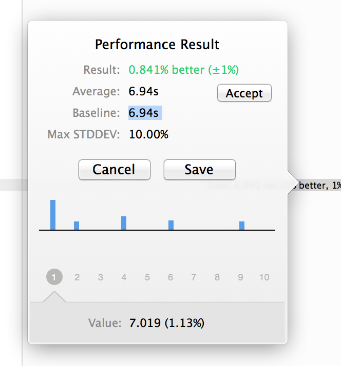
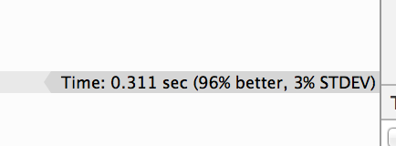
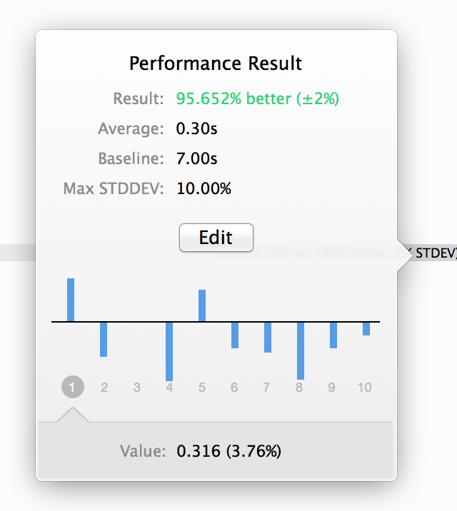

# iOS8 Day-by-Day :: Day 6 :: Profiling Unit Tests

This post is part of a daily series of posts introducing the most exciting new
parts of iOS8 for developers - [#iOS8DayByDay](https://twitter.com/search?q=%23iOS8DayByDay).
To see the posts you've missed check out the introduction page,
but have a read through the rest of this post first!

---

## Introduction

Unit tests are widely accepted as incredibly useful tools to aid writing better
software. They allow you to establish the behaviour of your code before putting
it in front of end-users, and to ensure that everything works as expected in
conditions which aren't necessarily default.

In Xcode 5 __OCUnit__ was replaced with __XCUnit__, but there was very little
noticeable difference to end users. In Xcode 6, __XCUnit__ has had a few features
added to it, one of which is the ability to measure the performance of a piece
of code. This is really helpful to find sticking points in your app, and then
iteratively improve the performance.

The app which accompanies this article demonstrates how you can use the
new performance testing features of __XCUnit__ to improve the speed of a simple
algorithm. In this instance it takes a naive implementation of a moving average,
measures the performance, before creating a new implementation which has better
performance.

The code is available on github at [github.com/ShinobiControls/iOS8-day-by-day](https://github.com/ShinobiControls/iOS8-day-by-day),
so grab it. Any questions then hit me up on twitter [@iwantmyrealname](https://twitter.com/iwantmyrealname).

## Measuring Test Performance

The concept behind the new performance measuring functionality in __XCTest__ is
you can specify a block which the test runner will run repeatedly, measuring the
time it takes to complete each time.

Each time you run your test suite, this performance measurement will be repeated,
and a comparison to the last time will be displayed. This allows you to spot
regressions in performance easily, and to iterate on improving performance.

Implementing this is really simple - `XCTestCase` now has method called
`measureBlock` on it. This takes a `void` block/closure and times it:

    func testSampleTestPerformance() {
      self.measureBlock() {
        // Code under test
        methodCallUnderTest()
      }
    }

This might become a little clearer with a specific example.

## Moving average example

Moving average is a common problem in computing, and is basically an implementation
of a finite impulse response filter with unit weights. There are many ways to
implement it, but the simplest is as follows:

    func calculateMovingAverage(data: Double[]) -> Double[] {
      // Create an array to store the result
      var result = Double

      // Now perform the calculation
      for i in 0...(data.count - windowSize) {
        let slice = data[i..(i+windowSize)]
        let partialSum = slice.reduce(0) { $0 + $1 }
        result.append(Double(partialSum) / Double(windowSize))
      }
      return result
    }

The moving average is the mean of a window which moves along the input array - which
is exactly what is being implemented here. This method is part of the
`NaiveMovingAverageCalculator` class, which we can then put under test.

    class MovingAverageTests: XCTestCase {
      let calculatorCreator : () -> MovingAverageCalculator = { return NaiveMovingAverageCalculator() }
      var calculator: MovingAverageCalculator = NaiveMovingAverageCalculator()

      override func setUp() {
        super.setUp()
        // Reset the calculator
        calculator = calculatorCreator()
      }

      func testMovingAveragePerformance() {
        // This is an example of a performance test case.
        calculator.windowSize = 1000
        self.measureBlock() {
          // Put the code you want to measure the time of here.
          let randomArray = self.RandomDouble(10000)
          let result = self.calculator.calculateMovingAverage(randomArray)
          XCTAssertEqual(result.count, 9000)
        }
      }

      func RandomDouble(length: Int) -> Array<Double> {
        srand48(time(nil))
        var result = Double
        for i in 1..length {
          result.append(drand48())
        }
        return result
      }
    }

There is one test method in the above code sample (`testMovingAveragePerformance()`),
which includes the key `measureBlock()` method. Inside this block we are using
the `RandomDouble()` utility method to create an array of random doubles of length
`10000`, before requesting the calculator to generate the moving average.

When you run this test suite then that test will be run 10 times. Once completed
you can click the tag on the right hand side to see how it performed:

You can see a column chart of the time for each test run - giving you an indication
of the variance. You can also see the mean time and its standard deviation. Setting
a baseline saves this result, and then subsequent test runs will be compared to
this. In fact, in the above picture, the baseline was set and you can see that
a subsequent test run had only a tiny difference in performance, as you would expect.

## Improving the moving average

Having decided that 6 seconds is an incredibly long time to perform a moving
average, you can go ahead an attempt to improve upon it. The result of this
is the `BetterMovingAverageCalculator` class, which has the following
`calculateMovingAverage()` method:

    func calculateMovingAverage(data: Double[]) -> Double[] {
      var result = Double

      var currentSum = data[0..windowSize].reduce(0) { $0 + $1 }
      result.append(Double(currentSum) / Double(windowSize))
      for i in 0..(data.count - windowSize) {
        // Remove the first entry
        currentSum -= data[i]
        // And add the new one
        currentSum += data[i + windowSize]
        // Save it off
        result.append(Double(currentSum) / Double(windowSize))
      }

      return result
    }

This approach is a common improvement to a moving average - keeping a running
sum means that the same sum operation is not repeated for every output value.

To see how this fairs in comparison to the original implemention, you can just
update the test class as follows:

    let calculatorCreator : () -> MovingAverageCalculator = { return BetterMovingAverageCalculator() }
    var calculator: MovingAverageCalculator = BetterMovingAverageCalculator()

Now running the test suite again will cause the following balloon to appear:

If you click on it, you can reveal more result data:

That's quite a huge difference - well over 95%. It'd be great if it was that easy
to optimise all code.

If you're happy with this new code, then you can reset the baseline to the new
calculator, and you'll have changed your benchmark. The results can be checked
in to source control and shared with your team, so you're all working to the same
baselines.

## Conclusion

There is a popular adage in software engineering, that you shouldn't optimise
prematurely, so you probably shouldn't be throwing this new functionality all
over your tests.

However, there are a couple of cases that this new tools really caters for:

- Ensuring that performance regressions are noticed, caught and dealt with or
accepted.
- Making optimisation a lot easier when the time comes.

It can be used in conjuction with a more fine-grained profiler, such as that
provided by instruments to really assist with improving the performance of your
app.

The code for this moving average project is available on github at
[github.com/ShinobiControls/iOS8-day-by-day](https://github.com/ShinobiControls/iOS8-day-by-day).
Feel free to fork it, and write a more optimal moving average calculator :)
As ever, questions / comments below or via [@iwantmyrealname](https://twitter.com/iwantmyrealname).

sam
