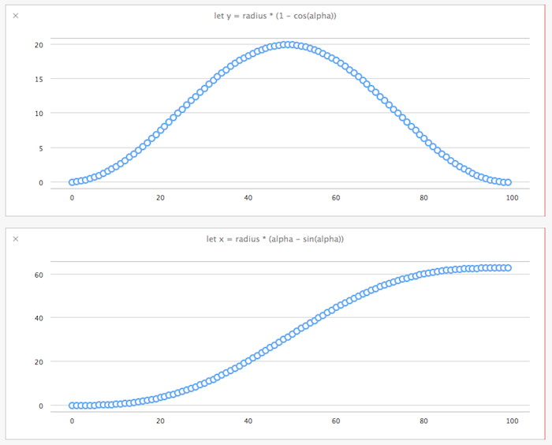
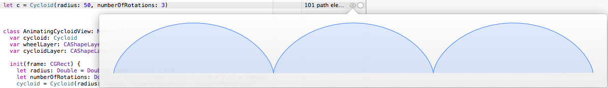
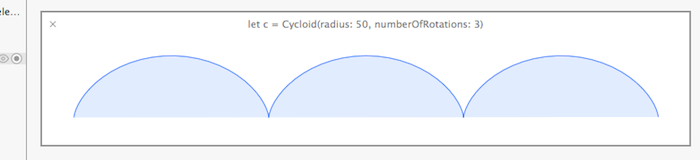
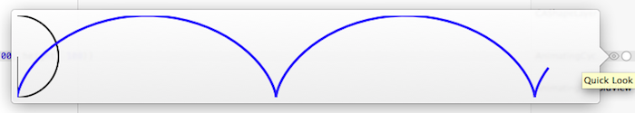
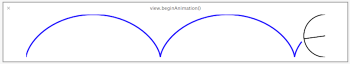
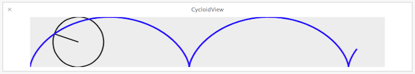
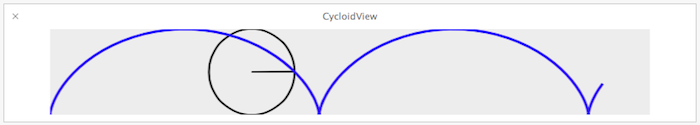
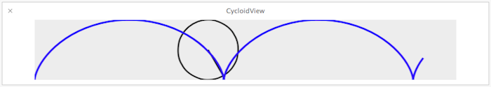
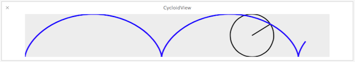
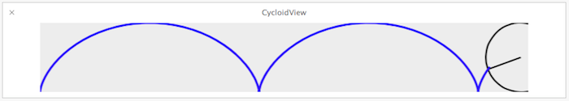

# iOS8 Day-by-Day :: Day 10 :: Xcode 6 Playgrounds

This post is part of a daily series of posts introducing the most exciting new
parts of iOS8 for developers - [#iOS8DayByDay](https://twitter.com/search?q=%23iOS8DayByDay).
To see the posts you've missed check out the [index page](http://shinobicontrols.com/iOS8DayByDay),
but have a read through the rest of this post first!

---

## Introduction

Playgrounds are a completely new concept in Xcode 6 - bringing the world of a
completely interactive code development environment with the powerful new language
that is Swift. Using a playground feels very much like a powered-up REPL - combining
the persistence of a source code file with the immediate response of a REPL.

Playgrounds are really easy to get started with - in fact when you open Xcode 6
there is an option to create a new playground. You can choose either an iOS playground
or an OSX playground, and they only support writing in Swift.

Today's article won't cover many of the basics of playgrounds - it's not difficult
to get started, but will instead cover some of the more advanced features available
through the __XCPlayground__ framework.

The accompanying project is itself a playground, and is available in the ShinobiControls
github repo at
[github.com/ShinobiControls/iOS8-day-by-day](https://github.com/ShinobiControls/iOS8-day-by-day).
You'll notice that there are two projects within this repo - one for iOS, one for
OSX.

> __Note__: At the time of publication, not all the features are available for
> iOS (beta 4 of Xcode 6). Therefore, the OSX playground is provided for reference.
> The code is very similar - with like-for-like exchanges where possible. The code
> snippets in this article will refer to the iOS version.

The aim of the playground project is to create a view which can draw a cycloid.
A cycloid is the name of the curve which is traced by a point on the edge of a
wheel as it rotates. This development process is very representative of what you
could use a playground for. You can read more about cyloids on
[Wikipedia](http://en.wikipedia.org/wiki/Cycloid), and the following image (also
from Wikipedia) gives you an idea of what you're going to try and create:

## Interactive Coding & Timelines

As has already been mentioned, playgrounds allow for instantaneous feedback from
code as you write it. This makes it ideal for algorithm development. In the
centroid example, we can use high-school geometry to calculate the `x` and `y`
positions of the point on the rim of the wheel for a given angle:

    let radius = 10.0
    for circleProp in 1...100 {
      let alpha = Double(circleProp) / 100.0 * 2.0 * M_PI
      let y = radius * (1 - cos(alpha))
      let x = radius * (alpha - sin(alpha))
    }

This code loops through 100 samples of the angle of rotation of the circle and
calculates the location of the point for each of them. If you look at this code
in the playground you'll see that over on the right-hand side it tells you that
each line was executed 100 times (as you would expect):

That in itself is not particularly ground-breaking, but if you mouse-over the
quicklook gutter then you'll see a couple of icons appearing - a quicklook eye
and a plus for __Value History__:

If you click this button then the assistant editor will open with a timeline
view, containing a graph of these values over time:

The timeline will automatically add reassignments to variables of the same name.
If you want to specify that a particular value should be added to a given
timeline chart you can use the `XCPCaptureValue(identifier:, value:)` method.
This is part of the __XCPlayground__ framework, so you'll need to import that:

    import XCPlayground

Any time that you call `XCPCaptureValue()`, it'll be added to the timeline
representation for the given string identifier. i.e. it'll be added to the end
of a chart if one exists for the given name (and the type can be plotted). If
the identifier has not yet been seen then a new view will appear in the timeline
assistant editor and will be populated appropriately for the given type.

You can add other types to the timeline as well, including views, bezier paths,
colors, strings, arrays, dictionaries etc. In fact pretty much anything which
has an associated quick look. However, how do you add something which doesn't
have a quick look representation? In the next section you'll learn how to do
this.

## Custom QuickLook

Now that you're happy with the algorithm itself, you'll want to build a class
to contain the functionality. You can do this within a playground as well, and
they offer some additional tools for making the experience great.

With the cycloid example, the initializer requires a radius and number of
rotations:

    init(radius: Double, numberOfRotations: Double = 2.5) {
      self.radius = radius
      self.numberOfRotations = numberOfRotations
      super.init()
    }

And the previously developed algorithm is used in the `generateDatapoint()`
method:

    func generateDatapoint(angle: Double) -> CGPoint {
      let y = radius * (1 - cos(angle))
      let x =  radius * (angle - sin(angle))
      return CGPoint(x: CGFloat(x), y: CGFloat(y))
    }

So to actually create the points which make up the cycloid path you create the
following method:

    func pointsForCycloid(numberSamples: UInt) -> [CGPoint] {
      var dataPoints = [CGPoint]()
      for sampleIndex in 0..<numberSamples {
        let angle = Double(sampleIndex) / Double(numberSamples) * 2.0 * M_PI * numberOfRotations
        dataPoints.append(generateDatapoint(angle))
      }
      return dataPoints
    }

OK, so you think that you've got this class working correctly, but how can you
check? Well, if your class inherits from `NSObject` then you can implement the
`debugQuickLookObject()` method to return something that the playground can
visualize. The objects you can return include bezier paths, strings, colors and
images.

Since you're dealing with `CGPoint` objects here then a bezier path would be
ideal. The following method will create a bezier path from using the result of
the `pointsForCycloid()` method:

    func bezierPath(numberSamples: UInt) -> UIBezierPath {
      let bezierPath = UIBezierPath()
      bezierPath.moveToPoint(CGPoint.zeroPoint)
      for point in pointsForCycloid(numberSamples) {
        bezierPath.addLineToPoint(point)
      }
      return bezierPath
    }

This means that the `debugQuickLookObject()` method is as simple as:

    func debugQuickLookObject() -> AnyObject? {
      return bezierPath(100)
    }

To see this in action, simple instantiate one of these `Cycloid` objects:

    let c = Cycloid(radius: 50, numberOfRotations: 3)

You can either click the quicklook icon to see the result in a popover:

Or, like you did with the values of `x` and `y`, you can add it to the timeline
so that it will stay there and get updated each time the playground re-evaluates
:

This is starting to look pretty cool now - you've got a class which will create
the cycloid path for you. In the next section you're going to see how to use
this to create a view which animated a wheel drawing this path.

## Custom View Development

Creating custom views can be a really slow process in Xcode - although this has
improved with the ability to do live rendering in interface builder. Even so,
you are often required to build your project and run it up on a simulator before
you can see what it actually looks like. This makes for a slow iterative loop -
speeding this up could offer massive gains in productivity. Even just the
ability to quicklook a view in playgrounds really can help here, but that's just
scratching the surface of what's possible.

> __Note:__ Remember throughout this section that at the time of publication,
animation of `UIView` in playgrounds was not supported. Therefore, in order to
see it in action, use the OSX version instead. It is very similar code, with a
few platform differences (including coordinate system differences).

The sample playground includes a `UIView` subclass called `AnimatingCycloidView`.
This uses the previously created `Cycloid` class to determine the path of the
appropriate cycloid and draws it on screen using a `CAShapeLayer`.

    func createCycloidLayer() -> CAShapeLayer {
      let layer = CAShapeLayer()
      layer.bounds = self.bounds
      layer.position = CGPoint(x: self.bounds.width / 2.0, y: self.bounds.height / 2.0)
      layer.path = self.cycloid.bezierPath(100).CGPath
      layer.fillColor = UIColor.clearColor().CGColor
      layer.strokeColor = UIColor.blueColor().CGColor
      layer.lineWidth = 3.0
      
      return layer
    }

A similar method is used to create the wheel. Since this is is a `UIView` you
get a quicklook for free:

    let view = AnimatingCycloidView(frame: CGRect(x: 0, y: 0, width: 700, height: 100))

However, you want to be able to animate the wheel to trace the cycloid path. The
animation method is fairly standard, and just uses `CABasicAnimation` to rotate
and translate the wheel simultaneously:

    func beginAnimation() {
      self.wheelLayer.setValue(-2 * M_PI * self.cycloid.numberOfRotations, forKeyPath: "transform.rotation.z")
      self.wheelLayer.setValue(self.bounds.width, forKeyPath: "position.x")
      self.cycloidLayer.strokeEnd = 1.0
      
      CATransaction.begin()
      CATransaction.setAnimationDuration(6.0)
      
      let animation = CABasicAnimation(keyPath: "transform.rotation.z")
      animation.fromValue = 0
      animation.toValue   = -2 * M_PI * cycloid.numberOfRotations
      
      let translation = CABasicAnimation(keyPath: "position.x")
      translation.fromValue = 0
      translation.toValue   = self.bounds.width
      
      let animationGroup = CAAnimationGroup()
      animationGroup.animations = [animation, translation]
      animationGroup.timingFunction = CAMediaTimingFunction(name: kCAMediaTimingFunctionLinear)
      animationGroup.removedOnCompletion = false
      
      wheelLayer.addAnimation(animationGroup, forKey: "wheelSpin")
      
      CATransaction.commit()
    }

Try adding the `view` to the timeline with the __Value History__ button and then
watching what happens. You'll see the cycloid view in the timeline, but only in
its completed state:

It would be really helpful if you could see the animation happening. Well, the
__XCPlayground__ has a function which can help you out - in the form of
`XCPShowView()`. This takes an identifier and a view object:

    XCPShowView("CycloidView", view)

This function automatically adds a view to the timeline, and then delays the end
of execution within the timeline, until the timeout value specified in the lower
right hand corner of the timeline:

You will now see the wheel animating across the view. You can also then use the
slider at the bottom of the timeline to track backwards and forwards in time.
The frames of the view animation are captured so you can see exactly how the
animation is behaving.

The `XCPShowView()` method is using a method called
`XCPSetExecutionShouldContinueIndefinitely` under the hood. This method allows
the playground process to continue until either the timeline timeout is reached,
or the playground source has changed - at which point the code will be re-run.

## Conclusion

Playgrounds offer the potential to be really very useful. They are certainly
great for learning Swift - but in that respect they don't offer a lot more than
the REPL does. Once you add the full force of the Cocoa and CocoaTouch APIs then
there really is a lot to play with. Even in the the short sample project, it was
possible to go from building an algorithm from simple mathematical principles
through to designing a class to encompass that functionality, right up to
building a view containing fairly complex animations. At no point do you have to
consider any of the mechanics of interacting with an app, which is of huge
importance when iterating quickly.

I encourage you to jump in and muck around in a playground if you haven't
already. Even without some of the more advanced topics covered here today, they
offer huge value.

Don't forget that the source code which accompanies today's article is on the
ShinobiControls github at 
[github.com/ShinobiControls/iOS8-day-by-day](https://github.com/ShinobiControls/iOS8-day-by-day).
Feel free to grab it and gimme a shout on twitter if you have any questions or
complaints - I'm [@iwantmyrealname](https://twitter.com/iwantmyrealname).

sam