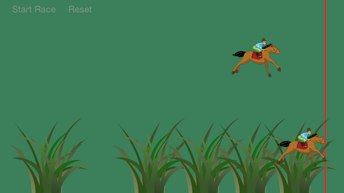
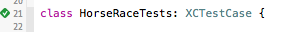

# iOS8 Day-by-Day :: Day 11 :: Asynchronous Testing

This post is part of a daily series of posts introducing the most exciting new
parts of iOS8 for developers - [#iOS8DayByDay](https://twitter.com/search?q=%23iOS8DayByDay).
To see the posts you've missed check out the [index page](http://shinobicontrols.com/iOS8DayByDay),
but have a read through the rest of this post first!

---

## Introduction

This blog series has already taken a look at one of the new features available
in XCTest, the testing framework in Xcode, in the shape of profiling unit tests -
you can check it out in day 6's
[article](http://www.shinobicontrols.com/blog/posts/2014/07/25/ios8-day-by-day-day-6-profiling-unit-tests).
This isn't the only addition to the framework though - and today's topic will
look at one of the other new features in the form of asynchronous testing.

There are many things which can be formulated as asynchronous tasks in your
iOS app - rather than returning a result immediately will instead call a block/closure
you provide when the result is ready. This is generally good practice, since you
can write functions which won't block the current queue whilst they're waiting for
some kind of response. However, this can make unit testing far more difficult -
rather than calling a function and then checking that the result is correct, you
need to somehow check the result of a callback during the unit test.

In the past, there have been add-on testing frameworks which provide this functionality,
but in Xcode 6, you can use XCTest directly.

The project which accompanies this post is called __HorseRace__, and is a very
simple game which animates two horses across the screen. Note, the app itself
is pretty much irrelevant - but its API has asynchronous components that can be
tested. The code for this project is available on the ShinobiControls github at
[github.com/ShinobiControls/iOS8-day-by-day](https://github.com/ShinobiControls/iOS8-day-by-day).

## Testing an Asynchronous Method

Asynchronous methods can represent all kinds of things - including background
processing, UI events and network events. It's not recommended to unit test for
all these things (unit testing the network isn't really in the spirit of unit
testing), but the process is the same for all.

The __HorseRace__ sample project includes a __TwoHorseRaceController__ class which
is responsible for running the race itself. Note that since unit tests in Swift
exist in a separate module, both the types to be tested, and the methods within
__must__ be marked __public__. Private and internal types and methods are not
visible outside the module and therefore not available to your test module.

The __TwoHorseRaceController__ includes the following sample async method:

    public func someKindOfAsyncMethod(completionHandler: () -> ()) {
      dispatch_async(dispatch_get_global_queue(DISPATCH_QUEUE_PRIORITY_DEFAULT, 0), {
        sleep(3)
        dispatch_async(dispatch_get_main_queue(), {
          completionHandler()})
        })
    }

This method is a very simple async method, which doesn't actually do anything. It
accepts a closure with the signature `() -> ()` as the `completionHandler`. It then
sleeps for three seconds on a background queue, before calling the completion handler
closure. Note that the `someKindOfAsyncMethod()` will return almost instantaneously,
but the callback won't occur until the sleep timer has completed.

Writing a test for this method to check that the `completionHandler` closure is
called is actually really simple. The core of asynchronous tests in XCTest is the
`XCTestExpectation` class. You can create multiple instances of these, and when
each one of them has been completed you call the `fulfill()` method on it. At the
end of the test you set up a timer which will wait either for the timer to run
out or all the expectations to be fulfilled - whichever occurs first. This determines
the pass/fail state of the test.

The following is a demonstration of creating a test for the aforementioned async
method:

    func testBasicAsyncMethod() {
      // Check that we get called back as expected
      let expectation = expectationWithDescription("Async Method")

      raceController.someKindOfAsyncMethod({
        expectation.fulfill()
        })

      waitForExpectationsWithTimeout(5, handler: nil)
    }

- The `XCTestCase` class has a method to create an `XCTestExpectation` in the form
of `expectationWithDescription()`. This expectation must be fulfilled in order for
the test to pass.
- `raceController` is a property on the test class which is populated in the
`setUp()` method:

      override func setUp() {
        super.setUp()
        // Put setup code here. This method is called before the invocation of each test method in the class.

        // Get hold of the view controller
        let window = UIApplication.sharedApplication().delegate.window!
        viewController = window.rootViewController as? ViewController
        raceController = viewController.raceController
      }

- The test method is invoked, with a closure that simply fulfills the expectation.
- `waitForExpectationsWithTimeout()` is used to tell the test runner how long it
should wait for the expectations to be fulfilled. It's important to have a timeout
so that your tests don't hang when they aren't performing as expected.

The asynchronous tests are run in exactly the same was as other unit tests in
Xcode. You'll notice that there will be a pause when it hits this test, whilst it
waits the three seconds for the expectation to be fulfilled. If you set the timeout
to below three seconds then the test will fail - since the expectation wasn't
fulfilled before the timeout occurred. Note that if all the expectations are
fulfilled before the timeout then the test runner will continue on to the next
test - it doesn't wait until the timeout for every test.

## Multiple Expectations

The last section used an expectation to await a callback - but there are occasions
where you want multiple callbacks - each with a different argument. Take, for
example, the `startRace(maxDuration:, horseCrossedLineCallback:)` method, which
has a closure of the form `((Horse) -> Void)?` for its second argument. This closure
will be called each time a horse crosses the line, completing the race. In this
very simple game, every horse is guaranteed to cross the line exactly once, and
this closure will not be invoked for any other reason. The following test method
will assure this:

    func testRaceCallbacks() {
      // The horse race controller should callback each time a horse completes
      // the race.
      let h1Expectation = expectationWithDescription("Horse 1 should complete")
      let h2Expectation = expectationWithDescription("Horse 2 should complete")

      raceController.startRace(3, horseCrossedLineCallback: {
        (horse: Horse) in
        switch horse.horseView {
        case self.viewController.horse1:
          h1Expectation.fulfill()
        case self.viewController.horse2:
          h2Expectation.fulfill()
        default:
          XCTFail("Completetion called with unknown horse")
        }
      })

      waitForExpectationsWithTimeout(5, handler: nil)
    }

1. Since this is a two-horse race, you need to expectations. Each one represents
the event of a horse crossing the line.
2. In the callback, you switch on which horse has crossed the line - and then
fulfill the appropriate expectation.
3. If the callback is invoked with a different horse then the test will fail - via
use of the `XCTFail()` function.
4. `waitForExpectationsWithTimeout()` is used in the same was as before. Since there
are now two expectations defined within the scope of the test function, they will
both have to be fulfilled for the test to pass.

## Key-Value Observation Expectation

One of the common places that you might want to use asynchronous testing is to
assert that a property on an object should have changed. In CocoaTouch notifications
about property changes are provided by the Key-Value Observation (KVO) architecture.
You could quite easily implement a KVO pattern with the new async tools that you've
learnt about already, however, it's quite involved. Since KVO changes are quite
a common async operation, the XCTest framework provides a convenience method
for creating an expectation which uses KVO. The following test demonstrates it
in action:

    func testResetButtonEnabledOnceRaceComplete() {
      let expectation = keyValueObservingExpectationForObject(viewController.resetButton,
                                                              keyPath: "enabled",
                                                              expectedValue: true)

      // Simulate tapping the start race button
      viewController.handleStartRaceButton(viewController.startRaceButton)

      // Wait for the test to run
      waitForExpectationsWithTimeout(5, handler: nil)
    }

This test is ensuring that the reset button becomes enabled once the race has
finished:
1. The `keyValueObservingExpectationForObject(keyPath:, expectedValue:)` method
is used to create an expectation which will wait for the given key path to be
updated, and that it should change to the specified value.
2. The race is then kicked off, by simulating a tap on the `startRaceButton`.
3. Again, `waitForExpectationsWithTimeout(handler:)` is used to set a timeout for
the test.

## Conclusion

You can run all three of these tests by running the horse race app and seeing
them in action. Importantly, these tests demonstrate how you can test parts of
the user interaction which would be asynchronous - i.e. async testing doesn't just
work for long running background processing and network operations.

If you're not already starting to use asynchronous APIs in your apps then it
might be time to start considering them - certainly they have suddenly become
far easier to test than in previous versions of XCode.

It's great to see that Apple has been concentrating on improving the testing
tools available within the IDE. It shows a commitment to modern software development
and writing high-quality code.

The code for the __HorseRace__ app is available on the ShinobiControls github at
[github.com/ShinobiControls/iOS8-day-by-day](https://github.com/ShinobiControls/iOS8-day-by-day).
Grab it and take a look at how the tests work. Whatever you do, don't rate it as
the recommended way to build a game like this - the game is very much secondary
to the tests here :) You can send me some complaints and hatred - I'm
[@iwantmyrealname](https://twitter.com/iwantmyrealname) on Twitter.

sam
