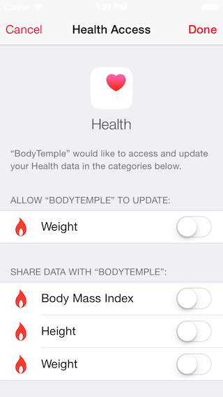
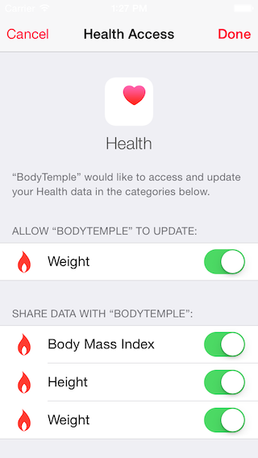

# iOS8 Day-by-Day :: Day 12 :: HealthKit

This post is part of a daily series of posts introducing the most exciting new
parts of iOS8 for developers - [#iOS8DayByDay](https://twitter.com/search?q=%23iOS8DayByDay).
To see the posts you've missed check out the [index page](http://shinobicontrols.com/iOS8DayByDay),
but have a read through the rest of this post first!

---

## Introduction

One of the more consumer-oriented features introduced in iOS8 is that of the
Health app. It was featured in the keynote at WWDC and was... THIS ISN'T
FINISHED.

The underlying technology behind the health app is HealthKit, which is
essentially a structured datastore designed specifically for health data. Not
only is there an schema for health data, but extra concerns such as access
permissions, querying and unit conversion. HealthKit allows app developers to
interact with this datastore - to add and query data points and calculate
statistics.

In today's article you'll get a whistle-stop tour of some of the features of
HealthKit, and see how easy it is to create an app which can save data points
and query the datastore. The accompanying app is called __BodyTemple__ and is
available in the github repo at
[github.com/ShinobiControls/iOS8-day-by-day](https://github.com/ShinobiControls/iOS8-day-by-day).

## Data Structure Overview

The structure of data in HealthKit represents an ontology of pretty much
everything related to personal well-being. This includes obvious measurements
such as body mass, but also extends to more specialized readings such as blood
oxygen saturation and dietary zinc. The underlying database is a set of time-
series - consisting of independent time-indexed samples.

In terms of code these samples are represented by the `HKSample` class, which
itself is a subclass of the immutable `HKObject` class. `HKObject` is the
fundamental type used in HealthKit - and includes properties such as `UIID`,
`source` and `metadata`. Since these objects are immutable, they are created
using initializers on the `HKQuantitySample` and `HKCategorySample` subclasses.
These are fairly self explanatory in their distinction between representing a
categorical data type and a quantifiable type (such as body mass). They each
have some kind of type property to specify what the value represents
(`categoryType` and `quantityType` respectively). The following demonstrates
creating a quantity sample for body mass:

    let weightType = HKObjectType.quantityTypeForIdentifier(HKQuantityTypeIdentifierBodyMass)
    let weightValue = HKQuantity(unit: HKUnit(fromString: "kg"), doubleValue: massNumber)
    let metadata = [ HKMetadataKeyWasUserEntered : true ]
    let sample = HKQuantitySample(type: weightType, quantity: weightValue,
                    startDate: datePicker.date, endDate: datePicker.date, metadata: metadata)  

- `HKObjectType` is a class which represents the aforementioned type property.
It has methods for creating types such as`quantityTypeForIdentifier()` and
`categoryTypeForIdentifier()`, which take a framework-defined string constant
to specify exactly which type it represents (e.g. `HKQuantityTypeIdentifierBodyMass`).
- A quantity sample obviously has an associated value, and this is provided by
the `HKQuantity` class. This requires a double value and an `HKUnit` object
which represents the units the double was measured in.
- You can provide a metadata dictionary including details such as the
measurement device - here the `HKMetadataKeyWasUserEntered` key shows that the
data has been manually entered.
- Finally the `HKQuantitySample` is constructed using the type, quantity and
metadata objects you've created, along with a start and end date.

The `HKUnit` class is an incredibly powerful concept, in that it will cause
HealthKit to convert between units (provided they represent the same physical
quantity) implicitly. This goes both for simple units (such as those
representing mass, volume and temperature) and for compound units (such as those
representing density). The powerful string parsing of the `HKUnit(fromString:)`
initializer is an excellent way to create these objects.

To see the selection of different values that can be recorded, check out the
__HKTypeIdentifiers__ file. The following represents a small selection:

- Body mass
- Body fat percentage
- Height
- Step count
- Blood glucose
- Blood alcohol content
- Dietary energy consumed
- Body temperature
- Inhaler usage

In addition to quantity and categorical time-series types, you can also store
characteristic types, that is those which are incredibly unlikely (or don't) to
change over time, for example date of birth, sex and blood type. You would
expect that a user would set these in the health app and then they are available
to you when reading data from the store.

As well as personal physical measurements, you can also store details of workout
sessions through the `HKWorkout` subclass of `HKSample`. This has properties for
recording the type of workout, the duration, the energy burned and the distance.
Since `HKWorkout` is another subclass of `HKObject` it is also immutable, so
these properties are all populated at initialization time. The energy burned and
distance are again examples of `HKQuantity` objects, and the activity type is an
enum (`HKWorkoutActivityType`) which includes over 50 types of exercise,
including:

- Archery
- CrossTraining
- Dance
- Fishing
- Hocket
- SkatingSports
- SnowSports
- StairClimbing
- Swimming
- Yoga

You'll notice that through out this run through of the data model, you've been
dealing solely with `HKObject` subclasses. This is very much like how CoreData
uses `NSManagedObject`, and allows the interface to the data store to be
consistent, irrespective of whether you're storing a workout or a blood pressure
reading. We'll take a look at this interface soon, but first there's a rather
important issue to take a look at - that of permissions.
 
## Permissions

By its nature, any data associated with health is extremely personal, and
therefore incredibly sensitive. Whilst having this central store for all health
data on a device is great - the security risk could be huge. For example, an ad
network knowing the user's body mass, and when they last ate is a huge concern
for privacy. It can also be a lot more subtle than that - there is huge
correlation between users recording blood sugar levels, and being diabetic - so
even knowing that the data _exist_ is a leak of personal data.

In order to protect users' privacy, HealthKit includes a very granular
permissions system, including a super-simple UI. In order for an app to read
from or write to HealthKit it has to ask the user for specific permissions. The
permissions are based on the types introduced in the last section - e.g.
`HKQuantityType` or `HKCharacteristicType`. All access to the data is performed
through a `HKHealthStore` object, and it is this that you request permissions
from. The following method demonstrates requesting access to the data store:

    private func requestAuthorisationForHealthStore() {
      let dataTypesToWrite = [
        HKQuantityType.quantityTypeForIdentifier(HKQuantityTypeIdentifierBodyMass)
      ]
      let dataTypesToRead = [
        HKQuantityType.quantityTypeForIdentifier(HKQuantityTypeIdentifierBodyMass),
        HKQuantityType.quantityTypeForIdentifier(HKQuantityTypeIdentifierHeight),
        HKQuantityType.quantityTypeForIdentifier(HKQuantityTypeIdentifierBodyMassIndex),
        HKCharacteristicType.characteristicTypeForIdentifier(HKCharacteristicTypeIdentifierDateOfBirth)
      ]
      
      self.healthStore?.requestAuthorizationToShareTypes(NSSet(array: dataTypesToWrite),
        readTypes: NSSet(array: dataTypesToRead), completion: {
        (success, error) in
          if success {
            println("User completed authorisation request.")
          } else {
            println("The user cancelled the authorisation request. \(error)")
          }
        })
    }

The method `requestAuthorizationToShareTypes(_:, readTypes:, completion:)`
accepts `NSSet` objects containing the quantities that you require to share (
write) and read. The completion closure is called once the procedure is complete.

When this method is run, then the store checks to see whether it has already
asked the user for this configuration of permissions. If it has then it will
call the completion block immediately - irrespective of whether permission was
granted or not. If it hasn't yet asked the user about this set of permissions
then it'll display a modal request page like this:

Note that you cannot discover whether you have permissions to read a given type,
and that if you attempt to write a type for which you do not have authorization
then you'll get an error back describing the problem.

You should only use one `HKHealthStore` throughout your app - this way meaning
that you can consolidate you permission requests to one point. In __BodyTemple__
this happens in the __TabBarViewController__, which since it is the top-level
view controller owns and propagates the health store to its child view
controllers, and requests the permissions required for use of the app.

## Writing Data

## Reading Data

## Conclusion