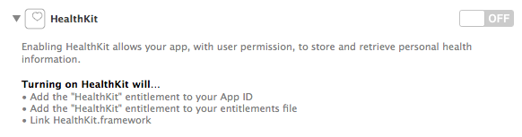
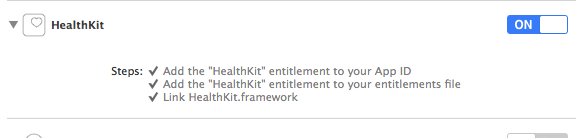
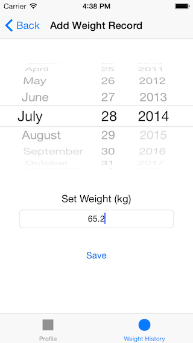
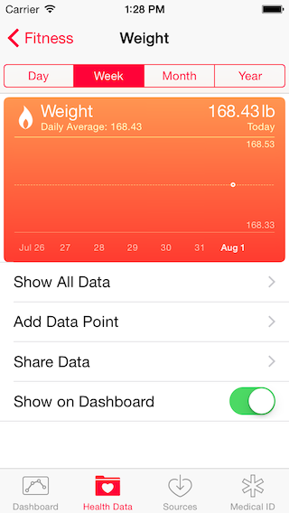
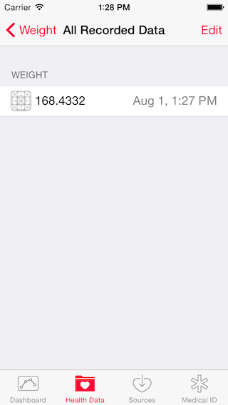
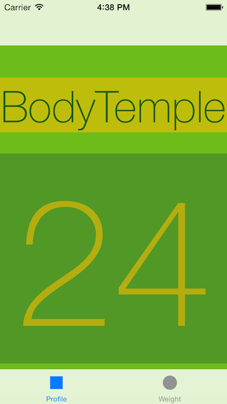
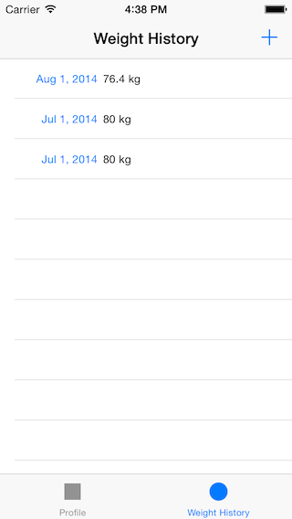

# iOS8 Day-by-Day :: Day 12 :: HealthKit

This post is part of a daily series of posts introducing the most exciting new
parts of iOS8 for developers - [#iOS8DayByDay](https://twitter.com/search?q=%23iOS8DayByDay).
To see the posts you've missed check out the [index page](http://shinobicontrols.com/iOS8DayByDay),
but have a read through the rest of this post first!

---

## Introduction

One of the more consumer-oriented features introduced in iOS8 is that of the
Health app. It was featured in the keynote at WWDC and has received a fair
amount of hype since that point. In fact some of the world's biggest names in
healthcare have already put their names behind it as being a huge step forward
in modern healthcare.

The underlying technology behind the health app is HealthKit, which is
essentially a structured datastore designed specifically for health data. Not
only is there an schema for health data, but extra concerns such as access
permissions, querying and unit conversion. HealthKit allows app developers to
interact with this datastore - to add and query data points and calculate
statistics.

In today's article you'll get a whistle-stop tour of some of the features of
HealthKit, and see how easy it is to create an app which can save data points
and query the datastore. The accompanying app is called __BodyTemple__ and is
available in the github repo at
[github.com/ShinobiControls/iOS8-day-by-day](https://github.com/ShinobiControls/iOS8-day-by-day).

## Data Structure Overview

The structure of data in HealthKit represents an ontology of pretty much
everything related to personal well-being. This includes obvious measurements
such as body mass, but also extends to more specialized readings such as blood
oxygen saturation and dietary zinc. The underlying database is a set of time-
series - consisting of independent time-indexed samples.

In terms of code these samples are represented by the `HKSample` class, which
itself is a subclass of the immutable `HKObject` class. `HKObject` is the
fundamental type used in HealthKit - and includes properties such as `UIID`,
`source` and `metadata`. Since these objects are immutable, they are created
using initializers on the `HKQuantitySample` and `HKCategorySample` subclasses.
These are fairly self explanatory in their distinction between representing a
categorical data type and a quantifiable type (such as body mass). They each
have some kind of type property to specify what the value represents
(`categoryType` and `quantityType` respectively). The following demonstrates
creating a quantity sample for body mass:

    let weightType = HKObjectType.quantityTypeForIdentifier(HKQuantityTypeIdentifierBodyMass)
    let weightValue = HKQuantity(unit: HKUnit(fromString: "kg"), doubleValue: massNumber)
    let metadata = [ HKMetadataKeyWasUserEntered : true ]
    let sample = HKQuantitySample(type: weightType, quantity: weightValue,
                    startDate: datePicker.date, endDate: datePicker.date, metadata: metadata)  

- `HKObjectType` is a class which represents the aforementioned type property.
It has methods for creating types such as`quantityTypeForIdentifier()` and
`categoryTypeForIdentifier()`, which take a framework-defined string constant
to specify exactly which type it represents (e.g. `HKQuantityTypeIdentifierBodyMass`).
- A quantity sample obviously has an associated value, and this is provided by
the `HKQuantity` class. This requires a double value and an `HKUnit` object
which represents the units the double was measured in.
- You can provide a metadata dictionary including details such as the
measurement device - here the `HKMetadataKeyWasUserEntered` key shows that the
data has been manually entered.
- Finally the `HKQuantitySample` is constructed using the type, quantity and
metadata objects you've created, along with a start and end date.

The `HKUnit` class is an incredibly powerful concept, in that it will cause
HealthKit to convert between units (provided they represent the same physical
quantity) implicitly. This goes both for simple units (such as those
representing mass, volume and temperature) and for compound units (such as those
representing density). The powerful string parsing of the `HKUnit(fromString:)`
initializer is an excellent way to create these objects.

To see the selection of different values that can be recorded, check out the
__HKTypeIdentifiers__ file. The following represents a small selection:

- Body mass
- Body fat percentage
- Height
- Step count
- Blood glucose
- Blood alcohol content
- Dietary energy consumed
- Body temperature
- Inhaler usage

In addition to quantity and categorical time-series types, you can also store
characteristic types, that is those which are incredibly unlikely (or don't) to
change over time, for example date of birth, sex and blood type. You would
expect that a user would set these in the health app and then they are available
to you when reading data from the store.

As well as personal physical measurements, you can also store details of workout
sessions through the `HKWorkout` subclass of `HKSample`. This has properties for
recording the type of workout, the duration, the energy burned and the distance.
Since `HKWorkout` is another subclass of `HKObject` it is also immutable, so
these properties are all populated at initialization time. The energy burned and
distance are again examples of `HKQuantity` objects, and the activity type is an
enum (`HKWorkoutActivityType`) which includes over 50 types of exercise,
including:

- Archery
- CrossTraining
- Dance
- Fishing
- Hocket
- SkatingSports
- SnowSports
- StairClimbing
- Swimming
- Yoga

You'll notice that through out this run through of the data model, you've been
dealing solely with `HKObject` subclasses. This is very much like how CoreData
uses `NSManagedObject`, and allows the interface to the data store to be
consistent, irrespective of whether you're storing a workout or a blood pressure
reading. We'll take a look at this interface soon, but first there's a rather
important issue to take a look at - that of permissions.
 
## Permissions

By its nature, any data associated with health is extremely personal, and
therefore incredibly sensitive. Whilst having this central store for all health
data on a device is great - the security risk could be huge. For example, an ad
network knowing the user's body mass, and when they last ate is a huge concern
for privacy. It can also be a lot more subtle than that - there is huge
correlation between users recording blood sugar levels, and being diabetic - so
even knowing that the data _exist_ is a leak of personal data.

Before your app can use HealthKit, you need to enable it in the __Capabilities__
pane of the project settings. This requires that you sign in to your Apple
developer account, and then acquires the appropriate entitlements for your app.

In order to protect users' privacy, HealthKit includes a very granular
permissions system, including a super-simple UI. In order for an app to read
from or write to HealthKit it has to ask the user for specific permissions. The
permissions are based on the types introduced in the last section - e.g.
`HKQuantityType` or `HKCharacteristicType`. All access to the data is performed
through a `HKHealthStore` object, and it is this that you request permissions
from. The following method demonstrates requesting access to the data store:

    private func requestAuthorisationForHealthStore() {
      let dataTypesToWrite = [
        HKQuantityType.quantityTypeForIdentifier(HKQuantityTypeIdentifierBodyMass)
      ]
      let dataTypesToRead = [
        HKQuantityType.quantityTypeForIdentifier(HKQuantityTypeIdentifierBodyMass),
        HKQuantityType.quantityTypeForIdentifier(HKQuantityTypeIdentifierHeight),
        HKQuantityType.quantityTypeForIdentifier(HKQuantityTypeIdentifierBodyMassIndex),
        HKCharacteristicType.characteristicTypeForIdentifier(HKCharacteristicTypeIdentifierDateOfBirth)
      ]
      
      self.healthStore?.requestAuthorizationToShareTypes(Set<NSObject>(arrayLiteral: dataTypesToWrite),
        readTypes: Set<NSObject>(arrayLiteral: dataTypesToRead), completion: {
        (success, error) in
          if success {
            println("User completed authorisation request.")
          } else {
            println("The user cancelled the authorisation request. \(error)")
          }
        })
    }

The method `requestAuthorizationToShareTypes(_:, readTypes:, completion:)`
accepts `NSSet` objects containing the quantities that you require to share (
write) and read. The completion closure is called once the procedure is complete.

When this method is run, then the store checks to see whether it has already
asked the user for this configuration of permissions. If it has then it will
call the completion block immediately - irrespective of whether permission was
granted or not. If it hasn't yet asked the user about this set of permissions
then it'll display a modal request page like this:

Note that you cannot discover whether you have permissions to read a given type,
and that if you attempt to write a type for which you do not have authorization
then you'll get an error back describing the problem.

You should only use one `HKHealthStore` throughout your app - this way meaning
that you can consolidate you permission requests to one point. In __BodyTemple__
this happens in the __TabBarViewController__, which since it is the top-level
view controller owns and propagates the health store to its child view
controllers, and requests the permissions required for use of the app.

## Writing Data

You've already seen the `HKHealthStore` object in the context of requesting
appropriate permissions, and this same object is used to both read and write to
the data store. Saving data is actually really simple - and this is primarily
because of the apparent complexity in the data model. Since every single thing
that can be stored in HealthKit is a descendant of `HKObject` then saving is as
simple as:

    func saveSampleToHealthStore(sample: HKObject) {
      println("Saving weight")
      self.healthStore?.saveObject(sample, withCompletion: {
        (success, error) in
        if success {
          println("Weight saved successfully 😃")
        } else {
          println("Error: \(error)")
        }
        })
    }

The `saveObject(_:, withCompletion:)` will attempt to save any `HKObject` to the
datastore, and since it is an asynchronous method it has a callback for when it
is complete. It is at this point that you would discover that your app doesn't
have permission to write (as in the screenshot in the previous section).

In __BodyTemple__ hitting save on the following screen will create a
`HKQuantitySample` object which is then saved on the screen dismissal:

Once this has completed you can see that it has worked in the Health app:

## Reading Data

There are several different approaches for requesting data from HealthKit,
depending primarily on the type of data you want to retrieve, and whether you
want HealthKit to perform any kind of processing on the data.

In the simplest case you might want to retrieve some characteristic data - such
as the date of birth of the user:

    func requestAgeAndUpdate() {
      var error: NSError?
      let dob = self.healthStore?.dateOfBirthWithError(&error)
      
      if error {
        println("There was an error requesting the date of birth: \(error)")
        return
      }
      
      // Calculate the age
      let now = NSDate()
      let age = NSCalendar.currentCalendar().components(.YearCalendarUnit, fromDate: dob,
                                                        toDate: now, options: .WrapComponents)
      
      self.ageLabel.text = "\(age.year)"
    }

There are methods directly on the `HKHealthStore` to get hold of these. The
above `requestAgeAndUpdate()` method populates a label with the user's age:

To request sampled data you need to create an `HKQuery`, which itself requires
a sample type and predicate, upon which to filter. The following method
demonstrates how to get a list of body mass samples for the last 2 months:

    func perfromQueryForWeightSamples() {
      let endDate = NSDate()
      let startDate = NSCalendar.currentCalendar().dateByAddingUnit(.CalendarUnitMonth,
        value: -2, toDate: endDate, options: nil)
      
      let weightSampleType = HKSampleType.quantityTypeForIdentifier(HKQuantityTypeIdentifierBodyMass)
      let predicate = HKQuery.predicateForSamplesWithStartDate(startDate,
        endDate: endDate, options: .None)
      
      let query = HKSampleQuery(sampleType: weightSampleType, predicate: predicate,
        limit: 0, sortDescriptors: nil, resultsHandler: {
        (query, results, error) in
          if !results {
            println("There was an error running the query: \(error)")
          }
          dispatch_async(dispatch_get_main_queue()) {
            self.weightSamples = results as! [HKQuantitySample]
            self.tableView.reloadData()
          }
        })
      self.healthStore?.executeQuery(query)
    }

Notice that the query is again asynchronous, and so you must provide a closure
to handle the delivery of the results. Note that this will occur on a background
queue and therefore you need to make sure that you marshal any UI updates back
to the main queue.

This represents a one-off query, but you might also want to perform a long-
running query, which will notify you each time new samples appear in the
database, by repeatedly calling the result handler closure. This can be useful
if you are working with values which have a high sample rate, and are being
created by a different app. This is exactly the functionality provided by
`HKObserverQuery`, which looks very similar to the `HKSampleQuery` your saw
above. Since it is a long-running query it must be canceled by calling the
`stopQuery(_:)` method on `HKHealthStore`.

Another query type worth mentioning is the anchored query, represented by the
`HKAnchoredObjectQuery`, which will provide you a pointer to the most recent
result returned. You can then re-run the query at a later stage and only get
newer results returned. This means that you don't have to repeatedly process the
result set to determine whether you have already seen each sample.

The final class worth mentioning with respect to HealthKit is `HKStatistics`,
which, as the name suggests, allows you to perform basic statistical treatments
of the dataset - i.e. finding the sum/mean. It's important here to be aware of
the fact that some measurements are cumulative (that is to say the a sum makes
sense, e.g. energy intake), whereas some are discrete - where min and max might
apply. These concepts are well-defined in HealthKit determined by the 
`HKQuantityAggregationStyle` enumeration.

You can also generate a collection of statistics (such as total energy consumed
per day for the last week) using the `HKStatisticsCollectionQuery`. This is an
expansion on a statistics query, but with the concept of time intervals and an
anchor date.

## Conclusion

On the surface of it the health app seems like a pretty cool idea for iOS8, but
once you get down into HealthKit then you realise that this could be really
quite powerful. In creating HealthKit Apple hasn't attempted to create one
healthcare app to rule them all, but instead has created a framework through
which the important aspects of healthcare monitoring can interoperate. There is
only one canonical set of body mass readings for a person, so why do they
currently have to be entered for each app? It's also a lot clearer to the end
user exactly what healthcare data the app has access to - which is another easy
win.

From the point of view of developers, having an easy-to-use pre-existing
datastore is huge news in itself. It might not offer the perfect schema for your
purposes, but the power of being able to share data entered from other apps is
huge.

Admittedly HealthKit is only going affect developers of apps in this space, but
it is certainly worth taking a look at it. It gives you an idea of how Apple's
APIs are modernizing as the ecosystem moves forward.

The code for the accompanying app is available on github at the usual place:
[github.com/ShinobiControls/iOS8-day-by-day](https://github.com/ShinobiControls/iOS8-day-by-day).
Go grab it, play with it and then complain about it to me on twitter - I'm 
[@iwantmyrealname](https://twitter.com/iwantmyrealname)

sam

