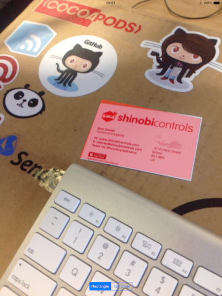
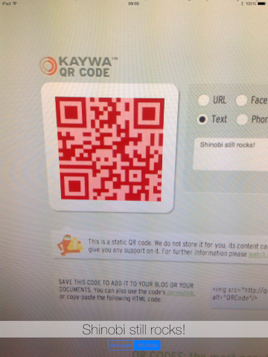

# iOS8 Day-by-Day :: Day 13 :: CoreImage Detectors

This post is part of a daily series of posts introducing the most exciting new
parts of iOS8 for developers - [#iOS8DayByDay](https://twitter.com/search?q=%23iOS8DayByDay).
To see the posts you've missed check out the [index page](http://shinobicontrols.com/iOS8DayByDay),
but have a read through the rest of this post first!

---

## Introduction

CoreImage never tends to get top-billing when looking at new features in iOS,
and this isn't terribly fair. Over the past few years CoreImage has seen some
huge advances in performance and functionality, and iOS8 is no exception. In
fact there are some really huge changes, including the ability to create custom
filter kernels for the first time. But that's not the focus of today's post -
instead we're going to concentrate on new feature detection algorithms.

Last year a face detector was added to __CoreImage__ - you can read about how to
use it in
[day 18](http://www.shinobicontrols.com/blog/posts/2013/10/15/ios7-day-by-day-day-18-detecting-facial-features-with-coreimage)
of iOS7 Day-by-Day. At the same time a QR code detector was added to
__AVFoundation__ - see
[day 16](http://www.shinobicontrols.com/blog/posts/2013/10/11/ios7-day-by-day-day-16-decoding-qr-codes-with-avfoundation),
but it's actually quite hard to use __AVFoundation__ in the general image case.
Well, the advances in __CoreImage__ in iOS8 improve the situation somewhat.

The __CIDetector__ class was introduced in iOS7, but only contained a facial
feature detector. iOS8 augments this with rectangle and QR code detection, which
are the subject of today's article.

The accompanying project is an app which takes a live camera view and runs the
frames through __CoreImage__, detecting either rectangles or QR codes. The code
is written in such a way that it is obvious how you can adapt it to work on
images you've grabbed from sources other than the camera - making it
particularly versatile. As usual, the source code is available in the
iOS8-day-by-day repo on github at
[github.com/ShinobiControls/iOS8-day-by-day](https://github.com/ShinobiControls/iOS8-day-by-day).
Note that since it uses a camera the app has to be run on a physical device.

## Detecting Rectangles

Detecting rectangles in images is often one of the first parts of a computer
vision algorithm - whether it be automatic business card interpretation, or road
sign processing. Although rectangle detection sounds like it should be a really
simple process, as with many problems in computer vision, it's far harder than
you might expect. So it's great that Apple have implemented an efficient
algorithm as part of the CoreImage detectors.

The main class associated with CoreImage detectors is the aptly-named
`CIDetector`. The same class is used for all the different types of detectors,
and is instantiated with the `CIDetector(ofType:, context:, options:)`
initializer. The `type` argument is a string, which for a rectangle detector is
`CIDetectorTypeRectangle`. The options argument is a dictionary of settings
associated with this detector. The following method created a `CIDetector` to be
used for detecting rectangles:

    func prepareRectangleDetector() -> CIDetector {
      let options = [CIDetectorAccuracy: CIDetectorAccuracyHigh, CIDetectorAspectRatio: 1.0]
      return CIDetector(ofType: CIDetectorTypeRectangle, context: nil, options: options)
    }

You can see that the options here are specifying the accuracy as high, with the
`CIDetectorAccuracy` key, and the `CIDetectorAspectRatio` key is used to specify
that you're searching for squares. This aspect ratio doesn't mean that you're
only looking for squares, but it will be used in the ranking of possible
rectangles to determine which is the most likely candidate. For example, if you
know that you're going to use the detector for business cards then setting the
aspect ratio to `2.0` will likely yield better results.

Once you've created a `CIDetector` it's actually really simple to use. The
method `featuresInImage()` takes a `CIImage` and then returns an array of
`CIFeature` objects (well, a subclass of) which represent the detected objects.
In the case of a rectangle detector, the `CIFeature` subclass is 
`CIRectangleFeature`, which has `CGPoint` properties for each of the four
corners of the detected rectangle.

The following method demonstrates how you can use the detector to find a
rectangle in a supplied `CIImage`:

    func performRectangleDetection(image: CIImage) -> CIImage? {
      var resultImage: CIImage?
      if let detector = detector {
        // Get the detections
        let features = detector.featuresInImage(image)
        for feature in features as [CIRectangleFeature] {
          resultImage = drawHighlightOverlayForPoints(image, topLeft: feature.topLeft, topRight: feature.topRight,
                                                      bottomLeft: feature.bottomLeft, bottomRight: feature.bottomRight)
        }
      }
      return resultImage
    }

This unwraps the option `detector`, before using the `featuresInImage()` method
to perform the detection itself. At the time of writing, the rectangle detector
will only ever detect one rectangle in an image, so the `features` array will
have either exactly one or zero `CIRectangleFeature` objects in it.

This method returns a new `CIImage`, which contains a red patch overlaid on the
source image over the position of the detected rectangle. This uses the utility
method `drawHighlightOverlayForPoints()` method:

    func drawHighlightOverlayForPoints(image: CIImage, topLeft: CGPoint, topRight: CGPoint,
                                       bottomLeft: CGPoint, bottomRight: CGPoint) -> CIImage {
      var overlay = CIImage(color: CIColor(red: 1.0, green: 0, blue: 0, alpha: 0.5))
      overlay = overlay.imageByCroppingToRect(image.extent())
      overlay = overlay.imageByApplyingFilter("CIPerspectiveTransformWithExtent",
        withInputParameters: [
          "inputExtent": CIVector(CGRect: image.extent()),
          "inputTopLeft": CIVector(CGPoint: topLeft),
          "inputTopRight": CIVector(CGPoint: topRight),
          "inputBottomLeft": CIVector(CGPoint: bottomLeft),
          "inputBottomRight": CIVector(CGPoint: bottomRight)
        ])
      return overlay.imageByCompositingOverImage(image)
    }

This method creates a colored image, and then uses the perspective transform
filter to map it to the points provided. It then creates a new `CIImage` by
overlaying this colored image with the source image.

In the __LiveDetection__ sample project, the `performRectangleDetection()`
method is used as part in the __CoreImageVideoFilter__ class to run the detector
on each of the frames received from the camera, before rendering it on screen.
This class is a little more involved than you might expect it to be, and it
isn't within the scope of this article to go in to much detail, however an
overview might be helpful.

1. An __AVFoundation__ pipeline is created which uses the camera as input, and
provides a pixel buffer of each frame to a delegate method.
2. In this delegate method a `CIImage` is created from this pixel buffer.
3. The provided filter function (which takes an input `CIImage` and returns a
new `CIImage`, much like a map function) is passed the current image.
4. The image is cropped to match the view size it is to be rendered in.
5. The `CIImage` is then rendered on the OpenGLES surface using a pre-created
`CIRenderContext`.
6. Rinse and repeat for each frame received from the camera.

If you need to do live video processing using __CoreImage__ then it might be
worth taking a look at this class in greater detail, but if you don't then the 
`performRectangleDetection()` method just takes a `CIImage`, which you can
create using one of the many constructors.

Running this app up will kick off the rectangle detection right away, and you'll
see results like the following on the screen:

The performance is pretty good for real-time use - certainly the demo app copes
well on an iPad 3.

## Detecting QR Codes

Once you've understood rectangle detection, then you'll find that QR code
detection is very similar. You again need to create a `CIDetector` instance,
this time with the detector type string being `CIDetectorTypeQRCode`:

    func prepareQRCodeDetector() -> CIDetector {
      let options = [CIDetectorAccuracy: CIDetectorAccuracyHigh]
      return CIDetector(ofType: CIDetectorTypeQRCode, context: nil, options: options)
    }

And then exactly the same procedure is used to actually perform the detection -
calling `featuresInImage()` and providing a `CIImage`. This time it will return
an array of `CIQRCodeFeature` objects - each of which has the same corner
points, with the addition of `messageString`.

The following method will again highlight the location of the barcode within the
provided image, but also return the decoded string:

    func performQRCodeDetection(image: CIImage) -> (outImage: CIImage?, decode: String) {
      var resultImage: CIImage?
      var decode = ""
      if let detector = detector {
        let features = detector.featuresInImage(image)
        for feature in features as [CIQRCodeFeature] {
          resultImage = drawHighlightOverlayForPoints(image, topLeft: feature.topLeft, topRight: feature.topRight,
            bottomLeft: feature.bottomLeft, bottomRight: feature.bottomRight)
          decode = feature.messageString
        }
      }
      return (resultImage, decode)
    }

In the __LiveDetection__ app this method is used in the same way as the
rectangle detection method, but with the addition that the text of a label is
updated with the current decoded value:

    detector = prepareQRCodeDetector()
    videoFilter.applyFilter = {
      image in
      let found = self.performQRCodeDetection(image)
      dispatch_async(dispatch_get_main_queue()) {
        if found.decode != "" {
          self.qrDecodeLabel.text = found.decode
        }
      }
      return found.outImage
    }

If you run the app up, select QR code, and then point the camera at a QR code
you can see the result:

## Conclusion

I think that CoreImage is really cool, and offers loads of functionality that
developers just aren't aware of, but maybe that's just me and my previous life 
in the world of computer vision. These new detectors are just part of what's
available, and are a much easier way of performing these detections than using
__AVFoundation__. Although you might not be able to use it directly in your apps
it's a fun thing to have a play with - and you never know when it might be
useful.

As ever, the code for the __LiveDetection__ demo app is available on github at 
[github.com/ShinobiControls/iOS8-day-by-day](https://github.com/ShinobiControls/iOS8-day-by-day
). Let me know you like it - follow me and say hi on twitter - I'm
[@iwantmyrealname](https://twitter.com/iwantmyrealname).

sam

