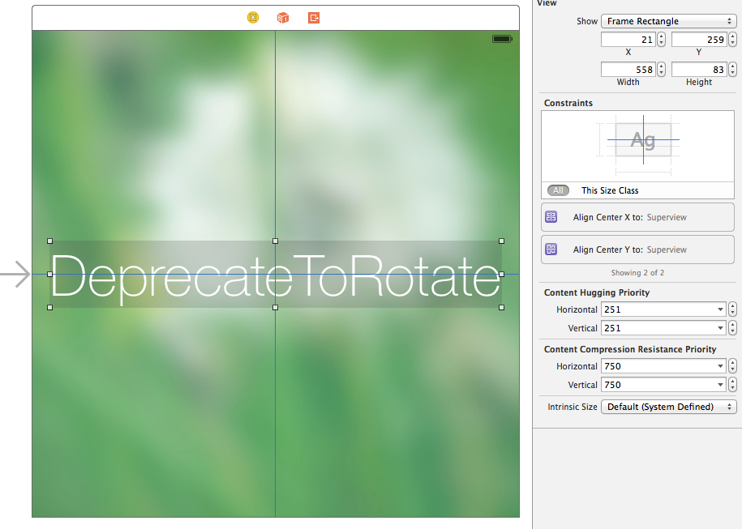
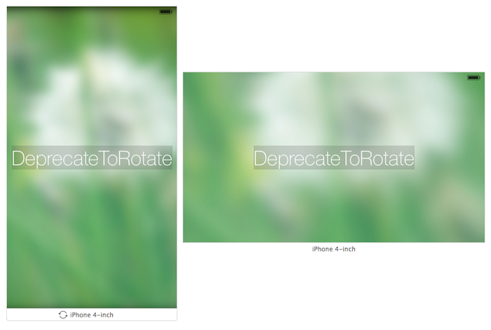
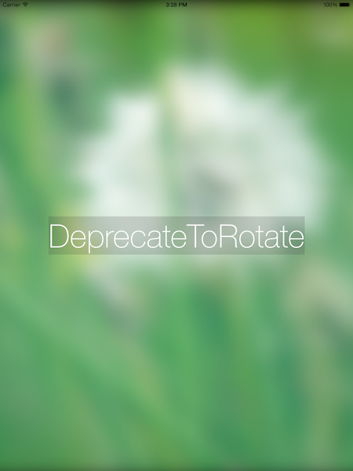
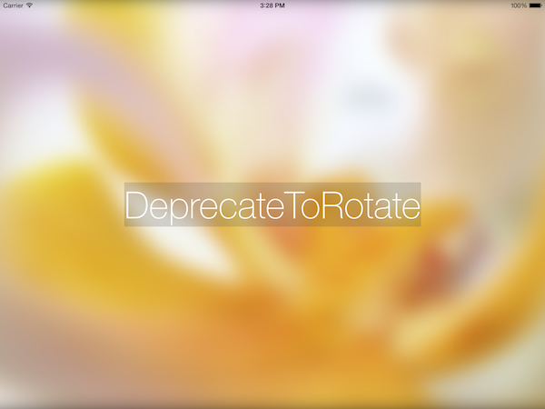

# iOS8 Day-by-Day :: Day 14 :: Rotation Deprecation

This post is part of a daily series of posts introducing the most exciting new
parts of iOS8 for developers - [#iOS8DayByDay](https://twitter.com/search?q=%23iOS8DayByDay).
To see the posts you've missed check out the [index page](http://shinobicontrols.com/iOS8DayByDay),
but have a read through the rest of this post first!

---

## Introduction

It might be scary to discover that as part of embracing adaptive UI in iOS8, the
view controller rotation methods you've come to love have all been deprecated.
In fact the new approach to rotation is far simpler and much more coherent.

In today's article you'll learn about how iOS8 deals with device rotation, and
what you need to do to get your apps up to scratch.

The accompanying app is a simple app called __RotateToDeprecate__, which
demonstrates how you can build a layout which rotates elegantly and then further
customize the rotation behavior. You can find the source code for the app in the
iOS8 Day-by-Day github repo at
[github.com/ShinobiControls/iOS8-day-by-day](https://github.com/ShinobiControls/iOS8-day-by-day).

## Auto Layout to the rescue

The underlying principle for rotation in iOS8 is that from the point of view of
the content, a rotation is simply a bounds change. Nothing more complicated than
that.

If you think about it this makes perfect sense: the window needs to know that
the device has been rotated so that it too can rotate to match the new
orientation. It also needs to resize since there are currently no iOS devices
with square screens. Now, from the point of view of the content of the window -
i.e. your view controller hierarchy, you just need to respect the change of size
of your parent - the fact that it is a rotation is not particularly relevant.

Therefore in the simplest case, dealing with rotation can be covered by having a
suitably adaptive layout - which leads you to using auto layout, storyboards and
size classes. If a rotation causes a size class change then your view controller
will automatically transition from one layout to the new one. Note that if the
rotation causes a trait collection change then your views will all get calls to
`traitCollectionDidChange()` and your view controllers calls to
`willTransitionToTraitCollection()`.

For example, in the __RotateToDeprecate__ app, the constraints on the large
label are set up simply to ensure that it is centered both vertically and
horizonally in its superview:

These constraints will be re-evaluated on rotation (or indeed on any superview
bounds change) to ensure that they are always valid. This means that the label
will be centered irrespective of orientation:

This is great news - and in most cases this is probably all you need to do. No
longer do you manually have to relayout your content in one of the rotation
methods. However, what if you do want to have some custom behavior? Read on...

## Customizing rotation behavior

You've already seen one of the ways that you can customize behavior of some
rotations - via the `willTransitionToTraitCollection()` method (which is on the
`UIContentContainer` protocol, which is itself adopted by `UIViewController`).
This method will be called _whenever_ the trait collection for a container
changes, which is true of rotations on an iPhone. It provides you with a
transition coordinator which allows you to hook in to the transition animation.

However, this won't be true for all rotations - for example, iPads have the same
size classes irrespective of their orientation, and therefore won't be
transitioning between trait collections on rotation. Helpfully there is another
method on the `UIContentContainer` protocol in the shape of 
`viewWillTransitionToSize(_:, coordinator:)`, which will be called whenever the
container is transitioning to a new size. You can override this method to
customize the rotation functionality.

The second argument to this method is a `UIViewControllerTransitionCoordinator`,
which you'll no doubt remember from the forest of protocols associated with
custom view controller transitions. In iOS8 their functionality has been
extended to supporting transitioning within a view controller as well as between
two view controllers.

If you wish to perform some custom animations you can use the
`animateAlongsideTransition(_:, completion:)` method which allows you to hook
into the system animation itself.

For example, in __DeprecateToRotate__, there are 2 possible background images -
one which should be associated with a __tall__ orientation, and one with
__wide__. The following method performs the switch between the background images:

    override func viewWillTransitionToSize(size: CGSize, withTransitionCoordinator coordinator: UIViewControllerTransitionCoordinator) {
      let transitionToWide = size.width > size.height
      let image = UIImage(named: transitionToWide ? "bg_wide" : "bg_tall")
      
      coordinator.animateAlongsideTransition({
        context in
        // Create a transition and match the context's duration
        let transition = CATransition()
        transition.duration = context.transitionDuration()
        
        // Make it fade
        transition.timingFunction = CAMediaTimingFunction(name: kCAMediaTimingFunctionEaseInEaseOut)
        transition.type = kCATransitionFade
        self.bgImageView.layer.addAnimation(transition, forKey: "Fade")
        
        // Set the new image
        self.bgImageView.image = image
        }, completion: nil)
    }

1. First we determine whether the transition is moving to a __wide__
configuration, by looking at the provided `size` argument.
2. This is used to choose which background image should be shown.
3. The `animateAlongsideTransition()` method is used to animate from the current
image to the new one.
4. A `CATransition` is used to get a nice fade effect. Note that you are
provided with a `UIViewControllerTransitionCoordinatorContext`, from which you
can find the duration of the animation.

You'll note that throughout this there has been no mention of the actual
rotation - which for 90% of cases is fantastic. However, there might be
occasions that your animation requires knowledge of the rotation - for example
complex rotation effects for parts of your content. In these instances you can
use the `targetTransform()` method on the transition coordinator context to
obtain the `CGAffineTransform` which represents the rotation. This will either
be a +90, -90 or 180 rotation or the identity transform.

## Conclusion

The thought of having to fix all your custom rotation code might seem daunting
at first, but in actual effect, this new rotation behavior is far more logical.
It enables you to not even think about rotation in 90% of the cases. You can
consider your content, and how it should be displayed in different layouts -
irrespective of not only the orientation but the device itself.

The sample project which accompanies today's post is available on github at
[github.com/ShinobiControls/iOS8-day-by-day](https://github.com/ShinobiControls/iOS8-day-by-day).
If you have any comments or just wanna say hi then hit me up on twitter - I'm
[@iwantmyrealname](https://twitter.com/iwantmyrealname).

sam

