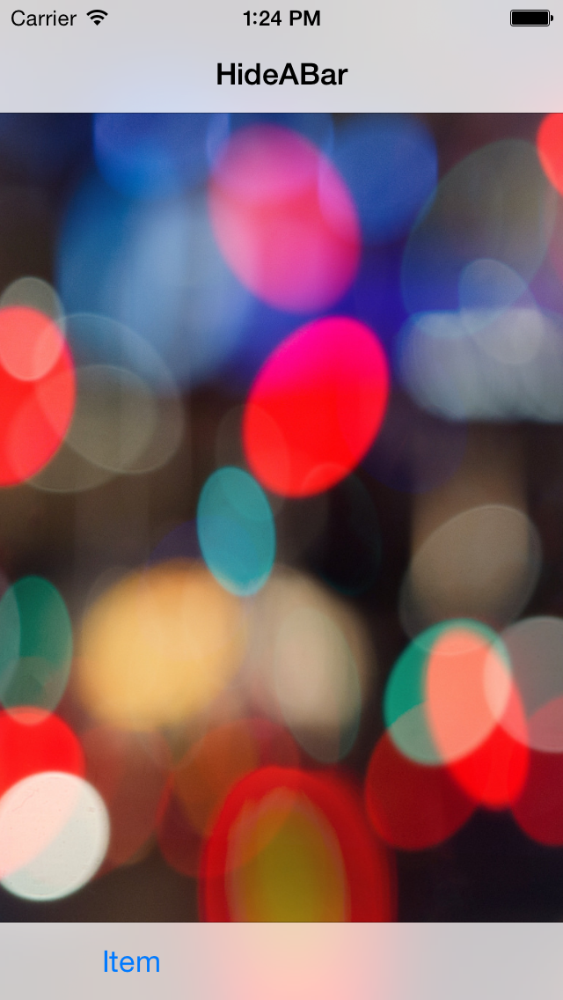
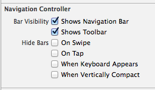

# iOS8 Day-by-Day :: Day 16 :: Navigation Bar Hiding

This post is part of a daily series of posts introducing the most exciting new
parts of iOS8 for developers - [#iOS8DayByDay](https://twitter.com/search?q=%23iOS8DayByDay).
To see the posts you've missed check out the
[introduction page](http://www.shinobicontrols.com/ios8daybyday),
but have a read through the rest of this post first!

---

## Introduction

Today's post is quite a short one - a snippet if you will, but that makes it no
less interesting or useful. Back in iOS7, Safari introduced the ability to show
and hide the navigation and tool bars by tapping or swiping. This really
allowed the content to shine through - reducing the proportion of the screen
dedicated to less-useful chrome at appropriate times.

In iOS8 the navigation controller has been updated with some additional
properties which offer this functionality out-the-box. In today's post you'll
learn about how to use it and how you can configure it to behave exactly as you
want.

There is a small accompanying project which is available in the iOS8 Day-by-Day
repo on github at
[github.com/ShinobiControls/iOS8-day-by-day](https://github.com/ShinobiControls/iOS8-day-by-day).

## Navigation Controller Updates

Since the bars usually present in an iOS app are part of a navigation
controller the auto-hiding functionality is made available through additions to
the `UINavigationContoller` API.

There are four different "modes" of bar hiding available - hiding on tap,
hiding on swipe, hiding based on vertical size class and hiding on keyboard
appearance.

### Hiding on tap

The simplest implementation is to have the bars disappear when you tap on the
view, and this is performed by setting the `hidesBarsOnTap` property to `true`.
You can also get hold of the gesture recognizer via the
`barHideOnTapGestureRecognizer` property. This means that you can use the
gesture delegate methods to use your own gesture recognizers in concert with
this 'global' tap recognizer.

Tapping is all well and good, but if you want to provide some UI that the user
should be able to interact with via tapping then it won't be clear whether
tapping with hide/reveal the bars, or interact with the content. In this
scenario then the swipe gesture might be more appropriate.

### Hiding on swipe

In the same way that tapping can show/hide the bars, there is also a built in
swipe gesture recognizer to perform exactly the same task. In this instance
rather than toggling, a swipe up will hide the bars and a swipe down will reveal
them again.

You can enable this behavior using the `hidesBarsOnSwipe` boolean property, and
again you can get hold of the gesture recognizer via the
`barHideOnSwipeGestureRecognizer` property.

### Hiding when vertically compact

Clearly a fairly common use case would be to hide the bars when there is a
restriction on vertical space. In the new world of adaptive layout this
corresponds to having a __compact__ vertical size class. This functionality is
again provided as a boolean property in the form of
`hidesBarsWhenVerticallyCompact`. Setting this to true will cause the bars to
disappear when the container becomes vertically compact. Note that you can use
this together with the tap and swipe properties to get the bars to re-appear in
this mode.

### Hiding on keyboard appearance

The final mode is controlled by the `hidesBarsWhenKeyboardAppears` boolean
property. Setting this to `true` will cause the bars to disappear when the
keyboard animates on screen. The user can bring the bars back simply by tapping
in the content area.

## Sample app

The sample app which accompanies this article is incredibly simple. It shows a
navigation controller which which has the tap, swipe and compact height
properties set to true:

    navigationController.hidesBarsOnSwipe = true
    navigationController.hidesBarsOnTap = true
    navigationController.hidesBarsWhenVerticallyCompact = true

The app will start with the bars visible by default:

Tapping, or swiping upwards will hide these bars:

If you rotate the iPhone then it'll transition to a compact vertical size class
and so the bars will hide:

As well as using the properties in code, the __Attributes Inspector__ inside
interface builder have some new check boxes to support this new behavior:

## Conclusion

Short and sweet - this is nice new functionality that's incredibly simple to
use. It has well-understood UX and really adopts the 'defer to content' paradigm
that was introduced in iOS7.

You can grab today's sample project from the iOS8 day-by-day github repo on the
ShinobiControls github at
[github.com/ShinobiControls/iOS8-day-by-day](https://github.com/ShinobiControls/iOS8-day-by-day).

You should follow me on Twitter - I'd like that very much. I'm 
[@iwantmyrealname](https://twitter.com/iwantmyrealname).

sam
