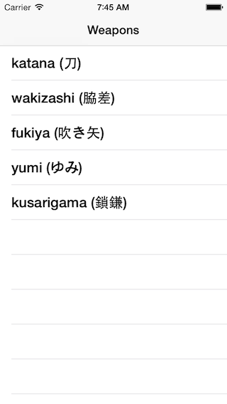
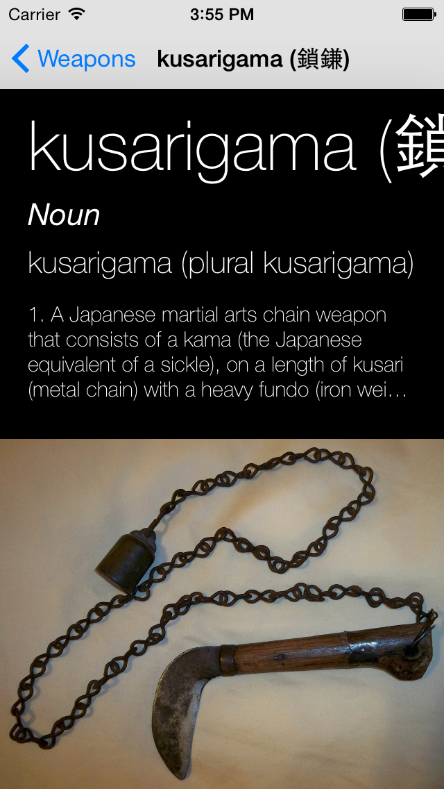
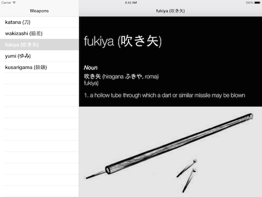
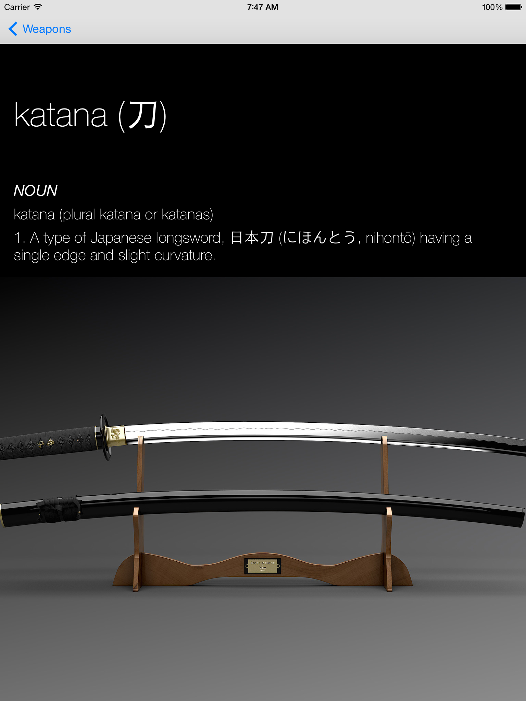
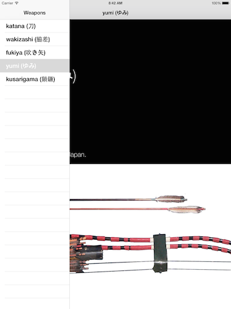
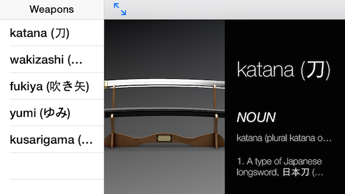

# iOS8 Day-by-Day :: Day 18 :: UISplitViewController

This post is part of a daily series of posts introducing the most exciting new
parts of iOS8 for developers - [#iOS8DayByDay](https://twitter.com/search?q=%23iOS8DayByDay).
To see the posts you've missed check out the [index page](http://shinobicontrols.com/iOS8DayByDay),
but have a read through the rest of this post first!

---

## Introduction

If you've used Xcode's master-detail template in the past then you'll be aware
of the rather confusing code that it creates. This is because it uses two
completely different view controller hierarchies depending on the device it's
running on. The split view controller works on the iPad, but not the iPhone, so
a navigation controller is used instead. This means that the code is littered
with idiom checks and repetition.

The fundamental principle is sound - you can't use the same view controller
hierarchy on all devices. However, there is no reason that this shouldn't be
abstracted away from the developer into the framework itself. This is exactly
what iOS8 does - with the introduction of adaptive view controller hierarchies.

In the master-detail scenario this means that a `UISplitViewController` can now be
used on all devices. It retains the same appearance on an iPad as in iOS7, but
on an iPhone it appears as a navigation controller.

In today's article you're going to learn more about what this means for your
code, and how you can override the default behavior. The accompanying project is
based on the master-detail project template in Xcode 6, so uses the new split
view controller. You can download the code from the ShinobiControls github at
[github.com/ShinobiControls/iOS8-day-by-day](https://github.com/ShinobiControls/iOS8-day-by-day).

## Adaptive View Controller Hierarchy

In the newly adaptive `UISplitViewController`, the view controller hierarchy is
determined by its horizontal size class. When `Compact` then the split view will
appear __Collapsed__ - in a navigation controller. The master view controller
will be displayed first, and selecting one of the rows in the table will push
the detail view controller onto the navigation stack.

This is in contrast to the `Regular` horizontal class, which expands to display
the master and detail view controllers simultaneously. This can be in a
selection of configurations - known as display modes. This defaults in the
landscape having a permanently visible primary column:

And in portrait an overlaid view controller which can be toggled using the left
button item in the navigation bar:

Importantly, the new split view controller requires no differences in code to
represent the two different view controller hierarchies. Providing the detail
view controller with the appropriate model object is now performed in the 
`prepareForSegure(segue:, sender:)` method:

    override func prepareForSegue(segue: UIStoryboardSegue, sender: AnyObject?) {
      if segue.identifier == "showDetail" {
        let indexPath = self.tableView.indexPathForSelectedRow()
        if let weapon = weaponProvider?.weapons[indexPath.row] {
          let controller = (segue.destinationViewController as UINavigationController).topViewController as DetailViewController
          controller.weapon = weapon
          controller.navigationItem.leftBarButtonItem = self.splitViewController.displayModeButtonItem()
          controller.navigationItem.leftItemsSupplementBackButton = true
        }
      }
    }

This raises an interesting problem - if you want to present a new view
controller in the secondary pane in code then you need to know whether the split
view is currently appearing as a navigation controller, or an expanded split
view. To address this, two new methods have been added to `UIViewController` in
the form of `showViewController()` and `showDetailViewController()`. These
methods have different behavior depending on the hierarchy the view controller
finds itself in. The ancestors are interrogated in turn until one is found which
provides an implementation. If either reaches the root view controller then the
provided view controller will be displayed using `presentViewController()`.

The following table details the behaviors exhibited in different scenarios:

|                         | `show`    | `showDetail`                      |
|-------------------------|-----------|-----------------------------------|
| Navigation Controller   | `push`    | -                                 |
| Expanded Split View     | -         | redirect to a `show` on secondary |
| Collapsed Split View    | -         | redirect to a `show` on primary   |
| Vanilla view controller | -         | -                                 |
| Root                    | `present` | `present`                         |

This might look complicated, but the end result is that using the show and
show detail methods will not only guarantee that the supplied view controller
will be displayed, but that it will make sense for the current context.

## Overriding Default Behavior

Since the appearance is determined by size class you can easily show an expanded
split view on an iPhone by overriding the trait collection. This is done by
creating a container view controller and providing a trait collection override.

The sample application overrides the horizontal size class based on the width of
the current view:

    class TraitOverrideViewController: UIViewController, UISplitViewControllerDelegate {
      
      override func viewDidLoad() {
        super.viewDidLoad()
        performTraitCollectionOverrideForSize(view.bounds.size)
      }
      
      override func viewWillTransitionToSize(size: CGSize, withTransitionCoordinator coordinator: UIViewControllerTransitionCoordinator) {
        super.viewWillTransitionToSize(size, withTransitionCoordinator: coordinator)
        performTraitCollectionOverrideForSize(size)
      }
      
      private func performTraitCollectionOverrideForSize(size: CGSize) {
        var overrideTraitCollection: UITraitCollection? = nil
        if size.width > 320 {
          overrideTraitCollection = UITraitCollection(horizontalSizeClass: .Regular)
        }
        for vc in self.childViewControllers as [UIViewController] {
          setOverrideTraitCollection(overrideTraitCollection, forChildViewController: vc)
        }
      }
    }

`performTraitCollectionOverrideForSize()` takes a `CGSize`, and if the width is
larger than 320pts forces all the child view controllers to have a horizontally
regular size class. This method needs to be called in two places - once when the
view first loads, and then whenever the view controller changes size, the latter
using the new `viewWillTransitionToSize(_:, withTransitionCoordinator:)` method.

## Advanced Features

The split view delegate has new methods as well - which you can use to control
the behavior associated with expanding and collapsing split views. This occurs
when the split view transitions from being expanded to being collapsed - e.g. on
the newly updated iPhone version of __NinjaWeapons__.

You can specify whether a the detail view controller should be popped onto the
master's navigation stack when the split view is collapsing, and conversely
whether the top view controller should be used as the detail view when expanding
. The default behavior is great for most use cases, but if you have a more
complex hierarchical data structure, then these methods are invaluable.

The delegate methods even allow you to specify completely new view controllers
in these cases - so you can build a completely custom split view.

`UISplitViewController` also provides a toolbar button which allows cycling
between the different display modes when the split view is expanded. This button
adapts to the current circumstance - so it will show/hide an overlaid master VC,
or toggle between always visible and hidden otherwise. This button is accessible
via the `displayModeButtonItem()` method.

The width of the split is also configurable via the
`preferredPrimaryColumnWidthFraction`, `minimumPrimaryColumnWidth` and
`maximumPrimaryColumnWidth` properties on `UISplitViewController`.

The following code is used in __NinjaWeapons__ to configure both the split width
and set up the display mode button:

    private func configureSplitVC() {
      // Set up split view delegate
      let splitVC = self.childViewControllers[0] as UISplitViewController
      splitVC.delegate = self
      splitVC.preferredPrimaryColumnWidthFraction = 0.3
      let navVC = splitVC.childViewControllers.last as UINavigationController
      navVC.topViewController.navigationItem.leftBarButtonItem = splitVC.displayModeButtonItem()
    }

## Conclusion

The new and improved `UISplitViewController` is great - removing both idiom
checks and repeated code. It's out-the-box functionality is suitable for many
use cases, but is easily extendable to cover more esoteric requirements.

If you want to dive head-first into the new `UISplitViewController` in loads
more detail then I've written an entire chapter on the topic in the Ray
Wenderlich iOS8 By Tutorials book. It comes highly recommended (by me, as one of
the authors) and you can grab your copy from here.

The __NinjaWeapons__ project is available on github, as usual. It's at
[github.com/ShinobiControls/iOS8-day-by-day](https://github.com/ShinobiControls/iOS8-day-by-day).
Find me on twitter and tell me your favorite color - I'm
[@iwantmyrealname](https://twitter.com/iwantmyrealname).

sam
