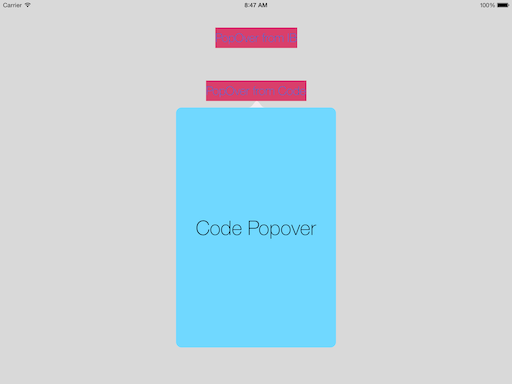
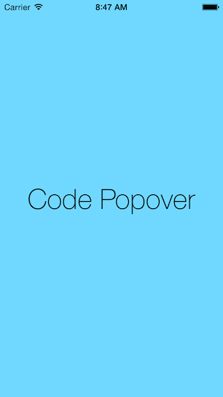
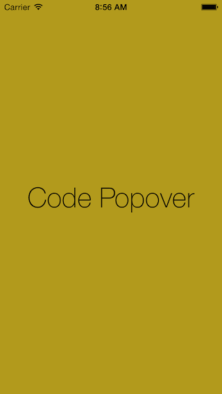
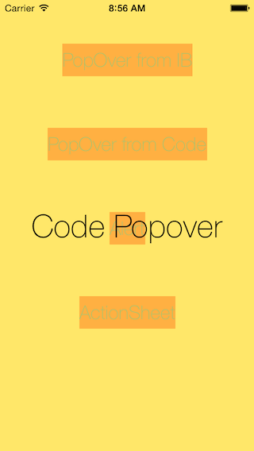
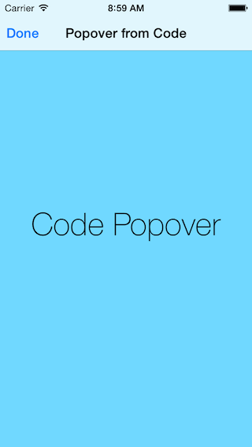
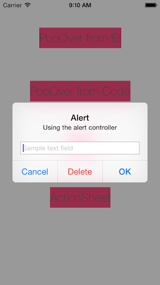
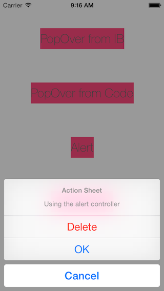
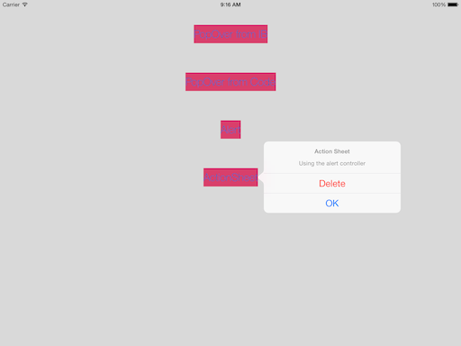

# iOS8 Day-by-Day :: Day 21 :: Alerts and Popovers

> __Apr 14 2015__ Updated to match changes in documentation of
> `UIPopoverPresentationController`

This post is part of a daily series of posts introducing the most exciting new
parts of iOS8 for developers - [#iOS8DayByDay](https://twitter.com/search?q=%23iOS8DayByDay).
To see the posts you've missed check out the [index page](http://shinobicontrols.com/iOS8DayByDay),
but have a read through the rest of this post first!

---

## Introduction

Presenting new views and view controllers to users on iOS has evolved a lot
since the original iPhoneOS. This has resulted in a pretty inconsistent state in
iOS7 - with some presentation methods being device restrictive, and others
creating views in second UIWindow objects.

iOS8 introduces the concept of a presentation controller, in the form of 
`UIPresentationController`. This is used to control the process of presenting
new view controllers in every scenario. This means that the way you use alerts,
popovers and action sheets has changed, to make a much more coherent and self-
consistent system.

This post won't go into depth on presentation controllers (that may well appear
in a later article), but instead focuses on what you need to know to update your
apps to the new iOS8 way of presenting popovers, alerts and action sheets.

The sample app which accompanies this project is available on github at
[github.com/ShinobiControls/iOS8-day-by-day](https://github.com/ShinobiControls/iOS8-day-by-day).

## Pop Overs

Popovers are now completely adaptive - which means that rather than having
separate code paths for iPhone and iPad, they can be used on every device. A new
class `UIPopoverPresentationController` has been introduced, and this controls
the presentation of a view controller in a popover style. You don't create one
of these directly, but instead one is created for you by UIKit when the 
`modalPresentationStyle` property on `UIViewController` is set to `.Popover`.

    let popoverVC = storyboard?.instantiateViewControllerWithIdentifier("codePopover") as! UIViewController
    popoverVC.modalPresentationStyle = .Popover

Presenting the popover is as simple as calling `presentViewController()`:

    presentViewController(popoverVC, animated: true, completion: nil)

Once you've called `presentViewController(_:, animated:)` you can then get hold of the popover presentation controller from the
`popoverPresentationController` property of `UIViewController`:

    let popoverController = popoverVC.popoverPresentationController

This has settings that you'll recognize from `UIPopoverController` which you can
use to configure the popover:

    popoverController.sourceView = sender
    popoverController.sourceRect = sender.bounds
    popoverController.permittedArrowDirections = .Any

Note the workflow is slightly counter-intuitive here: you have to 'present'
the popover view controller before configuring it. This is because the
presentation controller isn't created until presentation.

The popover presentation controller is inherently adaptive - a regular
horizontal size class will show a traditional popover, but a compact will (by
default) present using a full-screen modal presentation.

You can configure exactly how the adapted view controller appears (i.e. for 
compact width) using a `UIPopoverPresentationDelegate`. This has two methods -
one for specifying the modal presentation style, and the other for returning a
custom view controller.

You set the delegate as you'd expect:

    popoverController.delegate = self

The adaptive presentation style can be either `.FullScreen` or `.OverFullScreen`,
the difference being that fullscreen will remove the presenting view controller's
view, whereas over-fullscreen won't. You can set it with the following delegate
method:

    func adaptivePresentationStyleForPresentationController(controller: UIPresentationController) -> UIModalPresentationStyle {
      return .FullScreen
    }

You can see the difference by setting the background color to semi-transparent, 
as shown below:

The other delegate method allows you to return a completely custom view
controller for the adaptive display. For example, the following will put the
popover view controller inside a navigation controller:

    func presentationController(controller: UIPresentationController, 
              viewControllerForAdaptivePresentationStyle style: UIModalPresentationStyle) -> UIViewController? {
      return UINavigationController(rootViewController: controller.presentedViewController)
    }

And will result in something that looks like this:

Note that none of this has changed the appearance for regular width - that will
still show as a standard popover controller.

## Alerts

In the past, alerts were actually a subclass of `UIView`, which were then
displayed in a new `UIWindow`. This caused all kinds of issues with rotation and
really doesn't fit the adaptive rotation-agnostic world of iOS8. Since alerts
are just another way to present content, they have been brought in-line with the
rest of UIKit, in that it is just a `UIViewController` that is displayed using
the `presentViewController()` method.

The class you need is `UIAlertController`, and it is instantiated with a title,
message and preferred style:

    let alert = UIAlertController(title: "Alert",
                                  message: "Using the alert controller",
                                  preferredStyle: .Alert)

There are two options for the `preferredStyle`, and this represents the
difference between alerts and actionsheets.

The API has been modernized to use closures instead of delegate callbacks, so
you can add buttons as actions:

    alert.addAction(UIAlertAction(title: "Cancel",
                                  style: .Cancel,
                                  handler: dismissHandler))

Here, `dismissHandler` is defined as follows:

    let dismissHandler = {
      (action: UIAlertAction!) in
      self.dismissViewControllerAnimated(true, completion: nil)
    }

There are three different styles for `UIAlertAction`: `.Cancel`, `.Default` and
`.Destructive`.

You can also add text fields to alerts with
`addTextFieldWithConfigurationHandler`, which requires a closure which takes a
`UITextField` and configures it appropriately:

    alert.addTextFieldWithConfigurationHandler { textField in
      textField.placeholder = "Sample text field"
    }

Since `UIAlertController` is a subclass of `UIViewController`, you can then
present it as you would any other:

    presentViewController(alert, animated: true, completion: nil)

This will look like this:

## ActionSheets

Action sheets are actually a different style of a `UIAlertController`:

    let actionSheet = UIAlertController(title: "Action Sheet",
                                        message: "Using the alert controller",
                                        preferredStyle: .ActionSheet)

You can't display text fields in an action sheet, but actions are created in
exactly the same way as for an alert:

    let dismissHandler = {
      (action: UIAlertAction!) in
      self.dismissViewControllerAnimated(true, completion: nil)
    }
    actionSheet.addAction(UIAlertAction(title: "Cancel", style: .Cancel, handler: dismissHandler))
    actionSheet.addAction(UIAlertAction(title: "Delete", style: .Destructive, handler: dismissHandler))
    actionSheet.addAction(UIAlertAction(title: "OK", style: .Default, handler: dismissHandler))

Action sheets are adaptive, and when in a regular horizontal size class will
appear as a popover controller. You can configure the popover controller by
grabbing hold of the popover presentation controller, exactly as you did for
popover controllers:

    if let presentationController = actionSheet.popoverPresentationController {
      presentationController.sourceView = sender
      presentationController.sourceRect = sender.bounds
    }

And since an action sheet is again a `UIViewController` subclass, you present it
in the same way:

    presentViewController(actionSheet, animated: true, completion: nil)

## Conclusion

It's great when Apple take a look back at existing parts of the framework and
consolidate the way in which it works. This section of UIKit had evolved over
many years, and was in need of modernization. The quest for adaptivity and
becoming device agnostic has made it an ideal time to rethink the way they work.
It's an area that you should make sure you are aware of - it's a lot more
understandable than it used to be.

As ever, all the code for today's article is available on the ShinobiControls
github at
[github.com/ShinobiControls/iOS8-day-by-day](https://github.com/ShinobiControls/iOS8-day-by-day).
Let me know what you think on twitter 
[@iwantmyrealname](https://twitter.com/iwantmyrealname).

sam

