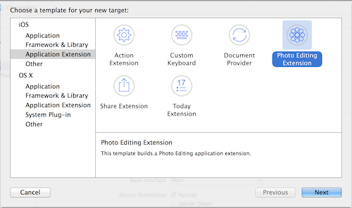
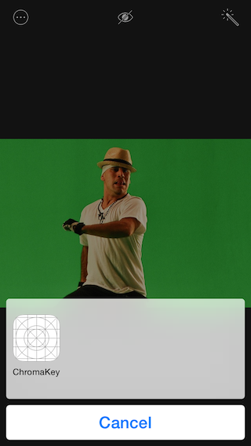

# iOS8 Day-by-Day :: Day 23 :: Photo Extension

This post is part of a daily series of posts introducing the most exciting new
parts of iOS8 for developers - [#iOS8DayByDay](https://twitter.com/search?q=%23iOS8DayByDay).
To see the posts you've missed check out the
[introduction page](http://www.shinobicontrols.com/ios8daybyday),
but have a read through the rest of this post first!

---

## Introduction

iOS8 Day-by-Day has looked at a couple of the new extensions in iO8 already -
the share extension and the today extension. In today's article you're going to
learn the basics behind the photo extension.

Extension points are ways that you can write your own code and functionality
which enhance the OS in more far-reaching ways than just your app. In the case
of photo extensions, you can create filters and more complex editing
functionality that will be available to the Photos app and any other apps which
request it.

The sample code which accompanies today's article builds a photo extension from
the chromakey core image filter that was used in day 19. You can get the source
code from the ShinobiControls github at
[github.com/ShinobiControls/iOS8-day-by-day](https://github.com/ShinobiControls/iOS8-day-by-day).

## Creating a Photo Extension

In the same way as for the other extension types, the easiest way to create a
photos extension is to use the template provided by Xcode 6:

This create a new target, and within it a subclass of `UIViewController`, which
adopts the `PHContentEditingController` protocol. This adds some lifecycle
methods which are are specific to photo extensions.

You can probably guess from the fact that this is a view controller, that a
photo extension has UI which is provided by you. In fact, the view controller is
presented with a navigation bar containing the name of the photo extension. The
rest is up to you. Since it's just a subclass of `UIViewController` you can use
all the usual techniques, including creating the design in a storyboard.

In the ChromaKey extension which accompanies this article, a simple design
including a slider is used to display the live result from the filter, and to
configure the threshold. This layout is created in the storyboard.

The project also contains the custom `CIFilter` class from day 19 - and the 
`PhotoEditingViewController` contains a reference to one:

    class PhotoEditingViewController: UIViewController, PHContentEditingController {
      
      let filter = ChromaKeyFilter()
      ...
    }

You'll use this filter both during the interactive editing phase, and also when
rendering the final image.

## Starting Interactive Editing

One of the methods defined on `PHContentEditingController` signifies the
beginning of the photo editing process - 
`startContentEditingWithInput(contentEditingInput:, placeholderImage:)`. This is
called when the user selects your extension from the list in the edit menu:

At this point here it is your responsibility to grab hold of the image, provide
it to your filter and enable the interactive controls which allow the user to
edit the photo.

    func startContentEditingWithInput(contentEditingInput: PHContentEditingInput?, placeholderImage: UIImage) {
      input = contentEditingInput
      filter.inputImage = CIImage(image: input?.displaySizeImage)
      thresholdSlider.value = filter.threshold
      updateOutputImage()
    }

You are provided a `PHContentEditingInput` object, which includes info about the
media you're editing. Importantly, there are several different ways you can get
hold of an input image:

- The supplied `placeholderImage`. This is a `UIImage` of what the output of
your filter provided last time (if you're using resumable editing). Use this if
it takes a long time to set up your filter process.
- The `displaySizeImage` property on `contentEditingInput`. This is a `UIImage`
which has been appropriately scaled to the current screen size. This should be
used for interactive editing, since it will be less processor intensive than
using the full-sized image.
- The `fullSizeImageURL` property on `contentEditingInput`. This provides you
access to the full-sized image, so that you can apply the final edit to the
original image. You should only use this during the edit finalization stages.

In the __ChromaKey__ example above, a the `displaySizeImage` is pushed into
CoreImage and then provided to the filter as the input image. The slider is set
to the appropriate value and then `updateOutputImage()` is called, which invokes
the filter:

    private func updateOutputImage() {
      filter.threshold = thresholdSlider.value
      glRenderer?.renderImage(filter.outputImage)
    }

This method uses a custom `GLRenderer` class to display the image in a `GLKView`
on the screen. This ensures that the filtering and display all takes place on
the GPU, and the image isn't being passed back and forth through the CPU. The
key method of the `GLRenderer` class is `renderImage()`, which is very similar
to the code used in the CoreImage live detection code from day 13:

    func renderImage(image: CIImage) {
      glView.bindDrawable()
      if glView.context != EAGLContext.currentContext() {
        EAGLContext.setCurrentContext(glView.context)
      }
      
      // Calculate the position and size of the image within the GLView
      // This code is equivalent to UIViewContentModeScaleAspectFit
      let imageSize = image.extent().size
      var drawFrame = CGRectMake(0, 0, CGFloat(glView.drawableWidth), CGFloat(glView.drawableHeight))
      let imageAR = imageSize.width / imageSize.height
      let viewAR = drawFrame.width / drawFrame.height
      if imageAR > viewAR {
        drawFrame.origin.y += (drawFrame.height - drawFrame.width / imageAR) / 2.0
        drawFrame.size.height = drawFrame.width / imageAR
      } else {
        drawFrame.origin.x += (drawFrame.width - drawFrame.height * imageAR) / 2.0
        drawFrame.size.width = drawFrame.height * imageAR
      }
      
      // clear eagl view to black
      glClearColor(0.0, 0.0, 0.0, 1.0);
      glClear(0x00004000)
      
      // set the blend mode to "source over" so that CI will use that
      glEnable(0x0BE2);
      glBlendFunc(1, 0x0303);
      
      renderContext.drawImage(image, inRect: drawFrame, fromRect: image.extent())
      
      glView.display()
    }

In order to make the editing interactive, the threshold slider is wired up such
that as the user changes the value, the filter is updated, and the image
re-rendered:

    @IBAction func handleThresholdSliderChanged(sender: UISlider) {
      updateOutputImage()
    }

That's it for getting the photo extension up and running. Now you need to cope
with the next phases of the lifecycle - first up: when the user cancels the
edit.

## Discard Changes?

## Finalizing the Edit

## Resumable Editing

## Conclusion

Photo extensions are a quite specialized - unless your app is in the business of
providing custom image manipulation algorithms. That doesn't make them any less
cool - in fact the fact that Apple has opened up this kind of functionality is
really rather exciting for the platform.

In addition to all the easy-access retro-filters that we can all use to take
hipster photos of our food, I think it'll be really exciting to see what other
ideas people come up with. For example, you could use a photo extension to
implement a steganography algorithm right into a filter, and then use it from
the photos app. Pretty cool stuff.

The source code for today's algorithm is available, as ever, on the
ShinobiControls github at
[github.com/ShinobiControls/iOS8-day-by-day](https://github.com/ShinobiControls/iOS8-day-by-day).
Take a look at it and let me know if you disagree with it :) Or at least give me
a follow on twitter - I'm [@iwantmyrealname](https://twitter.com/iwantmyrealname).

sam

