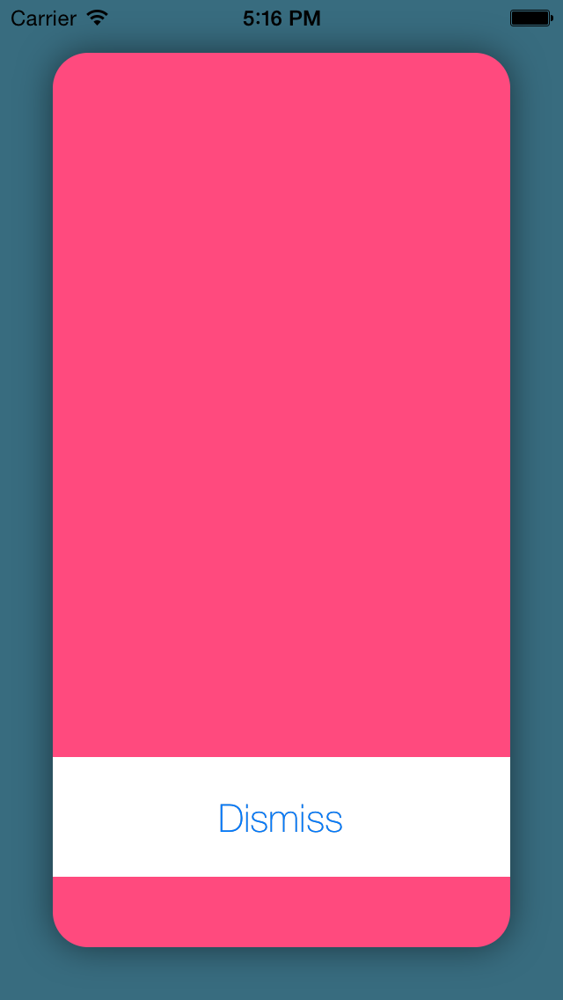
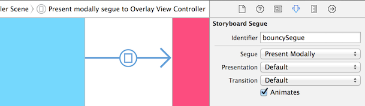
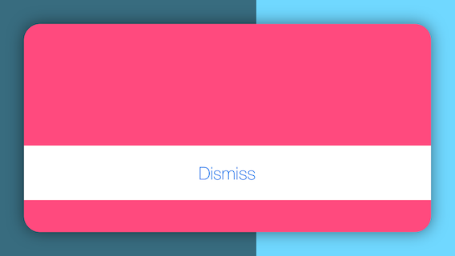
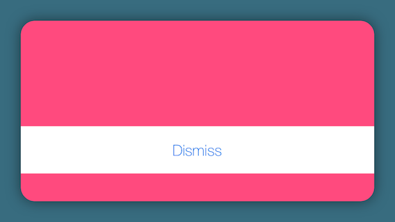

# iOS8 Day-by-Day :: Day 24 :: Presentation Controllers

This post is part of a daily series of posts introducing the most exciting new
parts of iOS8 for developers - [#iOS8DayByDay](https://twitter.com/search?q=%23iOS8DayByDay).
To see the posts you've missed check out the
[introduction page](http://www.shinobicontrols.com/ios8daybyday),
but have a read through the rest of this post first!

---

## Introduction

Back on [day 21](http://www.shinobicontrols.com/blog/posts/2014/08/26/ios8-day-by-day-day-21-alerts-and-popovers/)
you saw how UIKit has been updated to give a more consistent approach to showing
alerts, popovers and action sheets. The technology underlying this uses
presentation controllers, which are new to iOS8. It's possible to provide
your own custom presentation controllers for use in view controller transitions
and presentations.

In today's article you'll learn about what exactly presentation controllers are
for, what they can do and how to create your own. The project which accompanies
today's post is called __BouncyPresent__ and shows how to use a custom
presentation controller to create a customized modal view controller
presentation. It uses some of the view controller transitioning animation
concepts introduced in iOS7 alongside the new presentation controller concepts
to create an easy-to-understand, reusable presentation component.

As ever, the source code is available on the ShinobiControls github, at
[github.com/ShinobiControls/iOS8-day-by-day](https://www.shinobicontrols.com/iOS8-day-by-day).

## The role of the Presentation Controller

Whenever a view controller appears on the screen of an iOS device, it is said to
be presented. The improvements to alerts and the suchlike discussed in day 21
included consolidating all the different techniques into using view controllers,
so that they too become view controller presentations. In order to control how a
view controller is presented, iOS8 introduces `UIPresentationController`.

UIKit uses a presentation controller to manage the presentation of view
controllers from the moment they appear, through their lifetime, until they are
dismissed. The common modal presentation styles (such as popover) have built-in
presentation controllers, which exhibit the desired behavior, but if you
wish to provide your own then you must set the `modalPresentationStyle` to
`.Custom` (further implementation detail will be discussed later).

The presentation controller is responsible for positioning the view controller
which is being presented, and for adding any extra views to the view hierarchy
as appropriate. For example, in the sample app today, the presentation
controller will ensure that the presented view controller is inset from the
container, and a view which appears to dim the background will be added behind
the presented view controller.

On the surface of it, presentation controllers don't allow you to do anything
that you couldn't do before using the view controller transitioning system
in iOS7, but the responsibilities are much clearer. An animation controller is
responsible for the animation and the display of the view controller's content,
and the presentation controller is responsible for the appearance of everything
else. In the past, view controllers were responsible for views which weren't
within their own view hierarchy, which was confusing at best. As you'll see,
presentation controllers control the wider view hierarchy, and have hooks which
allow them to animate alongside the existing animations.

## Creating a custom Presentation Controller

Custom presentation controllers inherit from `UIPresentationController`, which
provides various methods which hook in to the lifecycle of a view controller
presentation. In the associated sample project, `OverlayPresentationController`
is a custom presentation controller, which ensures that the presented view
controller is inset from the container, and the background content is suitably
dimmed:

The dimming view is a property on the `OverlayPresentationController`, so that a
reference is maintained:

    class OverlayPresentationController: UIPresentationController {
       let dimmingView = UIView()
       ...
    }

The view is configured more fully during the initialization of the presentation
controller. Note that `init(presentedViewController:, presentingViewController:)`
is the designated initializer of `UIPresentationController`, so it's imperative
that the super method is called:

    override init(presentedViewController: UIViewController!, presentingViewController: UIViewController!) {
      super.init(presentedViewController: presentedViewController, presentingViewController: presentingViewController)
      dimmingView.backgroundColor = UIColor(white: 0.0, alpha: 0.5)
    }

This dimming view should be added to the view hierarchy when the view controller
is presented, and removed when it is dismissed. The 
`presentationTransitionWillBegin()` method is called when the presentation is
starting:

    override func presentationTransitionWillBegin() {
      dimmingView.frame = containerView.bounds
      dimmingView.alpha = 0.0
      containerView.insertSubview(dimmingView, atIndex: 0)
      
      presentedViewController.transitionCoordinator().animateAlongsideTransition({
        context in
        self.dimmingView.alpha = 1.0
      }, completion: nil)
    }

Here the dimming view is sized and positioned appropriately, and set as fully
transparent. It is also added at the back of the container view's view
hierarchy, i.e. behind the presented view controller's view.

Then, in order to fade the dimming view in, you can grab hold of the transition
coordinator from the presented view controller and use the
`animateAlongsideTransition()` method to specify animations which will occur as
part of the view controller's transition animation. Here, the alpha of the view
is updated so that it appears.

The opposite approach is used in the `dismissTransitionWillBegin()` method to
remove the dimming view:

    override func dismissalTransitionWillBegin() {
      presentedViewController.transitionCoordinator().animateAlongsideTransition({
        context in
        self.dimmingView.alpha = 0.0
      }, completion: {
        context in
        self.dimmingView.removeFromSuperview()
      })
    }

If you run the app now, then you won't actually see any difference in your
presentation. This is for two reasons:

1. UIKit isn't aware that it should be using your custom presentation
controller.
2. The presented view still has its default, full-screen size. You won't see the
dimming view until the presented view is smaller.

You can fix the latter of these with the `frameOfPresentedViewInContainerView()`
method on your presentation controller:

    override func frameOfPresentedViewInContainerView() -> CGRect {
      return containerView.bounds.rectByInsetting(dx: 30, dy: 30)
    }

This ensures that the presented view will have a frame inset from the container
view by 30 points on each edge.

## Using the custom Presentation Controller

iOS7 introduced customizable view controller transitions via the
`UIViewControllerTransitioningDelegate` protocol. In iOS8, this has been
extended with a new method for providing a presentation controller. You need to
create a transitioning delegate object which adopts this protocol and returns
the presentation controller that you've created:

    class OverlayTransitioningDelegate : NSObject, UIViewControllerTransitioningDelegate {
      func presentationControllerForPresentedViewController(presented: UIViewController!,
                              presentingViewController presenting: UIViewController!,
                              sourceViewController source: UIViewController!) -> UIPresentationController! {
          
        return OverlayPresentationController(presentedViewController: presented,
                                             presentingViewController: presenting)
      }
    }

Note that UIKit will maintain a strong reference to the presentation controller
for the duration of the presentation, so you don't need to.

There are two main ways of initiating a view controller presentation, through a
segue in a storyboard, or entirely through code. You can customize the
presentation for both of these.

Presenting from code involves creating the view controller and then using 
`presentViewController(_, animated:, completion:)` to present it:

    @IBAction func handleBouncyPresentPressed(sender: AnyObject) {
      let overlayVC = storyboard.instantiateViewControllerWithIdentifier("overlayViewController") as UIViewController
      prepareOverlayVC(overlayVC)
      presentViewController(overlayVC, animated: true, completion: nil)
    }

Importantly, the `prepareOverlayVC(_)` utility method does the necessary
customization:

    private func prepareOverlayVC(overlayVC: UIViewController) {
      overlayVC.transitioningDelegate = overlayTransitioningDelegate
      overlayVC.modalPresentationStyle = .Custom
    }

Here, the `modalPresentationStyle` is set to `.Custom`, which means that UIKit
will query the transitioning delegate for a presentation controller, rather than
use one of it's internal implementations. The `transitioningDelegate` property
is also set. Note that since this is a delegate object, UIKit will not maintain
a reference, so you need to keep a transitioning delegate around:

    let overlayTransitioningDelegate = OverlayTransitioningDelegate()

You can use this same utility method for customizing the presentation of a view
controller via a segue:

    override func prepareForSegue(segue: UIStoryboardSegue!, sender: AnyObject!) {
      if segue.identifier == "bouncySegue" {
        let overlayVC = segue.destinationViewController as UIViewController
        prepareOverlayVC(overlayVC)
      }
    }

The segue is appropriately named in the storyboard, and then the
`prepareForSegue()` method will configure the presented view controller when
appropriate:

You can now run the app up, and you'll see that you have successfully managed to
customize the presentation of your overlay view controller:

However, if you rotate the device, then you'll notice that your view isn't
adapting to the bounds change as you might expect:

Let's take a look at ways to fix that.

## Adaptive UI with Presentation Controllers

One of the core facilitators of adaptive layout in UIKit is the
`UIContentContainer` protocol, which you've already seen (back on 
[day 7](http://www.shinobicontrols.com/blog/posts/2014/07/28/ios8-day-by-day-day-7-adaptive-layout-and-uitraitcollection/)
)
`UIViewController` adopts. This is responsible for two levels of layout
adaptivity - coarse grained changes through trait collections changing (i.e.
size classes), and more fine-grained changes via view sizes changing.

Since presentation controllers can be thought of as the root 'controller' for a
presented view controller, they too adopt the `UIContentContainer` protocol, so
once again you get the opportunity to adapt the presentation according to the
the trait collection and size.

You also get an even more fine-grained layer in the form of
`containerViewWillLayoutSubviews()` and `containerViewDidLayoutSubviews()`.
These are equivalent to their `UIViewController` counterparts `viewWillLayoutSubviews()`
and `viewDidLayoutSubviews()`, and you can use them to precisely control the
appearance whenever a layout pass occurs.

There are several possible approaches to fixing the dimming view resizing
problem you saw at the end of the last section:

- Create the dimming view with autolayout constraints that will pin it to the
edges of the content view.
- Override `viewWillTransitionToSize(size:, withTransitionCoordinator:)` in the
presentation controller and update the dimming view appropriately.
- Override `containerViewWillLayoutSubviews()` and again, update the dimming
view appropriately.

Since we all know how to use autolayout, and 
[day 14](http://www.shinobicontrols.com/blog/posts/2014/08/06/ios8-day-by-day-day-14-rotation-deprecation/)
introduced the size transition method on `UIContentContainer`, in the
accompanying sample project, the last option is used:

    override func containerViewWillLayoutSubviews() {
      dimmingView.frame = containerView.bounds
      presentedView().frame = frameOfPresentedViewInContainerView()
    }

Here, the frames of both the dimming view and the presented view are updated to
ensure they are correctly sized and positioned.

Run the app up again now and you'll see that the rotation behavior is as
expected:

## Custom Presentation Animation

The focus of today's blog post isn't creating custom animations for view
controller transitions. This functionality was introduced back in iOS7 (in fact
[day 10](http://www.shinobicontrols.com/blog/posts/2013/10/03/ios7-day-by-day-day-10-custom-uiviewcontroller-transitions)
of iOS7 Day-by-Day covers the architecture in some detail), but it is worth
seeing how this interacts with the new presentation controllers.

Custom animations are the realm of the `UIViewControllerAnimatedTransitioning`
protocol, and as such require just two methods to be implemented:

    class BouncyViewControllerAnimator : NSObject, UIViewControllerAnimatedTransitioning {
      
      func transitionDuration(transitionContext: UIViewControllerContextTransitioning) -> NSTimeInterval {
        return 0.8
      }
      
      func animateTransition(transitionContext: UIViewControllerContextTransitioning) {
        if let presentedView = transitionContext.viewForKey(UITransitionContextToViewKey) {
          let centre = presentedView.center
          presentedView.center = CGPointMake(centre.x, -presentedView.bounds.size.height)
          transitionContext.containerView().addSubview(presentedView)
          
          UIView.animateWithDuration(self.transitionDuration(transitionContext),
            delay: 0, usingSpringWithDamping: 0.6, initialSpringVelocity: 10.0, options: nil,
            animations: {
              presentedView.center = centre
            }, completion: {
              _ in
              transitionContext.completeTransition(true)
          })
        }
      }
    }

You'll notice here that `animateTransition()` is only concerned with the
presented view - obtaining it, positioning it, adding it to the view hierarchy
and animating it. In the past, the animator would also be trying to animate
other aspects of the view hierarchy (such as the dimming view), but with the
introduction of the presentation controller, it has much more well-defined
responsibilities.

The other thing you need to remember to do is to update the transitioning
delegate so that UIKit knows there is a custom animator it should be using:

    func animationControllerForPresentedController(presented: UIViewController!, presentingController presenting: UIViewController!, sourceController source: UIViewController!) -> UIViewControllerAnimatedTransitioning! {
      return BouncyViewControllerAnimator()
    }

And then you're done. You can run the app up again now and you'll see that in
place of the rather dull ease-in-out animation curve, you've now got a more
interesting bounce.

## Conclusion

On the surface of it you might not think that presentation controllers offer you
much more functionality than you had in iOS7. In some respects you'd be correct.
However, the much better software design with the separation of concerns and
single responsibility goes a long way to understanding the protocol soup that is
view controller presentations.

Presentation controllers are also imperative in the adoption of adaptivity
throughout UIKit. To get great adaptivity you need not only to be able to adapt
layouts, but also view controller hierarchies. This would have been incredibly
difficult using just view controller hierarchies. Presentation controllers which
respond to the adaptive concepts of `UIContentContainer` give you, the
developer, great power to completely change the appearance of an app, including
the view controller hierarchy, in a device and context dependent manner.

I think that it's going to take a while before we fully understand the best
practices and usefulness of presentation controllers, but that's true of the
entire adaptive approach to app design. In the long run I think it'll result in
easier to understand, more maintainable apps, which work on a huge variety of
devices.

Don't forget that the code for today's article is available on github at
[github.com/ShinobiControls/iOS8-day-by-day](https://www.shinobicontrols.com/iOS8-day-by-day).
You can fork it, have a play with it and see what you think. If you haven't
already then please star the repo - it's nice to feel loved. In the same vein,
please do follow me on twitter and send me lots of hugs and kisses - I'm
[@iwantmyrealname](https://twitter.com/iwantmyrealname).

sam

