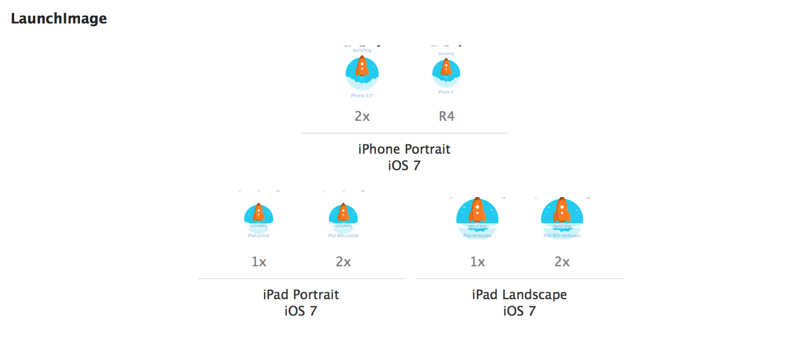
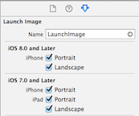
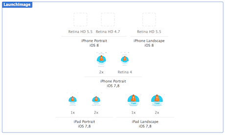

# iOS8 Day-by-Day :: Day 27 :: Launch Images

This post is part of a daily series of posts introducing the most exciting new
parts of iOS8 for developers - [#iOS8DayByDay](https://twitter.com/search?q=%23iOS8DayByDay).
To see the posts you've missed check out the [index page](http://shinobicontrols.com/iOS8DayByDay),
but have a read through the rest of this post first!

---

## Introduction

One of the new features in iOS8 and Xcode 6 that has maybe slipped under the
radar a little is an update in the ways you can specify launch screens.
Traditionally, these have been images which are display immediately on app
launch, before the live app UI is ready to go. With the introduction of the new
screen sizes of the iPhone 6 and iPhone 6 Plus, the lack of scalability of the
image-based approach is starting to show. Luckily, you can now provide a
storyboard or XIB file which will be used as the launch screen, across all
flavors of device.

Today's article will take a look at how (and why) to upgrade an app which was
built using Xcode 5 to use the new XIB-based approach. As such there is an
accompanying app that demonstrates the usage - available on the ShinobiControls
github at
[github.com/ShinobiControls/iOS8-day-by-day](https://github.com/ShinobiControls/iOS8-day-by-day).

## Scaling the existing approach

Launch screens are meant to be subtle - their sole purpose being to give the
impression that the app is loading super-fast. Therefore, in Apple's Human
Interface Guidelines, it suggests that launch screens should actually be
identical to the first screen of the app, minus any dynamic content such as
text.

In iOS 7 you would provide the content for the launch screen as images in an
asset library - requiring one image per device that it would run on. Taking in
to account the fact that iPads can launch apps in both portrait and landscape
orientations, and the existence of both retina and non-retina screens, this
means that you need to create a total of 6 different launch images:

The addition of iPhone 6 and iPhone 6 Plus actually means that you have to
produce three more launch images - since the iPhone 6 Plus can actually launch
apps in landscape.

If you open an iOS7 app in Xcode 6 and head on over to the __LaunchImage__ asset
in the asset catalog, then you might expect that there would be some new empty
spaces to fill, but this isn't the case. You first need to enable the new iOS8-
only types, which can be done using the attributes inspector:

Having checked the two boxes associated with iOS8 iPhone orientations, the asset
will be updated:

> __Top Tip:__ Until you either populate these new image cells, _or_ provide a
XIB/Storyboard launch screen, then your app will run in scaled mode on iPhone 6
and 6 Plus. It's therefore _really_ important to add this when upgrading your
old apps if you want to properly support the new devices.

Although this approach is perfectly viable, there are a couple of issues:

- It's a pain having to generate 9 different launch images for your app
- The images are obviously part of your app bundle, and therefore get
distributed with you app. That's _all_ of the images. One device will need at
most two of the images, which means that your app includes at least seven images
that it will _never use_.

Surely there's a better way?

## Creating a launch screen XIB

## Conclusion
