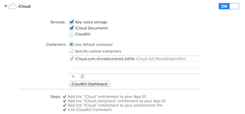
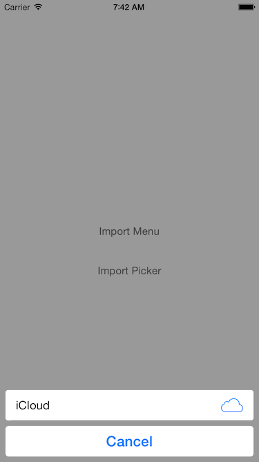
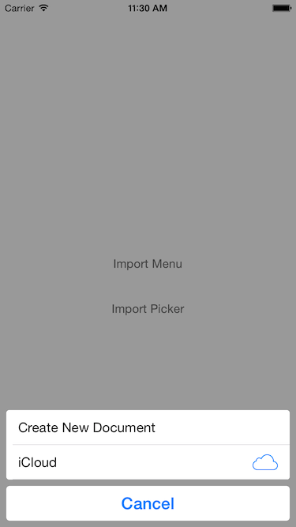
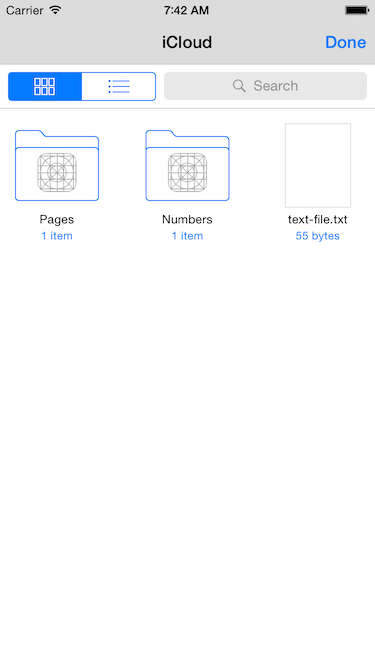
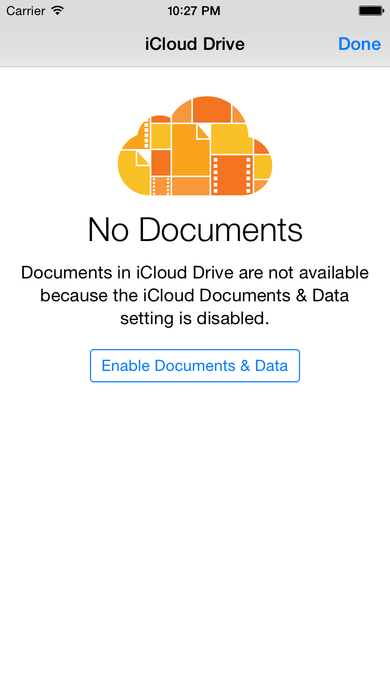

# iOS8 Day-by-Day :: Day 28 :: Document Picker

This post is part of a daily series of posts introducing the most exciting new
parts of iOS8 for developers - [#iOS8DayByDay](https://twitter.com/search?q=%23iOS8DayByDay).
To see the posts you've missed check out the [index page](http://shinobicontrols.com/iOS8DayByDay),
but have a read through the rest of this post first!

---

## Introduction

It has always been hard work to get content from one app to another on iOS.
Although possible, it is not generally a well-understood workflow, and therefore
results in users deciding that it is not possible.

This is set to change in iOS8 with the introduction of the unified document
picker view controller. This allows you to present UI from within your app which
allows the user to select documents which are present within iCloud drive, on
iCloud but managed by another app, and also from 3rd party document providers.

Today's post is a very brief introduction into what you can do and how to do it.
It isn't an introduction to working with documents on iOS. Or an introduction to
using CloudKit. Or an introduction to building your own document providers. If
you want those then shout at me and I might write them. There is a basic sample
app which accompanies the post - as ever available on the ShinobiControls github
at [github.com/ShinobiControls/iOS8-day-by-day](https://github.com/iOS8-day-by-day).

## Conceptual Overview

UIKit provides a view controller, which allows a user to select a file path.
This is communicated back to you via a single delegate method. It's actually
rather simple. However, understanding what's actually possible is a little more
complex.

The document picker enables four possible modes:

- __Import__. This creates a copy of the selected file inside your app's own
sandbox. It's the equivalent to a user selecting the file in a different app and
then exporting it to your app via the __Open in...__ dialog.
- __Export__. This allows you to publish a copy of your local file to a
different app's sandbox. The user selects where they want to export to and then
the system performs the copy. You will be unable to access the URL of the
resultant file.
- __Open__. Accesses a file within a different sandbox - i.e. editing it in
situ. This requires a more complicated interaction pattern (using security-
scoped URLs, and file coordination), since you can no longer be sure that you
are the sole user of a file.
- __Move__. The equivalent to an export and open with a delete. It moves a file
from your sandbox to a different place, and then provides you with a security-
scoped URL to access it.

This pretty much covers everything you might need to do in your app. It's very
important that you don't expect the user to decide between these 4 options. Your
workflow should be well-defined enough that these options are presented at
contextually relevant times. For example, your app might not need to use the
open and move modes - import and export might be good enough.

> __Note:__ Since the document picker and menu use iCloud by default, you'll
need to add the iCloud entitlement to your app:

## Document Menu

There are two new view controllers that have been added to UIKit to provide this
functionality:

- `UIDocumentMenuViewController` displays the different document data sources
available on the device. By default this only includes iCloud.
- `UIDocumentPickerViewController` is the actual file picker UI. In iCloud this
presents the different containers, directories and files available.

As you'd expect, the menu view controller results in selecting a picker view
controller.

A document menu view controller is created in two different ways; when opening
or importing, you specify a list of document types you're interested in. When
moving or exporting, you specify the URL of the file you'd like to work with.

For example, to import a file:

    let importMenu = UIDocumentMenuViewController(documentTypes: [kUTTypeText as NSString],
                                                         inMode: .Import)

This says that you're interested in text files, and that you'd like to import
the result.

In order to get the resultant picker, you need to set and implement a delegate:

    importMenu.delegate = self

You need to adopt the `UIDocumentMenuDelegate` protocol, which has two methods,
one of which covers cancellation, the other is required -
`documentMenu(_, didPickDocumentPicker:)`.

This will return the document picker object that the user selected. You can then
choose to present this (see later).

Once you've set the delegate you are free to present the new view controller:

    presentViewController(importMenu, animated: true, completion: nil)

This will something that resembles an action sheet:

You are also able to add your own custom actions to this sheet via 
`addOptionWithTitle(_,image:, order:, handler:)`. For example, in addition to
importing a document, you might want a user to be able to create a new document:

    importMenu.addOptionWithTitle("Create New Document", image: nil, order: .First,
                                  handler: { println("New Doc Requested") })

Which will produce the following:

## Document Picker

If you've implement the document menu, then the delegate callback will return
you a `UIDocumentPickerViewController` object. Alternatively you can create your
own using either a URL (for exporting and moving) or document types (for opening
or importing):

    let documentPicker = UIDocumentPickerViewController(documentTypes: [kUTTypeText as NSString],
                                                        inMode: .Import)

Either way, once you have a picker, you again need to set its delegate and then
present it:

    documentPicker.delegate = self
    presentViewController(documentPicker, animated: true, completion: nil)

The delegate protocol, `UIDocumentPickerDelegate` has 2 methods - one for user
cancellation, one for returning the URL of the resultant file. This has
different properties depending on the mode used:

    func documentPicker(controller: UIDocumentPickerViewController,
                        didPickDocumentAtURL url: NSURL) {
      // Do something
      println(url)
    }

Presenting the view controller (for the iCloud document picker) will result in a
view like this:

Notice that you can see the sandboxes associated with different applications, as
well as files which are present in iCloud Drive. Although you can see the
different files, for import/open you'll only be able to select the files which
match the types you specified in you `UTType` array.

## Use on Simulator

It's helpful when developing to use a simulator instead of a physical device,
which can cause some issues.

Before enabling iCloud Drive on the simulator (or device), you'll see the
following when attempting to use the iCloud document picker:

You can enable iCloud on a simulator in the same way as you can on a device.
However, if you want to use a test AppleID (highly recommended) then you
_must_ enable it for iCloud by logging in to iCloud on a device or your mac.
Otherwise, logging in on a simulator will result in a password authentication
error.

Once you've done this, you'll be able to open an iCloud document picker, but it
will probably appear empty. You need to trigger an iCloud sync, which you can do
from the __Debug__ menu on the simulator:

## Conclusion

If your app is based around documents, then the ability to select documents
consistently across the system is huge. Even more so once you combine it with
custom document providers that we can expect from people like Dropbox and Google
Drive.

The API for the document picker view controller is fairly simple - certainly
compared to working with `NSFileCoordinator` and security-scoped URLs. If it's
relevant to you I urge you to go ahead and implement it.

The sample app for today's post is pretty simple, and is available on the
iOS8 Day-by-Day github repo at 
[github.com/ShinobiControls/iOS8-day-by-day](https://github.com/iOS8-day-by-day).
As ever, let me know if you have any comments on twitter at
[@iwantmyrealname](https://twitter.com/iwantmyrealname). In particular, you
should say hi if you want the series to continue... if nobody is interested then
I might just attempt to get my life back ;)

sam

