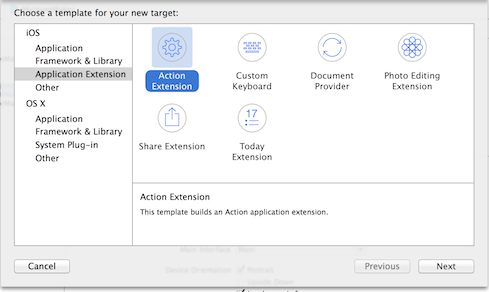
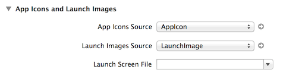
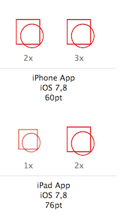
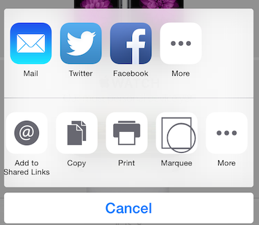
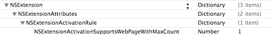
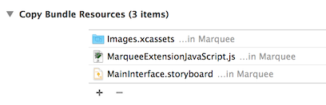
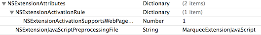

# iOS8 Day-by-Day :: Day 29 :: Safari Action Extension

This post is part of a daily series of posts introducing the most exciting new
parts of iOS8 for developers - [#iOS8DayByDay](https://twitter.com/search?q=%23iOS8DayByDay).
To see the posts you've missed check out the [index page](http://shinobicontrols.com/iOS8DayByDay),
but have a read through the rest of this post first!

---

## Introduction

This series has covered three of the new extension points so far (sharing,
today & photo) and today sees the turn of the action extension.

The action extension is quite similar to the sharing extension - in fact it
appears on the same 'share-sheet' popover UI. The difference is very much with
the intent: the sharing extension is used for exactly what its name suggests -
extracting content from an app for the purpose of sharing it, either directly or
via a social network.

In contrast, the action extension is intended to perform fairly light-weight
transformations of the content - either providing their own UI or returning
updated content to the requesting app.

Today's article will demonstrate how to create an action extension,
specifically for manipulating the content of web pages. The source code for the
app, __MarqueeMaker__ is available on github at
[github.com/ShinobiControls/iOS8-day-by-day](https://github.com/ShinobiControls/iOS8-day-by-day).

## Creating an Action Extension

Creating an action extension is best performed in the same way that you create
any of the extensions - via the templates in Xcode. Since all extensions
require that they are bundled with a host app, you need to create an app first,
and then add the extension to it:

Action extensions can either have UI or not. If your extension doesn't require
any input from the user in order to run, then you can choose not to have any UI.
The accompanying app does have some UI - allowing the user to specify which HTML
tags they'd like to manipulate:

Once you've done that then you'll be presented with a template that includes a
good starting point for building your extension. If you've selected to include a
user interface, then you'll be provided a view controller and storyboard in
which to build it. As ever, it's highly recommended to use adaptive layout to
create your interface.

You'll want to create an icon image to represent your app in the share sheet.
This icon is actually just the extension icon - which you can provide using an
asset catalog - ensuring that it is set correctly in the project settings:

Note that the action sheet uses template images - i.e. your icon image should be
composed of a single color and transparent. The non-transparent pixels will be
transformed to match the other icons in the sheet:

## Extracting Content from a Web Page

When you create a new extension from a template, it will appear in every single
action sheet by default. This means that it won't perform any checking of the
content types to determine whether or not it is appropriate. If you leave it
like this and attempt to submit it for app store review then it will be
rejected - you need to specify under what circumstances your extension should
appear.

This is controller via the extension's __Info.plist__ file - in the 
`NSExtension` dictionary. This contains a `NSExtensionAttributes` dictionary
that contains various properties which determine the behavior of the extension.
One of these is `NSExtensionActivationRule` - and when you create the extension
this will be set to be a string: `TRUEPREDICATE`. This means that your extension
will always appear.

You have a couple of options for this property - the simplest being turning it
into a dictionary (the alternative is to write a custom predicate), with keys
which specify different media types. Since __MarqueeMaker__ needs to operate on
web pages, one key is used: `NSExtensionActivationSupportsWebPageWithMaxCount`,
with a value of `1` - since the extension only works for a single web page at a
time:

Now, when you load up a web page in mobile Safari, and pull up the action sheet
then you'll see your extension appearing.

### Running a JS Preprocessor

Since you're using a web page here, extensions have a cool feature which allows
you to specify some JavaScript that Safari will run before invoking your
extension. From this you can provide content extracted from the web page to the
extension itself - which is pretty cool!

The javascript that you want running must conform to some requirements:

- There must be a global object called `ExtensionPreprocessingJS`
- This object must have a `run` method, which takes a single argument

The following JS code demonstrates how you can create a simple javascript object
which will provide the URL of the current page to the extension:

    var MarqueeMakerExtension = function() {};

    MarqueeMakerExtension.prototype = {
      run: function(arguments) {
        arguments.completionFunction({"baseURI" : document.baseURI});
      }
    }

    var ExtensionPreprocessingJS = new MarqueeMakerExtension;

Note that you provide content over the JS->UIKit bridge by calling the 
`completionFunction` method on the argument to the `run` function, providing a
dictionary of the things you want to access from within your Swift (or objC)
code.

This JS code should be placed in its own file, which is added to the extension's
target:

### Accessing the JS-provided content from Swift

To tell your extension that you've provided a JS preprocessor file, you need to
head back to the __Info.plist__ and add a new key to the `NSExtensionAttributes`
dictionary. `NSExtensionJavaScriptPreprocessingFile` should be set to the name
of the JS file __without__ the `.js` extension:

To access the bundled up content, you use exactly the same approach you did with
the sharing extension - via `NSItemProvider`. The `NSExtensionContext` has a
collection of `NSExtensionItem` objects via its `inputItems` property, which
each have `NSItemProvider` objects on the `attachments` property:

    override func viewDidLoad() {
      super.viewDidLoad()
      
      for item: AnyObject in self.extensionContext!.inputItems {
        let inputItem = item as NSExtensionItem
        for provider: AnyObject in inputItem.attachments! {
          let itemProvider = provider as NSItemProvider
          if itemProvider.hasItemConformingToTypeIdentifier(kUTTypePropertyList as NSString) {
            // You _HAVE_ to call loadItemForTypeIdentifier in order to get the JS injected
            itemProvider.loadItemForTypeIdentifier(kUTTypePropertyList as NSString, options: nil, completionHandler: {
              (list, error) in
              if let results = list as? NSDictionary {
                NSOperationQueue.mainQueue().addOperationWithBlock {
                  // We don't actually care about this...
                  println(results)
                }
              }
            })
          }
        }
      }
    }

You can interrogate each item provider to see whether it contains items of a
particular type - in this case the content provided from the JS preprocessor
will be of type `kUTTypePropertyList`. You can load it using the 
`loadItemForTypeIdentifier(_, options:, completionHandler:)` method.

> __NOTE:__ It's actually very important to call this `loadItemForTypeIdentifier`
method. If you don't then the javascript preprocessor won't be executed. Here,
in __MarqueeMaker__ you're not actually interested in the results, but it's
necessary to call it to ensure that the javascript is invoked, providing the
functionality for the next section.

When run, the above code will result in logged output:

    2014-09-23 08:40:55.815 MobileSafari[13553:212239] Unknown activity items supplied: (
        "http://www.apple.com/",
        "<WBUPrintPageRenderer: 0x7fa893faccf0>",
        "<UIPrintInfo: 0x7fa896063790>"
    )

You can run any type of javascript you like here - so you can extract all the
images from a web page, or query the DOM in any clever ways you can think of.
The possibilities are endless.

## Interacting with JavaScript

## Conclusion

