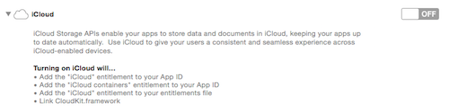
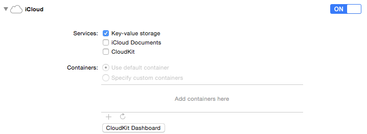
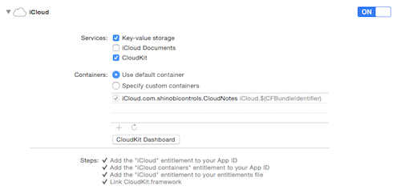
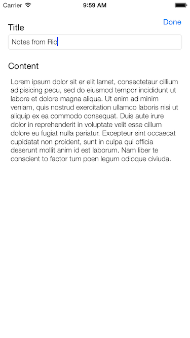
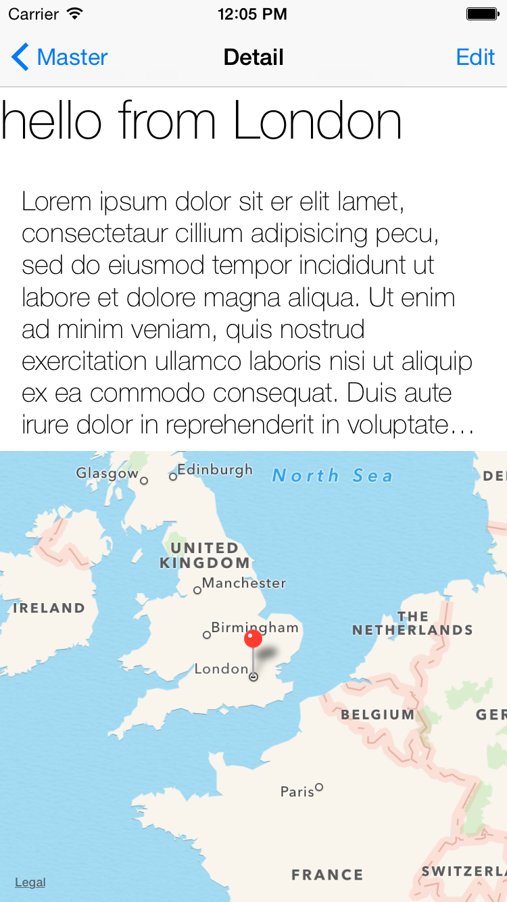
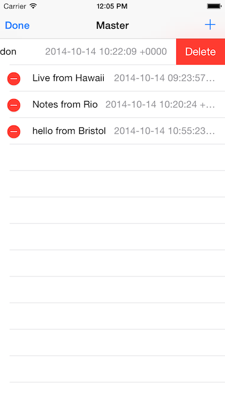
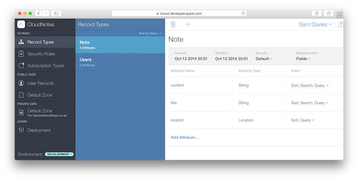
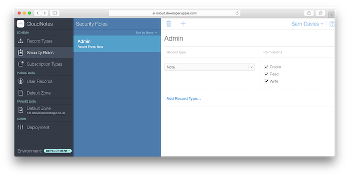
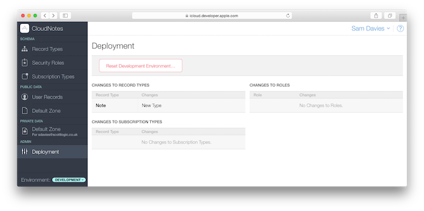

# iOS8 Day-by-Day :: Day 33 :: CloudKit

This post is part of a daily series of posts introducing the most exciting new
parts of iOS8 for developers - [#iOS8DayByDay](https://twitter.com/search?q=%23iOS8DayByDay).
To see the posts you've missed check out the [index page](http://shinobicontrols.com/iOS8DayByDay),
but have a read through the rest of this post first!

---

## Introduction

Apple introduced iCloud to the world a couple of years ago, and since then has
been introducing new ways for developers to utilize it. First was iCloud
CoreData, which is meant to be a completely seamless way of persisting and
syncing a object graph across devices. This suffered from all kinds of issues,
and iOS8 introduces something which pretends to be much less in the form of
CloudKit.

CloudKit offers very little magic in terms of data-syncing, and has no elements
of local persistence. It is simply a remote database - a transport mechanism for
storing data remotely. Having said that, you do get a huge amount of
functionality from the API - including user management, huge storage and
bandwidth capacities, security and privacy.

Today's article is going to take a look at some of the features of CloudKit in
reasonable detail. The framework is really big, so not every feature will be
covered. There is a sample app to accompany the chapter - called __CloudNotes__.
This is a simple note taking app which uses CloudKit as a persistence layer.
Although this app demonstrates CloudKit fairly well, it should not be taken as
'best practice' for creating a data-driven app in this way. For example, there
is no facility for offline resilience. You can grab the source code of the app
from the repo on the ShinobiControls github at
[github.com/ShinobiControls/iOS8-day-by-day](https://github.com/ShinobiControls/iOS8-day-by-day).

## High-level CloudKit Concepts

Before jumping in to look at some code, there are some architectural concepts
associated with CloudKit that you should get your head around.

### Authentication

Since CloudKit is build on iCloud, there isn't actually any authentication to
worry about - provided a user is logged into iCloud on the device, and they
permit your app to use iCloud then you're done! Your user would then be set up
with appropriate iCloud containers, and databases.

The developer doesn't get access to a list of users - which is great for
privacy. However, it does raise an interesting issue of discovery; loads of apps
expect the user to interact with their friends - which would be very difficult
if there's no way of discovering other users.

This is built in to CloudKit - a user can specify on a per-app basis whether
they want to allow users of that app to search for them by email address. As a
developer you can either implement this an individual search, or a full address
book search.

A user can opt-in or out of allowing an app to use the email address lookup
functionality, or indeed using iCloud altogether in the Settings app under
__iCloud Drive__.

### Containers

In the same way that the local storage available to your device is accessible
through a container, so too is your CloudKit allocation. This is the top-level
object in the world of CloudKit, and by default each app has its own,
independent container. It is possible that two apps signed by the same developer
share the same container - permitting sharing between iOS and OSX, as well as
across multiple apps on the same platform.

### Databases

The next level down the CloudKit tree is the databases that reside inside the
container. From the perspective of the app, each container has exactly two
databases: one _public_ and one _private_. The public database is shared between
_all_ users of this container - everybody can access the data, and by default
everybody can write to it.

The private database is, as you might expect, completely private to the current
user. This means that only the logged-in user has access to this data - they
can't choose to share part of it, nor can the developer take a look at a user's
private database. This is an extremely powerful feature - offering top-notch
privacy straight out of the box.

The API is very clear about which database you are interacting with - all
operations are performed on a database, and you use either the
`privateCloudDatabase` or `publicCloudDatabase` properties on your `CKContainer`
container object.

### Record Zones

Unlike in traditional relational databases, you can pop your records straight
into a database. You don't have to create a schema and associated tables - you
are free to implicitly build your schema as you go.

However, there is one more level between a database and records, and that is the
concept of a record zone. These just represent a collection of records -
allowing you to partition your data appropriately. Every database is created
with a default zone, but you are free to create your own custom zones as and
when you wish.

Zones offer some additional functionality to record partitioning, namely:

- __Per-zone Notifications__ Notifications are built into CloudKit - translating
into push notifications whenever something changes (see later). You can set up a
subscription to get notifications whenever something within a zone changes.
- __Atomic Commits__ This is essentially transactions - ensuring that all
records within a specified operation either complete or don't change at all.
This is crucial to ensuring the integrity of your data.
- __Delta Changes__ When an app arrives back on the network after being away it
can send a 'last-known-change' token upto iCloud, and it will then be sent all
the changes since that point, and a new token. This is invaluable for ensuring
that your local persistence store stays in sync with that on iCloud.

It is worth noting that records cannot change zones - instead they would have to
be recreated in a different zone, and that it's also not possible to have a
relationship between records in different zones.

### Records

As in many datastores, the lowest level of object in CloudKit is that of the
record. This is represented by the `CKRecord` class, and forms the basis of
every object type you want to store.

It is key-value coding compliant, and doesn't require you to specify the fields
up-front (much like `NSDictionary`). The field names should be strings, and the
values can be any of the following:

- `NSString`
- `NSNumber`
- `NSData`
- `NSDate`
- `CLLocation`
- `CKReference` - a reference to another `CKRecord`
- `CKAsset` - a binary blob of data uploaded to iCloud
- Arrays of the above

Records are created within a zone, and have a specified type - represented by a
string. All objects of the same type will share the same set of attributes -
much in the same way as you're used to in relational databases.

Records all have unique IDs, represented by the `CKRecordID` class, which
combines a zone ID with a record name. You can specify the record name
part of this ID when you create a record using the constructor that
takes a name. This is useful if you already have a unique ID for your object,
and don't want to manage two separate IDs. If you don't provide a record name,
one will be randomly generated for you.

### Subscriptions

Subscriptions allow you to ask iCloud to notify you of changes to the database
as they occur. You've already seen a mention of record zone subscriptions, which
will notify you when anything changes within a zone. It's also possible to
create query subscriptions - where you specify a query (via a predicate), and
the request that your app be notified if the results to the query should change.

Subscription notifications are delivered as push messages via APNS. There are
some caveats around their use - namely once a notification has been received,
it's important that you check for changes (since push notifications get
superseded).

Subscriptions offer a great alternative to polling iCloud to wait for changes.
This results in reduced power consumption - the holy grail of app optimization
requirements.

## Enabling CloudKit

CloudKit needs to be enabled on a per-app basis, and associated with a
particular developer ID. This involves adding the appropriate entitlements to
your app ID, and linking against the CloudKit framework.

Xcode has you covered in this area - via the __Capabilities__ tab of you project
settings file:

Flicking the switch will enable iCloud for your app:

Note that the default settings just enable the iCloud Key-Value store, and that
you need to check the __CloudKit__ checkbox to link against the correct
framework and configure the entitlements appropriately:

At this point you can create custom containers, should you wish to, or you can
stick with the default container created for you.

Notice that there is also a button labeled __CloudKit Dashboard__ that will sned
your browser to the web dashboard associated with this container. You can read
more about the dashboard later in this article.

Now that you've enabled CloudKit, you can go ahead and start creating pushing
some data into it.

## Creating Records

The accompanying sample app is a note pad, with the following protocol
representing the fields contained by a note:

    protocol Note {
      var id: String? { get }
      var title: String { get set }
      var content: String? { get set }
      var location: CLLocation? { get set }
      var createdAt: NSDate { get }
      var lastModifiedAt: NSDate { get }
    }

In order to persist an object with these properties in CloudKit, you have to
represent it as a `CKRecord`. As previously mentioned, if you don't specify a
name then CloudKit will generate a unique name for your record automatically,
and as you might expect `createdAt` and `lastModifiedAt` are similarly auto-
managed. This leaves you with three properties which need representing in a
`CKRecord`.

A `CKRecord` behaves very much like an `NSDictionary`, in that you create fields
by assigning values to keys. For example, __CloudNotes__ implements the custom
properties from the `Note` protocol as follows:

    class CloudKitNote: Note {
      let record: CKRecord
      
      ...
      
      var title: String {
        get {
          return record.objectForKey("title") as String
        }
        set {
          record.setObject(newValue, forKey: "title")
        }
      }
      
      var content: String? {
        get {
          return record.objectForKey("content") as? String
        }
        set {
          record.setObject(newValue, forKey: "content")
        }
      }
      
      var location: CLLocation? {
        get {
          return record.objectForKey("location") as? CLLocation
        }
        set {
          record.setObject(newValue, forKey: "location")
        }
      }
    
      ...
    }

`CloudKitNote` contains a `CKRecord` object, and the data for the properties is
accessed via `objectForKey()` and `setObject(_, forKey:)`.

There accessors for the non-custom properties just proxy through to the relevant
properties on `CKRecord`:

    var id: String? {
      return record.recordID.recordName
    }

    var createdAt: NSDate {
      return record.creationDate
    }
    
    var lastModifiedAt: NSDate {
      return record.modificationDate
    }

In this design, a `CloudKitNote` is either constructed with a `CKRecord` which
has been returned from a CloudKit API, or from another `Note`:

    init(record: CKRecord) {
      self.record = record
    }
    
    init(note: Note) {
      record = CKRecord(recordType: "Note")
      title = note.title
      content = note.content
      location = note.location
    }

Note that when creating a new `CKRecord` you have to specify _at least_ the
`recordType`. This is a string, and represents a set of objects which share
common attributes - similar in concept to a table in a relational database.

Now that you have created an appropriate `CKRecord`, you need to tell CloudKit
to save it. CloudKit actually has two distinct APIs, the so-called convenience
API and the `NSOperation` API. As you might expect from the naming, the
convenience API is a little easier to use, but at the cost of being less
configurable. This article will use both APIs to show you a flavor of the two
options.

There is a convenience API method on `CKDatabase` that allows you to save a
record, in the form of `saveRecord(_, completionHandler:)`. In order to use this
you need to get hold of a reference to a `CKDatabase` object.

Remember that a CloudKit app has one or more containers - and each of these has
access to two databases. If you are just using the default container, then the
`defaultContainer()` class method on `CKContainer` will return you a reference.
A `CKContainer` object then has two database properties: `privateCloudDatabase`
and `publicCloudDatabase`. Since CloudNotes is currently only supporting private
notes, then it uses the `privateCloudDatabase` to construct a custom
`CloudKitNoteManager` object:

    let noteManager = CloudKitNoteManager(database: CKContainer.defaultContainer().privateCloudDatabase)

`CloudKitNoteManager` is a helper class which implements the following protocol,
to encompass all the different persistence methods that the app needs:

    protocol NoteManager {
      func createNote(note: Note, callback: ((success: Bool, note: Note?) -> ())?)
      func getSummaryOfNotes(callback: (notes: [Note]) -> ())
      func getNote(noteID: String, callback: (Note) -> ())
      func updateNote(note: Note, callback: ((success: Bool) -> ())?)
      func deleteNote(note: Note, callback: ((success: Bool) -> ())?)
    }

Designing your app in this way (using the `Note` and `NoteManager` protocols)
will make it a lot easier to add a local persistence layer, or switch out
CloudKit for an alternative should you decide to.

The implementation of `createNote(note:, callback:)` in `CloudKitNoteManager`
looks like this:

    func createNote(note: Note, callback:((success: Bool, note: Note?) -> ())?) {
      let ckNote = CloudKitNote(note: note)
      database.saveRecord(ckNote.record) { (record, error) in
        if error != nil {
          println("There was an error: \(error)")
          callback?(success: false, note: nil)
        } else {
          println("Record saved successfully")
          callback?(success: true, note: ckNote)
        }
      }
    }

Notice that first we construct a `CloudKitNote` object from the supplied `Note`.
This allows you to use any object that conforms to the `Note` protocol (in fact,
in CloudNotes, this will be of type `PrototypeNote`, which is a POSO [I think I
just invented that acronym (C)SD]).

Once you have a `CKRecord` then you can call `saveRecord(_, completionHandler:)`
on your `CKDatabase` object. The completion handler is a closure which includes
a `Bool` to indicate success and an `NSError` object. It is vitally important
that you implement this completion handler, and actually inspect the error.

I'll say that again. You can't just ignore the error like you usually do.
CloudKit __will fail__. For perfectly legitimate reasons. If you don't handle
the error then your app __will lose data__.

There are a total of 28 CloudKit-specific error codes, including things such as
`NetworkUnavailable`, `NotAuthenticated`, `LimitExceeded` and
`ServerRejectedRequest`. When you build an app around you need to _at least_
investigate and handle the errors associated with network issues. Your users are
guaranteed to try to use your app without network access. How you handle this is
the difference between having users and not having users.

Note that despite mentioning how important errors are, CloudNotes doesn't really
handle that. Writing good error code is a pain, and is left to an exercise for
the reader ;-)

The other important thing that's worth mentioning is that the completion handler
is not likely to be called back on the main thread. Therefore, ensure you
marshal any UI code back onto the main queue.

The following shows the `createNote(_, callback:)` method in use in the 
`MasterViewController`, in a delegate method which creates a note:

    func completedEditingNote(note: Note) {
      dismissViewControllerAnimated(true, completion: nil)
      showOverlay(true)
      noteManager.createNote(note) {
        (success, newNote) in
        self.showOverlay(false)
        if let newNote = newNote {
          let newCollection = self.noteCollection + [newNote]
          self.noteCollection = newCollection
        }
      }
    }

There are two points which involve updating the UI, hiding the "Loading" overlay
(terrible UX, I know):

    private func showOverlay(show: Bool) {
      dispatch_async(dispatch_get_main_queue()) {
        UIView.animateWithDuration(0.5) {
          self.loadingOverlay.alpha = show ? 1.0 : 0.0
        }
      }
    }

And reloading the table's data when the `noteCollection` is updated:

    var noteCollection: [Note] = [Note]() {
      didSet {
        dispatch_async(dispatch_get_main_queue()) {
          self.tableView.reloadData()
        }
      }
    }

Notice that both of these marshal back to the main queue for UI updates.

## Querying For Records

There are two methods on the `NoteManager` protocol which represent queries for
records - `getSummaryOfNotes(callback:)` and `getNote(noteID:, callback:)`.
The latter of these uses the convenience API, and the implementation is as
follows:

    func getNote(noteID: String, callback: (Note) -> ()) {
      let recordID = CKRecordID(recordName: noteID)
      database.fetchRecordWithID(recordID) {
        (record, error) in
        if error != nil {
          println("There was an error: \(error)")
        } else {
          let note = CloudKitNote(record: record)
          callback(note)
        }
      }
    }

This uses the `CKDatabase` method `fetchRecordWithID`. As previously mentioned,
a `CKRecordID` is a unique identifier for a record within a container -
combining a zone ID with a record name. Since CloudNotes only uses the default
zone, a `CKRecordID` can be constructed solely from the `noteID`.

`fetchRecordWithID` is another asynchronous method, and so takes a completion
handler closure which returns a `CKRecord` object, and an `NSError`. It's again
really quite important to handle the error appropriately.

Here, a `CloudKitNote` object is created from the returned `CKRecord`, and
returned via the supplied callback. Note again that this will not be called on
the main thread, so and UI updates will need marshaling to the main thread.

There is also a convenience method on `CKDatabase` which allows you to run more
generalized queries - `performQuery(_, inZoneWithID:, completionHandler:)`. A
query is of the type `CKQuery`, which combines a record type with a predicate
and sort descriptors. The predicate is of type `NSPredicate`, and can therefore
be incredibly expressive. There are some things that `NSPredicate` can express
that are not supported by `CKQuery` - and you can find details of exactly what
is support in the `CKQuery` documentation. It is possible to include queries
based on location - which is really helpful - removing any of the difficult
spherical mathematics from your own code.

The one thing that this convenience method doesn't allow you to do is restrict
which fields you want returned. `CKRecord` objects can represent _partial_
records - that is to say, not containing all the properties that exist on the
original object. This can be really helpful if you just want to display a
summary of records, each of which contains a huge number of properties.

In CloudNotes, the table of all notes only needs the creation date and title of
the notes, and therefore it would be good to not have to request the content and
location (this is somewhat of a contrived example - the content and location
properties of the note are pretty small).

In order to request partial records, you have to drop the convenience API and
use the operation-based API instead.

### NSOperation-based API

The convenience API is a wrapper around a much more powerful API - which is
based around `NSOperation`. `CKOperation` is an abstract base class that
represents all the different operations that are performed on a CloudKit
database. There are concrete subclasses of this class, each of which represents
a specific type of operation. For example:

- `CKQueryOperation`
- `CKModifyRecordsOperation`
- `CKFetchSubscriptionsOperation`
- ...

You'll need to use the operation API whenever you want to perform slightly more
complex tasks with the database. Since these objects all inherit from 
`NSOperation`, they are invoked by adding them to an `NSOperationQueue`. You can
either provide your own, or use the default one associated with the database.
This affords you a huge amount of control when specifying dependencies between
operations, and priorities.

In CloudNotes, a `CKQueryOperation` is used in the implementation of
`getSummaryOfNotes(callback:)`:

    func getSummaryOfNotes(callback: (notes: [Note]) -> ()) {
      let query = CKQuery(recordType: "Note", predicate: NSPredicate(value: true))
      let queryOperation = CKQueryOperation(query: query)
      queryOperation.desiredKeys = ["title"]
      var records = [Note]()
      queryOperation.recordFetchedBlock = { record in records.append(CloudKitNote(record: record)) }
      queryOperation.queryCompletionBlock = { _ in callback(notes: records) }
      
      database.addOperation(queryOperation)
    }

Firstly, a `CKQuery` is constructed, which specifies the correct `recordType` of
`Note`, and since the notes don't need filtering, the predicate is just the 
`true` predicate - i.e. a filter that always returns `true`.

You can then use this `CKQuery` object to instantiate a `CKQueryOperation`.
Amongst other properties (such as `resultsLimit`), this has a property named
`desiredKeys`. This is an array of strings, that allows you to specify which of
the keys you want to retrieve - creating partial records. Since this method is
used to populate the table view, on `title` is required.

`recordFetchedBlock` and `queryCompletionBlock` allow you to provide closures
which will be called after each record arrives and after the query completes
respectively. These are used to construct an array of notes, and then passing
them back via the supplied callback block.

Finally, once you've created the operation, then you need to add it to an
operation queue so that it gets invoked. Here it's being added to the default
operation queue associated with the database.

The combination of these two methods allows CloudNotes to retrieve the records
from CloudKit, both for display in the table, and then (with a more rich
representation) in the detail view.

## Modifying Records

The final two operations to look at in the basic CRUD CloudNotes app are update
and delete. Both of these use the `CKModifyRecordsOperation` class to update the
database. This has a constructor which takes an array of `recordsToSave`, and an
array of record IDs to delete.

It also has `perRecordCompletionBlock` and `modifyRecordsCompletionBlock`
closures to get feedback on the process.

The `updateNote(note:, callback:)` method is implemented as follows:

    func updateNote(note: CloudKitNote, callback:((success: Bool) -> ())?) {
      let updateOperation = CKModifyRecordsOperation(recordsToSave: [note], recordIDsToDelete: nil)
      updateOperation.perRecordCompletionBlock = { record, error in
        if error != nil {
          // Really important to handle this here
          println("Unable to modify record: \(record). Error: \(error)")
        }
      }
      updateOperation.modifyRecordsCompletionBlock = { saved, _, error in
        if error != nil {
          if error.code == CKErrorCode.PartialFailure.toRaw() {
            println("There was a problem completing the operation. The following records had problems: \(error.userInfo?[CKPartialErrorsByItemIDKey])")
          }
          callback?(success: false)
        } else {
          callback?(success: true)
        }
      }
      database.addOperation(updateOperation)
    }

Again it's important to handle errors. In this instance, the error passed to the
`modifyRecordCompletionBlock` might contain a code of `PartialFailure`, which
indicates that some of the modifications weren't successful. In this case, you
can get hold of the records involved with the `CKPartialErrorsByItemIDKey` entry
on the `userInfo` dictionary.

The `deleteNote(note:, callback:)` method is almost identical in its
implementation:

    func deleteNote(note: Note, callback: ((success: Bool) -> ())?) {
      let deleteOperation = CKModifyRecordsOperation(recordsToSave: nil, recordIDsToDelete: [CKRecordID(recordName: note.id)])
      deleteOperation.perRecordCompletionBlock = { record, error in
        if error != nil {
          println("Unable to delete record: \(record). Error: \(error)")
        }
      }
      deleteOperation.modifyRecordsCompletionBlock = { _, deleted, error in
        if error != nil {
          if error.code == CKErrorCode.PartialFailure.toRaw() {
            println("There was a problem completing the operation. The following records had problems: \(error.userInfo?[CKPartialErrorsByItemIDKey])")
          }
          callback?(success: false)
        }
        callback?(success: true)
      }
      database.addOperation(deleteOperation)
    }

In this case, a `CKRecordID` is created for the specified note, and then this is
added to the `recordIDsToDelete` array.

## CloudKit Dashboard

You've now been building your datastore, and can grab things out of it, but it's
very much a black box. It would be really helpful to be able to see what's going
on inside your app's container. Well, Apple thought of this, and built the
CloudKit Dashboard:

You can access the dashboard via
[icloud.developer.apple.com](https://icloud.developer.apple.com), or via the
link in the iCloud capabilities tab.

As you build up record types you can see them and their attributes. It's also
possible to edit, remove and add new attributes to the types you've created, as
well as specifying which should be indexed, searchable and sortable.

The security roles pane allows you to specify roles, and associated permissions
on a per-record-type basis. This allows you to build a structure to your public
database whereby you have varying levels of protection:

__Subscription Types__ allows you to see and edit the subscriptions that you've
created from within your app, and you can also see the data that exists within
the different zones. Note that although you can see all the public data (as you
might expect), you can only see the private data associated with your developer
account (i.e. the account you're logged in with).

Because of this, it's really handy to have a different developer ID than your
personal version. You can even log in to an iCloud ID on a simulator, although
in order for it to be activated for iCloud, you __must__ log in to it on a
device before hand. This is a pain.

The final panel of interest is __Deployment__. This allows you to push changes
(of structure etc) from your development database to production, and also to
completely reset the development database. This functionality is invaluable, and
if you're finding that all your CloudKit requests are getting internal server
errors, then I'd suggest giving this big red button a try:

## Summary of other Features

CloudKit is huge - and today's post has only really covered some of the more
basic functionality. Here's a summary of some of the other features you'd expect
from a datastore, and a brief description of how they apply in the CloudKit
world:

- __Change Notifications__ Subscriptions allow you to build a query and then ask
iCloud to send you push messages whenever the results of the query are changed.
Or you can create a record zone subscription which will send a push notification
whenever data changes.
- __Relationships__ `CKReference` allows you to specify that two records are
related to each other. The documentation highly recommends that in one-to-many
situations the reference goes backwards. i.e. a child has one parent rather than
a parent having multiple children.
- __Blob fields__ If you have large chunks of data (such as images) that you
wish to associate with a record then you can use the `CKAsset` class to upload,
retrieve and reference this data. Note that in iOS 8.1 it will only be possible
for an asset to belong to a single record.
- __Transactions__ In a custom zone it's possible to specify that a particular
set of `CKOperation`s should be an 'atomic commit'. That is to say that either
all operations will succeed, or none of them will be committed. This is really
useful to maintain data integrity.
- __Cascading Deletes__ By default, if you delete a record which has a reference
to another record, then the child record will be deleted as well. It's worth
noting that if you have multiple references to the same record, then the first
delete will win - i.e. if you don't want the child deleted you need to change
the default behavior.
- __Save Rules__ In any database with multiple points of asynchronous access,
managing conflicts is a hugely complex task. By default, CloudKit uses a very
conservative rule, placing the responsibility for resolving these completely in
your hands. If you wish to then force overwrite the contents of a record in
iCloud then you must change the save rule to represent this.
- __Production__ Whilst developing your app, the schema is being built up as you
add records and structure. At the point that you want to push your app into the
wide world, you don't want the schema changing again. Nor do you want your
database full of dirty dev data. CloudKit allows you to switch to a production
database through the CloudKit Dashboard. At this stage you are also able to
specify which attributes should be indexed and searchable. This allows the
database engine to optimize appropriately.

## Conclusion

Phew - that was a long one! As you have probably realized, CloudKit is enormous.
It is incredibly versatile, and appears to be pretty well thought-out. It has
loads of advantages - huge quotas, simplicity, versatility, functionality, user
management, user trust, privacy, security etc. I do have some concerns about
potential disadvantages as well though.

As you might expect from Apple, the tooling of the first iteration just isn't
quite there. Things don't always work as expected - the dashboard throws up
frequent errors, I spent a long time trying to diagnose "internal server error",
and simulator support is flaky at best. However, I'd expect all of these things
to be fixed over the next year.

Far more concerning is the lock-in to Apple. It might be great to prototype
something with CloudKit, but can you definitely say that you don't want to build
a custom web dashboard to your data at a later stage? Or maybe an Android app?
It'd be great if Apple were to open up a REST API or something, to at least
allow the possibility of expansion in the future, but it's not in their interest
to do so.

CloudKit is extremely powerful, and relatively easy to get started with. It's
certainly worth having a play around with it, but be aware that it's not a magic
bullet. You still need to cope with all the difficulties associated with a
remote system going offline when the user moves out of range - local persistence
and conflict resolution. And you should also consider whether or not this is a
long-term solution, or just something for prototyping.

As ever, the project associated with this article is available on the
ShinobiControls github at
[github.com/ShinobiControls/iOS8-day-by-day](https://github.com/ShinobiControls/iOS8-day-by-day).
Please remember that this project was created to demo CloudKit, and almost
certainly has problems if you were to try and use it as a real note-taking app.
Feel free to take it and fix that - I'll happily take a pull request.

I've typed a lot today - I think you should reward me by following me and saying
hi on twitter - I'm [@iwantmyrealname](https://twitter.com/iwantmyrealname).

sam

