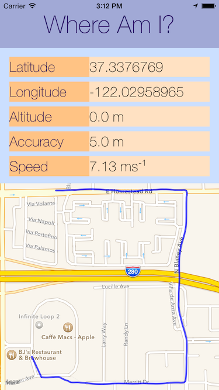
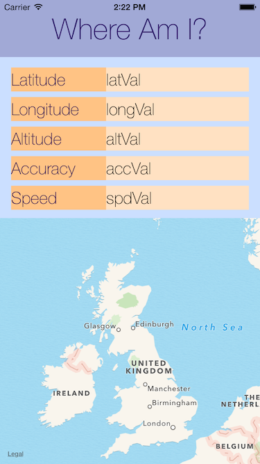
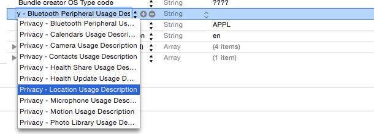
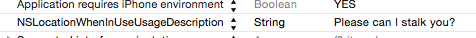
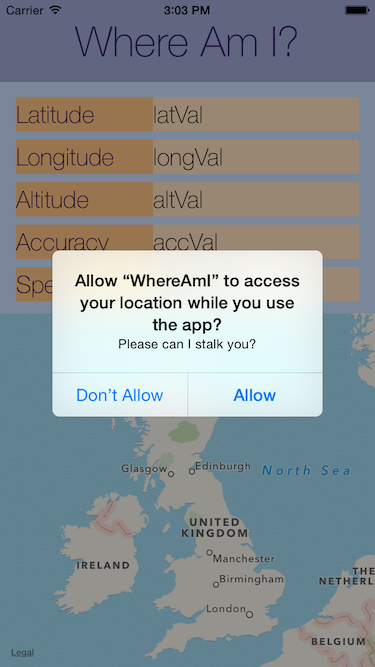

# iOS8 Day-by-Day :: Day 34 :: CoreLocation Authorization

This post is part of a daily series of posts introducing the most exciting new
parts of iOS8 for developers - [#iOS8DayByDay](https://twitter.com/search?q=%23iOS8DayByDay).
To see the posts you've missed check out the [index page](http://shinobicontrols.com/iOS8DayByDay),
but have a read through the rest of this post first!

---

## Introduction

CoreLocation is the framework which gives you access to the geo-location
functionality of devices within iOS. You'd use if you wanted to find the user's
currently location. The functionality provided by CoreLocation is obviously very
sensitive - it's important for users to be able to manage their privacy. In iOS7
and before, CoreLocation provided this functionality automatically, but this is
no longer the case.

In today's article you'll discover the different options for privacy with
CoreLocation introduced in iOS8, and how you need to update your apps to use
them.

The app which accompanies today's post is a simple route tracking app called
__Where Am I?__. It registers for updates from CoreLocation, displays them on
screen and plots the route on a map. You can get hold of the source code for
__Where Am I?__ on the ShinobiControls github at
[github.com/ShinobiControls/iOS8-day-by-day](https://github.com/ShinobiControls/iOS8-day-by-day).

## Refresher on CoreLocation

The model for finding the current location using CoreLocation is via a manager
object that pushes out updates via a delegate. `CLLocationManager` can do more
than this, but in the simplest example you might create one like this:

    let locationManager = CLLocationManager()

And then configure it as follows:

    locationManager.delegate = self
    locationManager.desiredAccuracy = 20
    locationManager.startUpdatingLocation()

You need to set a delegate, and then tell it that it should start work.

The delegate adopts the `CLLocationDelegateManager` protocol, and in the
simple case you can just implement the `locationManger(_, didUpdateLocations:)`
method:

    func locationManager(manager: CLLocationManager!, didUpdateLocations locations: [AnyObject]!) {
      if let location = locations.first as? CLLocation {
        // Update the fields as expected:
        latValLabel.text = "\(location.coordinate.latitude)"
        longValLabel.text = "\(location.coordinate.longitude)"
        altValLabel.text = "\(location.altitude) m"
        accValLabel.text = "\(location.horizontalAccuracy) m"
        spdValLabel.text = "\(location.speed) ms⁻¹"
        // Re-center the map
        mapView.centerCoordinate = location.coordinate
        // And update the track on the map
        historicalPoints.append(location.coordinate)
        updateMapWithPoints(historicalPoints)
      }
    }

This extracts the details we're interested in from the `CLLocation` object, and
updates the display appropriately.

If you build and run an app which contains this code in iOS8, you'll see
something like:

Eh? The updates aren't appearing. This would have worked in iOS7 (with a bit of
hand-waving about Swift).

This is because in iOS7, the location manager was responsible for asking the
user whether they wanted to allow access to the CoreLocation services. This is
no longer true in iOS8 - despite the lack of error messages, there's a problem
with your current code.

## New Methods on CoreLocationManager

iOS8 adds finer granularity on the privacy controls for location access. Namely,
a user can choose whether an app should be allowed to track their location even
when it's in the background, as opposed to in the foreground or not at all.

In order to support this, there are two new methods on `CLLocationManager` - 
`requestWhenInUseAuthorization()` and `requestAlwaysAuthorization()`. The names
of these methods make it pretty obvious what they do:

- `requestWhenInUseAuthorization()` If the user agrees then your app will have
access to CoreLocation only when it is in the foreground.
- `requestAlwaysAuthorization()` If the user agrees your app can access
CoreLocation even when it is in the background.

The alert displayed to the user will make this clear. If you requested the
_always_ option then the user will be prompted after your app has been using
CoreLocation in the background - allowing them to confirm that they're happy
with this.

So updating your location manager configuration code should fix your problems:

    // Prepare the location manager
    locationManager.delegate = self
    locationManager.desiredAccuracy = 20
    // Need to ask for the right permissions
    locationManager.requestWhenInUseAuthorization()
    locationManager.startUpdatingLocation()

However, if you run it up again, then you'll see that it still doesn't prompt
the user, and your delegate method won't receive any updates. Surely there's not
more to do? Turns out, despite the lack of error messages, that there is indeed
more to do. Excellent.

## Providing Usage Strings

CoreLocation now wants to display a message to the user asking for their consent
to start sending their tracking data around. The problem is that it doesn't know
why you want it, and it's not prepared to ask the user for their permission when
it doesn't know why.

You need to specify a so-called "usage string", which will be displayed to the
user explaining what your app will do with the location updates it has
requested. You do this in the __Info.plist__ file:

And fill in an appropriate string:

If you run your app up yet again you'll notice that it still doesn't work. This
is getting kinda ridiculous now.

This is because that key (`NSLocationUsageDescription`) is ignored in iOS8 and
later. Instead, two new keys have been introduces, corresponding to the two
privacy modes introduced before:

- `NSLocationAlwaysUsageDescription` foreground and background use
- `NSLocationWhenInUseUsageDescription` foreground only use

Helpfully, these keys don't have nice descriptive names in Xcode, so they don't
autocomplete in the default view of the plist editor.

You can enter the key name directly:

You can run the app up again, and finally you'll see the location privacy
request, complete with your string (please don't use this example):

If you grant access, then the app will then work as expected - receiving
location updates from the location manager via its delegate:

## Conclusion

Today's post has been quite short, but nonetheless important. The lack of error
reporting associated with this change in usage of `CLLocationManager` is sure to
trip people up - especially the required keys in __Info.plist__.

On the plus-side this really does represent an improvement in users' privacy.
They then have really fine-grained control on which apps are able to do what,
and in easy to understand terms.

As ever, the code associated with today's post is available on the
ShinobiControls github at:
[github.com/ShinobiControls/iOS8-day-by-day](https://github.com/ShinobiControls/iOS8-day-by-day).

Hope it's useful - let me know - 
[@iwantmyrealname](https://twitter.com/iwantmyrealname).

sam

