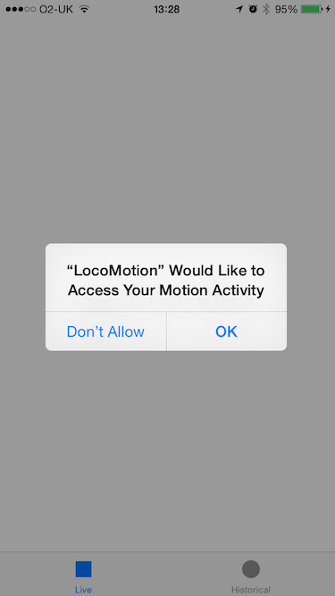
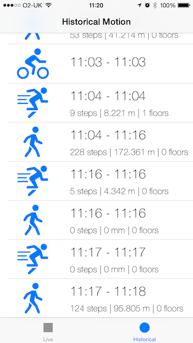
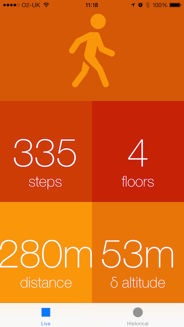
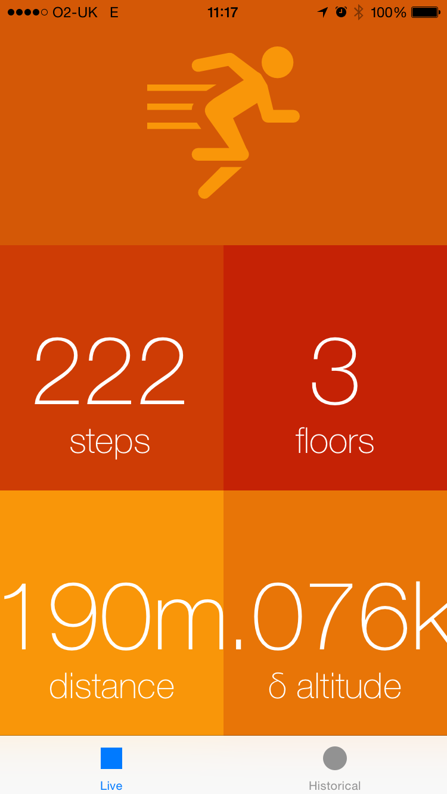

# iOS8 Day-by-Day :: Day 35 :: CoreMotion

This post is part of a daily series of posts introducing the most exciting new
parts of iOS8 for developers - [#iOS8DayByDay](https://twitter.com/search?q=%23iOS8DayByDay).
To see the posts you've missed check out the [index page](http://shinobicontrols.com/iOS8DayByDay),
but have a read through the rest of this post first!

---

## Introduction

The __CoreMotion__ framework is used in iOS to receive data from the plethora of
motion sensors available on a device. This includes the magnetometer, the
pedometer and the gyroscope. iPhone 6 and 6 Plus include an altimeter, so
CoreMotion has been updated to support this new sensor. iOS8 also sees some
other changes to the framework.

In today's blog post you'll see what replaces `CMStepCounter` due to its
deprecation, and the new type of activity classification available. There is an
accompanying app called __LocoMotion__ that demonstrates both how to present
live motion data, and how to query for historical data. You can grab the source
code from the ShinobiControls github at
[github.com/ShinobiControls/iOS8-day-by-day](https://github.com/ShinobiControls/iOS8-day-by-day).

## Motion Activity Data

At the highest level, CoreMotion offers estimates of "activity" data - i.e. an
estimate of what the user is actually doing. This is the result of a
classification algorithm which takes all the motion sensors (along with other
data) into account. In iOS7, the activities could be classified into
__running__, __walking__, __automotive__ and __stationary__. iOS8 adds a new
classification in the form of __cycling__.

Getting hold of motion activity data can take place in two different ways -
dependent on your use case. You can either request up to 7 days worth of
historical data, or you can ask for a live stream of updates, as the device
recognizes changes in the activity state.

`CMMotionActivityManager` is the class that is responsible for motion
activities, and a historical 'pull' query uses the
`queryActivityStartingFromDate(_, toDate:, toQueue:, withHandler:)`. Notice that
you have to provide a queue upon which your results will be delivered - this is
great for maintaining a responsive app, and is just an instance of 
`NSOperationQueue`:

    let oneWeekInterval = 24 * 3600 as NSTimeInterval
    motionActivityManager.queryActivityStartingFromDate(NSDate(timeIntervalSinceNow: -oneWeekInterval),
                                                        toDate: NSDate(), toQueue: motionHandlerQueue) {
      (activities, error) in
      if error != nil {
        println("There was an error retrieving the motion results: \(error)")
      }
      self.activityCollection = ActivityCollection(activities: activities as [CMMotionActivity])
    }

The handler is called with an array of `CMMotionActivity` objects and an error.
If the user hasn't authorized use of the motion sensors then you can inspect the
error and see that it has a type of `CMErrorMotionActivityNotAuthorized`.

A `CMMotionActivity` object has some `Bool` properties, which determine which
kind of activity was detected. These comprise `stationary`, `walking`, `running`,
`automotive`, `cycling` and `unknown`. There are various rules which specify
when each of these can occur (e.g. `unknown` will only be true when the device
has just been turned on) and most of them were present in iOS7. iOS8 adds the
cycling state. The activity also has a `startDate` and a `confidence`.

The first time you run an app, CoreMotion will present the user with
an alert asking whether they are happy to share their motion data:

__LocoMotion__ pulls the last 24 hours of activity data out, and displays in in
a table:

Getting live activity data from `CMMotionActivityManager` uses the
`startActivityUpdatesToQueue(_, withHandler:)` method. Again this requires an 
`NSOperationQueue` to determine which queue the results should be delivered on,
and a handler, which has a single `CMMotionActivity` argument.

The following method updates an image view with an appropriate logo given the
current activity type:

    activityManager.startActivityUpdatesToQueue(dataProcessingQueue) {
      data in
      dispatch_async(dispatch_get_main_queue()) {
        if data.running {
          self.activityImageView.image = UIImage(named: "run")
        } else if data.cycling {
          self.activityImageView.image = UIImage(named: "cycle")
        } else if data.walking {
          self.activityImageView.image = UIImage(named: "walk")
        } else {
          self.activityImageView.image = nil
        }
      }
    }

Note that unless you request that results are delivered on the main queue, then
you'll need to marshal any UI updates over to the main queue.

You use the `stopActivityUpdates()` method to cancel the delivery of updates.

To determine whether the current device supports motion activities, you can use
the `isActivityAvailable()`

## Pedometer Data

iOS7 introduced the ability to quantify the walking behavior of the user via the
`CMStepCounter` class. Well, that lasted all of a year - iOS8 deprecates it in
place of the much more generically named `CMPedometer`. This new class adds
functionality for measuring distance and floors climbed, where available.

The class methods `isStepCountingAvailable()`, `isDistanceAvailable()` and 
`isFloorCountingAvailable()` provide info on what capabilities are available on
the current device.

Again, you can request both live data, and historical data. Historical data is
provided through the `queryPedometerDataFromDate(_, toDate:, withHandler:)` and
live data via `startPedometerUpdatesFromDate(_, withHandler:)` and
`stopPedometerUpdates()`.

Both of these handlers have two parameters: an `NSError` and a `CMPedometerData`
object which contains properties for `numberOfSteps`, `distance`, 
`floorsAscended` and `floorsDescended`. The following code queries for pedometer
data between two dates:

    pedometer?.queryPedometerDataFromDate(activity?.startDate, toDate: activity?.endDate) {
      (data, error) -> Void in
      if error != nil {
        println("There was an error requesting data from the pedometer: \(error)")
      } else {
        dispatch_async(dispatch_get_main_queue()) {
          self.pedometerLabel.text = self.constructPedometerString(data)
        }
      }
    }

This renders the appropriate data for the running and walking activities in the
historical table view:

Since 'step count' is a cumulative property, requesting live data also requires
you provide a start date. Then, each call to your handler closure will give you
the current cumulative total from the start date you provided:

    pedometer.startPedometerUpdatesFromDate(NSDate()) {
      (data, error) in
      if error != nil {
        println("There was an error obtaining pedometer data: \(error)")
      } else {
        dispatch_async(dispatch_get_main_queue()) {
          self.floorsLabel.text = "\(data.floorsAscended)"
          self.stepsLabel.text = "\(data.numberOfSteps)"
          self.distanceLabel.text = "\(self.lengthFormatter.stringFromMeters(data.distance))"
        }
      }
    }

Note that again, you should marshal any UI updates to the main queue, even
though (somewhat inconsistently) you don't provide the pedometer with a queue
that you'd like your results delivered on.

## Altimeter Data

iPhone 6 and 6 Plus added a barometer, allowing you to measure the air pressure,
and therefore infer the relative change in altitude over small periods of time.
It doesn't make sense to present historical relative altitude, and therefore
you can only access data from this sensor on a live basis. The API is, however,
very similar to that of the previous APIs you've seen in this article.

`CMAltimeter` has a class method `isRelativeAltitudeAvailable()` that will tell
you whether or not the current device supports relative altitude measurements.
Provided it is, you can then use 
`startRelativeAltitudeUpdatesToQueue(_, withHandler:)` and
`stopRelativeAltitudeUpdates()` to receive the updates.

The handler is called with two parameters - a `CMAltitudeData` and `NSError`.
`CMAltitudeData` has a `pressure` property that represents the current pressure
(measured in kilopascals) and a `relativeAltitude` property. This
`relativeAltitude` property represents the _change_ in altitude
_since the previous measurement_.

The following implements this functionality:

    altimeter.startRelativeAltitudeUpdatesToQueue(dataProcessingQueue) {
      (data, error) in
      if error != nil {
        println("There was an error obtaining altimeter data: \(error)")
      } else {
        dispatch_async(dispatch_get_main_queue()) {
          self.altChange += data.relativeAltitude
          self.altitudeLabel.text = "\(self.lengthFormatter.stringFromMeters(self.altChange))"
        }
      }
    }

This ensures that the displayed altitude delta represents the change since the
beginning of the session.

## Conclusion

These new additions to CoreMotion are primarily there to wrap the new
functionality provided by the improvements to hardware. They do offer some
interesting possibilities around data driven apps, and represent the versatility
of the motion co-processor chips that Apple has created.

I have a few issues with the API - although all these classes are performing
very similar operations, some of the methods allow you to provide a queue,
whilst others don't. Maybe somebody could tell me why this is.

Today's app (__Locomotion__) demos both the live and historical data
functionality, and is available on github at
[github.com/ShinobiControls/iOS8-day-by-day](https://github.com/ShinobiControls/iOS8-day-by-day).

sam

[@iwantmyrealname](https://twitter.com/iwantmyrealname)

