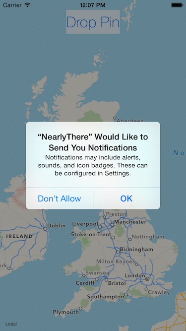
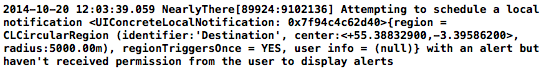
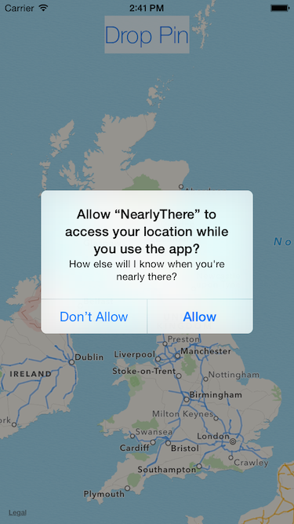

# iOS8 Day-by-Day :: Day 36 :: Location Notifications

This post is part of a daily series of posts introducing the most exciting new
parts of iOS8 for developers - [#iOS8DayByDay](https://twitter.com/search?q=%23iOS8DayByDay).
To see the posts you've missed check out the [index page](http://shinobicontrols.com/iOS8DayByDay),
but have a read through the rest of this post first!

---

## Introduction

iOS8 saw some changes to the way notifications work - particularly around
authorization and local notifications. Local notifications can be triggered on a
timer, and new to iOS based on location region monitoring.

It was possible to set up geofencing and present users with notifications when
they enter or leave an specified region in iOS7, but it was far from easy to set
up. This has all become a lot easier in iOS8, but location-based notifications
gaining first-class support.

The app which accompanies today's post is called __NearlyThere__ and allows a
user to drop a pin on the map and then ask to be notified when they arrive
within 50m of said pin. The code is available in the iOS8-day-by-day repo at
[github.com/ShinobiControls/iOS8-day-by-day](https://github.com/ShinobiControls/iOS8-day-by-day).

## Requesting Authorization

Since you're going to requesting location-based notifications, you need to ask
the user for permission to send them notifications and to use their location.
Both of these have been covered in iOS8 Day-by-Day (notifications on
[day 25](http://www.shinobicontrols.com/blog/posts/2014/09/09/ios8-day-by-day-day-25-notification-actions)
and location on [day 34](http://www.shinobicontrols.com/blog/posts/2014/10/16/ios8-day-by-day-day-34-corelocation-authorization)),
but it's worth having a brief summary.

User notifications are defined as sounds, alerts and badges that can interrupt
the user whilst your app isn't in the foreground. These can be triggered both by
remote and local (both temporal and spatial) notification events. To request
permission from the user, you need to specify what types of notifications you'd
like to use, and then register for them. Here, the only type requested is alert:

    // Ask for permission for notifications
    let notificationSettings = UIUserNotificationSettings(forTypes: UIUserNotificationType.Alert, categories: nil)
    UIApplication.sharedApplication().registerUserNotificationSettings(notificationSettings)

This will present the user with the following alert:

If you don't have this permission, and attempt to schedule a local notification
then you'll get an error in the console:

Asking the user permission to use their location is a little more complicated -
and is covered in depth in 
[day 34](http://www.shinobicontrols.com/blog/posts/2014/10/16/ios8-day-by-day-day-34-corelocation-authorization).
You need to create a `CLLocationManager()`, that will stay around for the
lifetime of the view controller (i.e. a property):

    let locationManager = CLLocationManager()

And then request permission:

    // Ask for permission for location
    locationManager.delegate = self
    locationManager.requestWhenInUseAuthorization()

Interesting, in order to use location notifications, your app doesn't need to
request permission to use location in the background. This is because the
geofencing is taken care of CoreLocation in the OS, and your app will only be
away of the location when the user chooses to bring the app into the foreground -
i.e. in response to a location.

You must also remember to set the `NSLocationWhenInUseUsageDescription` field in
__Info.plist__ to an appropriate string, as described in day 34. Once you've
done all this, then the user will be presented with the following when they
launch the app:

Note that there will be no errors if you don't get this right. So be sure to
check it.

If you schedule a location notification whilst your app doesn't have permission
to use the user's location, then the notification will not fire or be delivered
to your app. And you will not be informed of this.

## Creating Notifications

## Responding to Notifications

## Conclusion

