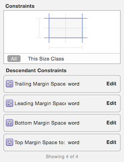
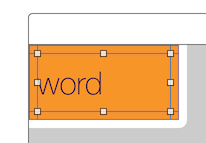
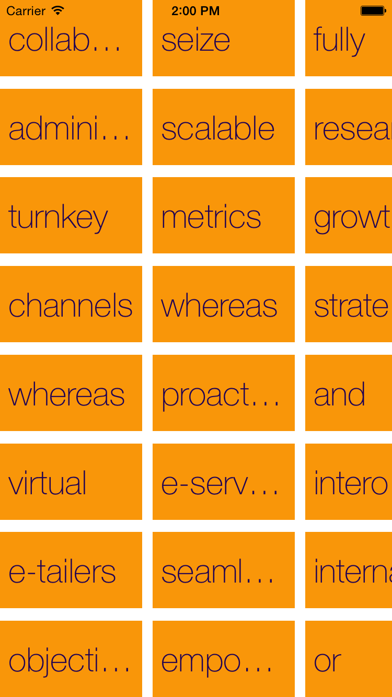
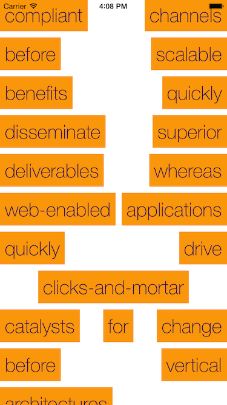
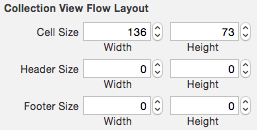
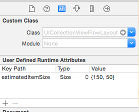

# iOS8 Day-by-Day :: Day 37 :: Autosizing Collection View Cells

This post is part of a daily series of posts introducing the most exciting new
parts of iOS8 for developers - [#iOS8DayByDay](https://twitter.com/search?q=%23iOS8DayByDay).
To see the posts you've missed check out the [index page](http://shinobicontrols.com/iOS8DayByDay),
but have a read through the rest of this post first!

---

## Introduction

Way back on [day 5](http://www.shinobicontrols.com/blog/posts/2014/07/24/ios8-day-by-day-day-5-auto-sizing-table-view-cells/)
of this series, we took a look at the new functionality within table views that
allows cells to define their own height - using the power of auto layout. Well,
imagine a world where you could extend that same principle to collection views.
How cool would that be?

Well, in iOS8, you can! This functionality is built in to the flow layout, and
is easy to access when building your own layouts. In today's brief post you'll
discover how to use auto-sizing cells within a flow layout, and a little bit
about the underlying implementation. The sample app is available in the
iO8 Day-by-Day repo on github at
[github.com/ShinobiControls/iOS8-day-by-day](https://github.com/ShinobiControls/iOS8-day-by-day).

## Enabling Sizing in a Flow Layout

When using a `UICollectionViewFlowLayout`, you hardly need to to anything in
order to enable cell auto-sizing. The key thing, as in autosizing
`UITableViewCell`s, is to ensure that the size is completely defined using auto
layout constraints.

For example, in this custom cell, the label has constraints that link it to
every side of the cell:

The other thing that you need to do to enable autosizing is specify an estimated
item size on the flow layout. This is new to iOS8 and plays a similar role to
its counterpart in `UITableView`.

To size cells in the past you had two options; one was to set the `itemSize`
property on `UICollectionViewFlowLayout` - applying the same size to every cell
within the collection view. For more fine-grained control on the cell sizes you
could implement the `collectionView(_, layout:, sizeForItemAtIndexPath:)` method
on `UICollectionViewDelegateFlowLayout`, however the responsibility for
calculating the size for each item is down to you - rather than the layout
engine built into UIKit. 

The `estimatedItemSize` property has a default of `CGSizeZero`, but setting it
to a non-zero size will enable the auto-sizing of cells.

The following code inside a `UICollectionViewController` subclass will enable
auto-sizing for it's flow layout.

    override func viewDidLoad() {
      super.viewDidLoad()
      // Do any additional setup after loading the view, typically from a nib.
      if let cvl = collectionViewLayout as? UICollectionViewFlowLayout {
        cvl.estimatedItemSize = CGSize(width: 150, height: 75)
      }
    }

Note that since the name of this property includes _estimated_, you don't have
to be hugely accurate in the value you specify. In fact, the cells will only be
laid out and sized as they are about to arrive on screen. The estimated value is
used to size the scroll bars appropriately.

Enabling this line will take a layout that looked like this:

and change its appearance to match this:

## Autosizing via Interface Builder

It seems a shame to have to drop to code to set the estimated size - all other
sizing properties associated with a flow layout can be configured within 
Interface Builder:

However, you'll notice that there is nowhere obvious to configure the
`estimatedItemSize` property. Hopefully in future updates to Xcode this issue 
will be addressed, but until that point, it is is still possible to set the
value via the __User Defined Runtime Attributes__ panel inside the
__Identity Inspector__ for the `UICollectionViewFlowLayout`.

This panel allows you to set properties on objects via key-value coding - which
is essentially what the specialized panels in IB do anyway.

## Mechanics of Autosizing

In order to allow a cell (or indeed any reusable item in a collection view) to
determine its own size, a new method has been added to `UICollectionReusableView` -
in the form of `preferredLayoutAttributesFittingAttributes(_:)`. This method
gives a cell the opportunity to return the layout attributes it would like to be
displayed with, given the ones the layout has provided.

The default implementation of this in `UICollectionViewCell` just changes the
size property to match the size determined via autolayout. In the flow layout,
the result from this method is only used if the `estimatedItemSize` property is
non-zero, but you could use it in whatever way you would like in your own custom
layouts.

Importantly, the default implementation does all the auto-layout magic for you.
If you wish to alter other attributes you can do that, but you don't have to get
involved with any of the autolayout unless you want to.

## Conclusion

This new feature has a fairly small API - just two new items across the whole of
the collection view classes. In the past achieving the same effect was possible,
but it was a lot of work, and also pulled the sizing of elements out into a
different place - effectively duplicating the same functionality.

Since the cells are likely to be fairly simple, and they have to be self-
contained, the autolayout engine will not add much complexity to the collection
view layout process - so you can be confident that you won't be crippling your
app.

The sample app that accompanies today's article is available as part of the iOS8
day-by-day repo on github at
[github.com/ShinobiControls/iOS8-day-by-day](https://github.com/ShinobiControls/iOS8-day-by-day).
It's pretty simple - I wanted to demo some more advanced uses with a custom
layout, but didn't get around to it. You should fork the repo and add a cool
thing that demos this. I might even send you some stickers/pens/t-shirt type
stuff... Let me know on [@iwantmyrealname](https://twitter.com/iwantmyrealname).

sam

