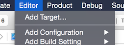
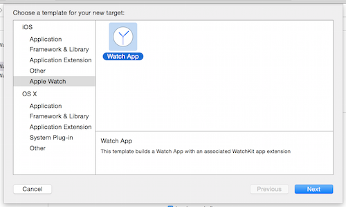
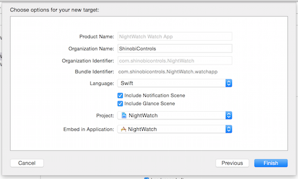
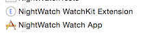
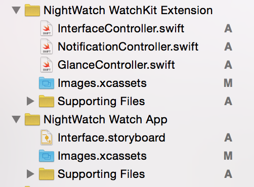
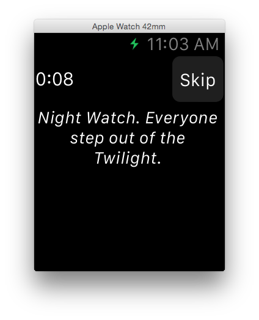

# iOS8 Day-by-Day :: Day 39 :: WatchKit

This post is part of a daily series of posts introducing the most exciting new
parts of iOS8 for developers - [#iOS8DayByDay](https://twitter.com/search?q=%23iOS8DayByDay).
To see the posts you've missed check out the [index page](http://shinobicontrols.com/iOS8DayByDay),
but have a read through the rest of this post first!

---

## Introduction

Although the Apple Watch was unveiled back in September 2014, developers have
only recently got hold of an SDK - hidden away inside iOS 8.2. It seems that the
Apple Watch has really caught the imagination of iOS developers from across the
world, and as such there have been loads of in-depth articles, opinion pieces
and videos created covering it. iOS8 Day-by-Day has always been intended to be
short overview of new technologies so that intermediate developers can hit the
ground running. Today's post on Apple Watch is no different. If you want to
learn everything there is to know about the SDK then read the documentation, and
then soak up the excellent content that's been created in the short time the SDK
has been alive.

This post will discuss what's different between an iOS app, and an Apple Watch
app, what we can do as developers, and a very quick guide to getting started.
The app that accompanies this post is called __NightWatch__ and provides the
wearer with instant access to some of the best quotes from this excellent movie.
(Well, I say excellent, I've never seen it, and hadn't actually heard of it until
I started this project.) The source code for the app is available on github at
[github.com/ShinobiControls/iOS8-day-by-day](https://github.com/ShinobiControls/iOS8-day-by-day).

## What can (and can't) I do on a watch?

Apple has made it very clear that the Apple Watch SDK in iOS 8.2 is the first
implementation, and that we can expect changes in coming iOS releases. This
might go some way to explaining what you might initially think is a fairly
restrictive API:

#### 1. You cannot write code to run on the watch

When you add a watch target to an existing project, it creates both a watch app,
and an extension. The watch app itself cannot contain code - it only contains
image assets and a storyboard. This is what will be pushed to the watch. The
extension runs on an iPhone and interacts with the layout that you created in
the aforementioned storyboard.

This actually closely simulates the impression that you're running code on the
watch, but it's important to be aware of the effect that this "remote display"
will have on the functionality and experience you wish to implement.

#### 2. There are three "tasks" you can customize on a watch

In addition to creating a full watch-app, you can also create glances and
notifications. Notifications are exactly the same as existing notifications on
iOS - with the added ability to customize their appearance. A notification
appears full-screen and has different visualizations depending on the battery
level and the user's response. Users can interact with notifications in the same
way that they can with the new notification interactions introduced to iOS 8.

A glance is an entirely new concept to the watch. The user will be able to
swipe through a collection of glances, and as such they cannot interact with
them. They're designed to show you the most important info in a short amount of
time, i.e. a glance.

The app itself is a lot more heavyweight - allowing the user to fully interact
with the UI components. Don't be fooled into thinking it's just a little phone
app though - there are restrictions on what is achievable, along with the
completely different user interaction.

#### 3. The API is heavily focused around energy efficiency for the watch

Something that might seem strange to you when you start working with outlets in
storyboards, is that you cannot read properties from any of them - they are
write only. This is because the code is running on the iPhone, with the UI
update instructions being sent over bluetooth to the watch. This is an expensive
operation (in terms of power), so all unnecessary communications are
eliminated.

You should also note that setting properties on UI controls is not an
instantaneous procedure. Instead, the operations are batched up and pushed to
the watch in one go.

#### 4. You cannot get access to any of the watch's sensors

This is a little disappointing, since there are going to be some great ideas for
apps using these new sensors. I think that this is a side effect of the lack of
native apps on the watch in the initial release, and that some kind of
interaction with the sensors will arrive in due course. This means that your
watch apps aren't able to do anything that your iPhone apps couldn't do. In
fact, they're very much meant to augment your iPhone app, for quick access to
relevant summary info.

## Getting Started

Watch apps can't exist on their own - they are packaged up as part of an iPhone
app. This reinforces the notion that Apple Watch apps are designed to supplement
the functionality provided by an iPhone app, and are not meant to be standalone.

As such, creating a watch app requires that you have an existing iPhone app, to
which you can add a target:

There is a new section called __Apple Watch__, from which you can select __Watch
App__:

The options screen allows you to specify whether you want a glance and
notification to be created alongside the app itself:

This will create two new targets - one for the watch app, and one for the
extension:

As mentioned before, the app itself runs on the phone, and doesn't currently
allow any custom code. It contains static assets - e.g. images and a storyboard
for the layout. The watch extension runs on the paired iPhone, and references
the storyboard that exists on the watch:

In the rest of this section you'll learn about building a watch app, glances and
notifications.

### Watch App

The watch app itself is made up of two parts - the UI is created entirely in a
storyboard which exists on the watch itself, and the code that controls this
interface runs as an extension on the iPhone. This means that the code that is
used to power a watch app is subject to the same restrictions that extensions
are - e.g. it can't run any background tasks.

The storyboard in the watch app contains scenes for the three different
interfaces:

You can see that the scenes are sized appropriately for the watch. Since the
watch is so small, and low-powered, the layout doesn't use auto layout, but
instead relies on a system of groups and simple metrics. Size classes are also
not supported, but you can use similar techniques in IB to provide slightly
different layouts for the two watch sizes (38mm and 42mm):

As you look through the object library lots of it will look familiar from
traditional iOS apps. The appearance of the standard controls has been
configured to work well on a watch, and there is actually only a subset of the
controls you might expect. Some of the important differences are as follows:

- The only possibility for creating animations is through an animated image -
which can be a collection of frames named correctly.
- A table doesn't have a datasource, but instead works by adding cells
individually.
- Since updating UI is expensive, there are specialized label subclasses for
displaying a day and a timer. These autoupdate on the watch, and don't require
interaction with the watch app extension.
- Maps are not interactive, but are rendered on the phone and then pushed as an
image to the watch.
- A group has no visual appearance, but instead acts as a container for other
display elements. It arranges them in a line, either vertically or horizontally.
This is a very powerful control which allows you to construct a whole host of
different layouts.

Watch apps can have one of two forms of navigation - either page based or
hierarchy based. You cannot mix between these, and they are formed through
collections of `WKInterfaceController` objects, corresponding to the interface
controllers in the storyboard.

#### Watch extension code

A layout isn't useful on its own - it needs to be able to dynamically update to
show different information. Since the watch app cannot run any code, this
responsibility is left to the watch kit extension.

If you take a look inside __InterfaceController.swift__, you'll see that 
`InterfaceController` is a subclass of `WKInterfaceController`. This is roughly
equivalent to `UIViewController` in iOS, with the remote display magic built in.

A `WKInterfaceController` has four methods that form the core of its lifecycle:
- `init()` Standard for all objects. You can create data objects and things
here.
- `awakeWithContext(_:)` You can use the context object whenever you are
instantiating a new interface controller, to provide it with data or navigation
info. There is no restriction on the type of context you send. Should prepare
the interface controls.
- `willActivate()` Called just before the interface appears on screen - this is
roughly equivalent to `viewWillAppear()` in `UIViewController`
- `willDeactivate()` Called as the interface is disappearing. You can use it to
tidy up.

Interfacing with the layout in the watch app story board is achieved in the same
way that it is in an iPhone app - via IBOutlets and IBActions. You can drag from
IB into your `WKInterfaceController` as expected to create outlets and actions:

    @IBOutlet weak var quoteLabel: WKInterfaceLabel!
    @IBOutlet weak var quoteChangeTimer: WKInterfaceTimer!

    @IBAction func handleSkipButtonPressed() {
      ...
    }

Notice here the types of `@IBOutlet` properties - `WKInterfaceLabel` instead of
`UILabel`, and `WKInterfaceTimer`. These new types represent the difference in
functionality between iPhone and Apple Watch - where communicating with the
user interface is an expensive operation. These `WKInterface*` types are read
only - i.e. although you can set values, you cannot read them back. For example,
setting the text on a label looks like this:

    quoteLabel.setText(quotes[currentQuote])

`WKInterfaceTimer` is a specialized interface object that will count up or down
to or from a specified `NSDate`. Since this is also read only, you can interact
with it as follows:

    quoteChangeTimer.setDate(NSDate(timeIntervalSinceNow: quoteCycleTime))
    quoteChangeTimer.start()

Check the documentation for further details on these and other interface object
controls that are available as part of the Apple Watch SDK.

Some of the controls allow user interaction - such as buttons or switches. These
can be wired up to IBActions, in the way you'd expect. Note that you won't
receive a reference to the button in question - which therefore means you will
probably have to have a different method for each of the button actions.

#### Running A Watch App

You can run the watch app in a simulator by selecting the correct scheme from
the selection menu:

This will start the specified iOS simulator, and it should show your app in a
secondary display window representing the watch:

If it doesn't, or to switch between different watch sizes, you can use the
__External Displays__ list in the __Hardware__ menu:

You can interact with this external display as you'd expect to be able to - so
you can put your new watch app through its paces even though you are not yet
able to buy an Apple Watch.

### Glance

### Notifications 

## Code sharing

## Conclusion
